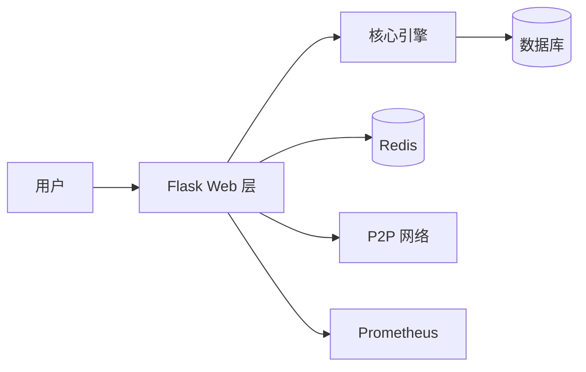

# Shuai Coin Ultimate

<!--
版本号:     2.1.0
最后更新:   2026-05-13
作者:       @dev-team
评审人:     @core-team
-->

[](https://github.com/shuai-coin/shuai-coin/actions)
[](https://github.com/shuai-coin/shuai-coin/actions)
[](LICENSE)
[](https://hub.docker.com/r/shuai-coin/shuai-coin)
[](https://python.org)
[](docs/)

基于 Python 实现的高性能、模块化全栈区块链原型。支持 PoW 共识、智能合约、P2P 网络、ZK 证明、分片扩容与隐私交易。

---

## 项目愿景

构建一个**开发者友好、安全可信、高性能可扩展**的下一代区块链基础设施，为去中心化应用 (DApp) 提供从零知识证明到隐私交易、从分片扩容到预言机的完整技术栈。

## 核心功能清单

- [x] PoW 共识机制与动态难度调整 (DDA)
- [x] 智能合约引擎 (ShuaiVM) 与 WASM 扩展
- [x] P2P 节点发现与最长链共识同步
- [x] 双模式鉴权 (Session + JWT)
- [x] 同步与异步双模式挖矿
- [x] RESTful API 与 Swagger 文档
- [x] Vue 3 + Element Plus 管理后台
- [x] Redis 缓存与速率限制
- [x] Prometheus + Grafana 监控告警
- [x] Docker 一键部署与 CI/CD 质量门禁
- [x] 内容审核 (敏感词 + 图片哈希黑名单)
- [x] 不可篡改管理员操作审计日志
- [x] 数据库迁移管理 (Flask-Migrate)
- [ ] 零知识证明 (ZK-SNARK) — 规划中
- [ ] 隐私交易 (环签名 + 隐身地址) — 规划中
- [ ] 分片扩容 — 规划中
- [ ] 预言机 — 规划中

---

## 30 秒快速启动

```bash
# 1. 安装依赖
pip install -r requirements.txt

# 2. 初始化数据库并启动
python run.py start_all

# 3. 打开浏览器
# 主页:      http://localhost:5000
# API 文档:  http://localhost:5000/apidocs
# 管理员:    admin / admin123
```

### Docker 一键部署

```bash
# 启动全栈服务 (Web + PostgreSQL + Redis)
docker-compose up -d

# 访问
open http://localhost:8000
```

---

## 技术架构



详情参见 [架构优化设计说明书](docs/architecture_v2.md) 与 [全量架构指南](docs/full_architecture_guide.md)。

---

## 测试

```bash
# 运行全量测试
pytest tests/ -v

# 生成覆盖率报告
pytest --cov=. --cov-report=html

# 打开覆盖率报告
open htmlcov/index.html
```

---

## 文档导航

| 文档 | 说明 |
| :--- | :--- |
| [API 规范](docs/API.md) | RESTful 接口规范、鉴权、错误码 |
| [架构设计 V2](docs/architecture_v2.md) | C4 模型、时序图、ADR |
| [架构迁移指南](docs/architecture.md) | V1 → V2 演进、回滚方案 |
| [合约开发](docs/contract_dev.md) | 智能合约规范、审计清单、CI |
| [部署指南 V2.1](docs/deploy_v2.1.md) | 一键部署、灰度发布、告警 |
| [生产部署](docs/deployment.md) | 灾备、备份恢复、容量规划 |
| [数据库修复报告](docs/fix_report_db_column.md) | 5 Whys、回归测试、监控 |
| [全量架构指南](docs/full_architecture_guide.md) | 链路追踪、成本、合规、FAQ |
| [接口变更日志](docs/interface-changelog.md) | 变更记录、回滚策略 |
| [节点管理审计](docs/node_mgmt_audit.md) | 审计日志、ELK、告警 |
| [术语表](docs/glossary.md) | 统一术语定义 |
| [文档索引](docs/README.md) | 文档中心与更新日志 |

---

## 故障排查速查

| 症状 | 排查命令 |
| :--- | :--- |
| 服务无法启动 | `docker-compose ps` / `python run.py start_all` |
| `no such column` | `python run.py db_mgmt db_upgrade` |
| 节点不同步 | `curl http://localhost:5000/api/p2p/resolve` |
| 权限错误 | 检查日志 `grep AUTH_REJECT logs/app.log` |
| 端口冲突 | `PORT=8000 python run.py start_all` |

---

## 贡献者行为准则

### 我们的承诺

为了营造开放和友好的环境，我们承诺：无论年龄、体型、残疾、种族、性别认同、经验水平、国籍、个人外貌、宗教或性取向，所有参与者都不会受到骚扰。

### 我们的标准

**积极行为包括:**
- 使用友好和包容的语言
- 尊重不同的观点和经验
- 优雅地接受建设性批评
- 关注对社区最有利的事
- 对其他社区成员表现出同理心

**不可接受的行为包括:**
- 使用性化语言或图像
- 恶意评论、人身或政治攻击
- 公开或私下骚扰
- 未经明确许可发布他人的私人信息
- 在专业场合可以被合理认为不适当的其他行为

### 执行

社区负责人有责任澄清和执行我们的行为标准。必要时可采取适当和公平的纠正措施。

---

## 联系方式

- **文档:** [docs/](docs/)
- **问题反馈:** [GitHub Issues](https://github.com/shuai-coin/shuai-coin/issues)
- **Discord:** [加入 Discord 社区](https://discord.gg/shuai-coin)
- **微信群:** 扫描下方二维码加入开发者微信群

```
┌─────────────────────────────────┐
│                                 │
│         [微信二维码占位]          │
│                                 │
│   扫码加入 ShuaiCoin 开发者社区    │
│                                 │
└─────────────────────────────────┘
```

- **邮件:** dev@shuai-coin.io
- **安全漏洞报告:** security@shuai-coin.io (PGP Key: `0xABCD1234`)

---

## 许可证

本项目基于 [MIT License](LICENSE) 开源。

---

*术语定义参见 [docs/glossary.md](docs/glossary.md)。*
