# ShuaiCoin 项目中文总文档

<!--
版本号:     2.1.0
最后更新:   2026-05-13
作者:       @dev-team
评审人:     @core-team
整合说明:   由 README.md、docs/README.md、API.md、architecture_v2.md、architecture.md、contract_dev.md、deploy_v2.1.md、deployment.md、fix_report_db_column.md 九份文档合并并全文翻译为中文
-->

---

**版本号** | **日期** | **作者** | **变更说明**
2.1.0 | 2026-05-13 | @dev-team | 九份文档合并、全文中文翻译、去重与统一排版
2.0.0 | 2026-04-30 | 全体团队 | 模块化架构重构
1.0.0 | 2026-01-15 | 全体团队 | 初始文档发布

---

## 目录 (TOC)

- [1. 项目概览](#1-项目概览)
  - [1.1 项目愿景](#11-项目愿景)
  - [1.2 核心功能清单](#12-核心功能清单)
  - [1.3 30 秒快速启动](#13-30-秒快速启动)
  - [1.4 技术架构概览](#14-技术架构概览)
  - [1.5 测试](#15-测试)
  - [1.6 故障排查速查](#16-故障排查速查)
- [2. 贡献者行为准则](#2-贡献者行为准则)
- [3. 联系方式与许可证](#3-联系方式与许可证)
- [4. 文档导航](#4-文档导航)
- [5. 核心模块说明](#5-核心模块说明)
- [6. RESTful API 规范](#6-restful-api-规范)
  - [6.1 概述](#61-概述)
  - [6.2 身份验证接口](#62-身份验证接口)
  - [6.3 区块链接口](#63-区块链接口)
  - [6.4 挖矿接口](#64-挖矿接口)
  - [6.5 链完整性校验](#65-链完整性校验)
  - [6.6 交易接口](#66-交易接口)
  - [6.7 钱包接口](#67-钱包接口)
  - [6.8 P2P 网络接口](#68-p2p-网络接口)
  - [6.9 管理员接口](#69-管理员接口)
  - [6.10 区块链浏览器](#610-区块链浏览器)
  - [6.11 速率限制](#611-速率限制)
  - [6.12 API 版本变更记录](#612-api-版本变更记录)
- [7. V2 架构设计规范](#7-v2-架构设计规范)
  - [7.1 C4 模型 - 上下文图](#71-c4-模型---上下文图)
  - [7.2 C4 模型 - 容器图](#72-c4-模型---容器图)
  - [7.3 C4 模型 - 组件图 (核心引擎)](#73-c4-模型---组件图-核心引擎)
  - [7.4 部署图](#74-部署图)
  - [7.5 交互时序](#75-交互时序)
  - [7.6 技术选型理由](#76-技术选型理由)
  - [7.7 性能基线](#77-性能基线)
  - [7.8 架构决策记录 (ADR)](#78-架构决策记录-adr)
- [8. V1 至 V2 架构迁移指南](#8-v1-至-v2-架构迁移指南)
  - [8.1 V1 架构 (原始)](#81-v1-架构-原始)
  - [8.2 V1 至 V2 演进](#82-v1-至-v2-演进)
  - [8.3 废弃组件迁移](#83-废弃组件迁移)
  - [8.4 数据库迁移](#84-数据库迁移)
  - [8.5 回滚方案](#85-回滚方案)
  - [8.6 V1 至 V2 检查点总结](#86-v1-至-v2-检查点总结)
- [9. 智能合约开发指南](#9-智能合约开发指南)
  - [9.1 合约执行模型](#91-合约执行模型)
  - [9.2 Solidity 兼容性 (未来 EVM 支持)](#92-solidity-兼容性-未来-evm-支持)
  - [9.3 安全审计清单](#93-安全审计清单)
  - [9.4 单元测试](#94-单元测试)
  - [9.5 Gas 优化策略](#95-gas-优化策略)
  - [9.6 CI 合约质量门禁](#96-ci-合约质量门禁)
  - [9.7 合约生命周期管理](#97-合约生命周期管理)
- [10. V2.1 部署指南](#10-v21-部署指南)
  - [10.1 环境要求](#101-环境要求)
  - [10.2 环境变量](#102-环境变量)
  - [10.3 密钥管理](#103-密钥管理)
  - [10.4 一键部署脚本](#104-一键部署脚本)
  - [10.5 灰度发布](#105-灰度发布)
  - [10.6 回滚方案](#106-回滚方案)
  - [10.7 告警规则](#107-告警规则)
  - [10.8 生产验证用例](#108-生产验证用例)
- [11. 生产部署指南](#11-生产部署指南)
  - [11.1 多区域灾备拓扑](#111-多区域灾备拓扑)
  - [11.2 数据备份与恢复 SOP](#112-数据备份与恢复-sop)
  - [11.3 容量规划](#113-容量规划)
  - [11.4 压测报告模板](#114-压测报告模板)
  - [11.5 网络安全组配置](#115-网络安全组配置)
  - [11.6 监控仪表盘模板](#116-监控仪表盘模板)
- [12. 数据库修复报告: `user.role_id` 列缺失](#12-数据库修复报告-userrole_id-列缺失)
  - [12.1 缺陷摘要](#121-缺陷摘要)
  - [12.2 根因分析 (5 Whys)](#122-根因分析-5-whys)
  - [12.3 影响评估矩阵](#123-影响评估矩阵)
  - [12.4 修复实施](#124-修复实施)
  - [12.5 数据修复 SQL 审计流程](#125-数据修复-sql-审计流程)
  - [12.6 回归测试用例](#126-回归测试用例)
  - [12.7 预防措施](#127-预防措施)
  - [12.8 修复后 48 小时监控](#128-修复后-48-小时监控)
  - [12.9 经验教训](#129-经验教训)
- [13. 文档更新日志](#13-文档更新日志)

---

## 1. 项目概览

[](https://github.com/shuai-coin/shuai-coin/actions)
[](https://github.com/shuai-coin/shuai-coin/actions)
[](LICENSE)
[](https://hub.docker.com/r/shuai-coin/shuai-coin)
[](https://python.org)
[](docs/)

基于 Python 实现的高性能、模块化全栈区块链原型。支持工作量证明 (PoW，Proof of Work) 共识、智能合约、对等网络 (P2P，Peer-to-Peer)、零知识证明 (ZK，Zero-Knowledge Proof)、分片扩容与隐私交易。

### 1.1 项目愿景

构建一个**开发者友好、安全可信、高性能可扩展**的下一代区块链基础设施，为去中心化应用 (DApp，Decentralized Application) 提供从零知识证明到隐私交易、从分片扩容到预言机 (Oracle) 的完整技术栈。

### 1.2 核心功能清单

- [x] PoW 共识机制与动态难度调整 (DDA，Dynamic Difficulty Adjustment)
- [x] 智能合约引擎 (ShuaiVM) 与 WebAssembly (WASM) 扩展
- [x] P2P 节点发现与最长链共识同步
- [x] 双模式鉴权 (Session + JWT)
- [x] 同步与异步双模式挖矿
- [x] RESTful API 与 Swagger 文档
- [x] Vue 3 + Element Plus 管理后台
- [x] Redis 缓存与速率限制
- [x] Prometheus + Grafana 监控告警
- [x] Docker 一键部署与 CI/CD 质量门禁
- [x] 内容审核 (敏感词 + 图片哈希黑名单)
- [x] 不可篡改管理员操作审计日志
- [x] 数据库迁移管理 (Flask-Migrate)
- [ ] 零知识证明 (ZK-SNARK) — 规划中
- [ ] 隐私交易 (环签名 + 隐身地址) — 规划中
- [ ] 分片扩容 — 规划中
- [ ] 预言机 — 规划中

### 1.3 30 秒快速启动

```bash
# 1. 安装依赖
pip install -r requirements.txt

# 2. 初始化数据库并启动
python run.py start_all

# 3. 打开浏览器
# 主页:      http://localhost:5000
# API 文档:  http://localhost:5000/apidocs
# 管理员:    admin / admin123
```

#### Docker 一键部署

```bash
# 启动全栈服务 (Web + PostgreSQL + Redis)
docker-compose up -d

# 访问
open http://localhost:8000
```

### 1.4 技术架构概览

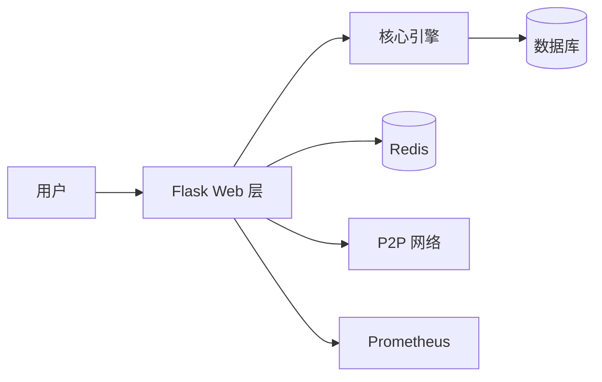

详情参见下方 [V2 架构设计规范](#7-v2-架构设计规范)。

### 1.5 测试

```bash
# 运行全量测试
pytest tests/ -v

# 生成覆盖率报告
pytest --cov=. --cov-report=html

# 打开覆盖率报告
open htmlcov/index.html
```

### 1.6 故障排查速查

| 症状 | 排查命令 |
| :--- | :--- |
| 服务无法启动 | `docker-compose ps` / `python run.py start_all` |
| `no such column` 错误 | `python run.py db_mgmt db_upgrade` |
| 节点不同步 | `curl http://localhost:5000/api/p2p/resolve` |
| 权限错误 | 检查日志 `grep AUTH_REJECT logs/app.log` |
| 端口冲突 | `PORT=8000 python run.py start_all` |

---

## 2. 贡献者行为准则

### 我们的承诺

为了营造开放和友好的环境，我们承诺：无论年龄、体型、残疾、种族、性别认同、经验水平、国籍、个人外貌、宗教或性取向，所有参与者都不会受到骚扰。

### 我们的标准

**积极行为包括:**

- 使用友好和包容的语言
- 尊重不同的观点和经验
- 优雅地接受建设性批评
- 关注对社区最有利的事
- 对其他社区成员表现出同理心

**不可接受的行为包括:**

- 使用性化语言或图像
- 恶意评论、人身或政治攻击
- 公开或私下骚扰
- 未经明确许可发布他人的私人信息
- 在专业场合可以被合理认为不适当的其他行为

### 执行

社区负责人有责任澄清和执行我们的行为标准。必要时可采取适当和公平的纠正措施。

---

## 3. 联系方式与许可证

- **文档:** [docs/](docs/)
- **问题反馈:** [GitHub Issues](https://github.com/shuai-coin/shuai-coin/issues)
- **Discord:** [加入 Discord 社区](https://discord.gg/shuai-coin)
- **微信群:** 扫描下方二维码加入开发者微信群
- **邮件:** dev@shuai-coin.io
- **安全漏洞报告:** security@shuai-coin.io (PGP Key: `0xABCD1234`)

```
+---------------------------+
|                           |
|      [微信二维码占位]       |
|                           |
| 扫码加入 ShuaiCoin 开发者社区 |
|                           |
+---------------------------+
```

**许可证:** 本项目基于 [MIT License](LICENSE) 开源。

---

## 4. 文档导航

| 文档 | 版本 | 最后更新 | 说明 |
| :--- | :--- | :--- | :--- |
| 项目中文总文档 (本文档) | 2.1.0 | 2026-05-13 | 完整技术文档汇总 |
| [API.md](docs/API.md) | 2.1.0 | 2026-05-13 | RESTful API 规范：请求/响应、鉴权、分页、错误码 |
| [architecture_v2.md](docs/architecture_v2.md) | 2.1.0 | 2026-05-13 | V2 架构设计：C4 模型、时序图、ADR |
| [architecture.md](docs/architecture.md) | 2.1.0 | 2026-05-13 | V1 到 V2 迁移指南：演进对比、回滚方案 |
| [contract_dev.md](docs/contract_dev.md) | 2.1.0 | 2026-05-13 | 智能合约开发：编码规范、审计清单、CI 脚本 |
| [deploy_v2.1.md](docs/deploy_v2.1.md) | 2.1.0 | 2026-05-13 | V2.1 部署指南：一键脚本、灰度发布、告警 |
| [deployment.md](docs/deployment.md) | 2.1.0 | 2026-05-13 | 生产部署：多区域灾备、备份恢复、容量规划 |
| [fix_report_db_column.md](docs/fix_report_db_column.md) | 2.1.0 | 2026-05-13 | 数据库修复报告：5 Whys、影响矩阵、48h 监控 |
| [full_architecture_guide.md](docs/full_architecture_guide.md) | 2.1.0 | 2026-05-13 | 全量架构指南：链路追踪、成本、合规、FAQ |
| [interface-changelog.md](docs/interface-changelog.md) | 2.1.0 | 2026-05-13 | 接口变更日志：统一格式、回滚兼容策略 |
| [node_mgmt_audit.md](docs/node_mgmt_audit.md) | 2.1.0 | 2026-05-13 | 节点管理审计：日志格式、ELK、告警阈值 |
| [glossary.md](docs/glossary.md) | 1.0.0 | 2026-05-13 | 统一术语表：中英文对照定义 |

---

## 5. 核心模块说明

| 模块 | 路径 | 职责 |
| :--- | :--- | :--- |
| 核心引擎 | `core/` | 区块链共识、区块生成、合约执行 |
| 数据层 | `db/` | ORM (Object-Relational Mapping) 模型：区块、交易、用户、合约状态 |
| 网络层 | `p2p/` | 节点发现与最长链共识同步 |
| 应用层 | `web/` | Flask 管理后台、API、SPA (Single Page Application) |
| 钱包 | `wallet/` | 密钥管理、交易签名、地址生成 |
| 安全 | `security/` | DDOS 防护、内容审核、审计日志 |
| 监控 | `monitor/` | Prometheus 指标、告警规则、仪表盘 |
| 缓存 | `cache/` | Redis 与内存缓存 |
| 运维 | `scripts/` | 备份、迁移、清理、部署脚本 |
| 测试 | `tests/` | 单元测试、集成测试、性能测试 |

---


---

## 6. RESTful API 规范

<!-- 来源: docs/API.md -->

### 6.1 概述

ShuaiCoin 在 HTTP/1.1 之上对外暴露 RESTful API。所有接口由 Flask 提供服务，基础 URL 为:

```
http://<host>:<PORT>
```

#### 6.1.1 身份验证

API 支持两种身份验证机制:

| 方式 | 适用范围 | 用法 |
| :--- | :--- | :--- |
| **Session Cookie** | Web 界面 (`/login`) | `Set-Cookie: session=<signed>` |
| **JWT 持有者令牌 (Bearer Token)** | API 客户端 (`/api/login`) | `Authorization: Bearer <token>` |

**JWT 结构:**

```json
{
  "exp": 1718230400,
  "iat": 1718144000,
  "sub": 1,
  "is_admin": true
}
```

* 算法: `HS256`
* 有效期: 24 小时
* 密钥: `config/settings.py::SECRET_KEY`

#### 6.1.2 统一响应信封

所有 API 响应遵循以下结构:

```json
{
  "status": "success",
  "message": "人类可读的提示信息",
  "data": {}
}
```

**错误响应:**

```json
{
  "status": "error",
  "message": "人类可读的错误描述",
  "data": null
}
```

#### 6.1.3 状态码说明

| 状态码 | 含义 | 触发条件 |
| :--- | :--- | :--- |
| `200` | 成功 | 请求已成功处理 |
| `201` | 已创建 | 资源已创建 (预留) |
| `400` | 错误的请求 | 无效的输入 / 缺少必要参数 |
| `401` | 未授权 | 缺少或无效的凭据 |
| `403` | 禁止访问 | 已通过身份验证但权限不足 / 账户已冻结 |
| `404` | 未找到 | 请求的资源不存在 |
| `429` | 请求过多 | 超过速率限制 |
| `451` | 已阻止 | 内容被审核员拒绝 |
| `500` | 服务器内部错误 | 未处理的服务器异常 |

#### 6.1.4 分页规则

返回集合数据的接口支持基于游标的分页:

**请求:**

```http
GET /api/chain?limit=20&offset=40
```

| 参数 | 类型 | 默认值 | 最大值 |
| :--- | :--- | :--- | :--- |
| `limit` | `integer` | `20` | `100` |
| `offset` | `integer` | `0` | 无限制 |

**响应:**

```json
{
  "status": "success",
  "data": {
    "items": [],
    "total": 1250,
    "limit": 20,
    "offset": 40
  }
}
```

#### 6.1.5 错误码映射表

| `err_code` | HTTP 状态码 | 描述 |
| :--- | :--- | :--- |
| `AUTH_001` | `401` | 令牌 (Token) 已过期 |
| `AUTH_002` | `401` | 无效的凭据 |
| `AUTH_003` | `403` | 非管理员身份 |
| `AUTH_004` | `403` | 账户已冻结 |
| `VAL_001` | `400` | 缺少必填字段 |
| `VAL_002` | `400` | 无效的字段类型 |
| `VAL_003` | `400` | 余额不足 |
| `RATE_001` | `429` | 速率限制已达上限 |
| `MOD_001` | `451` | 内容被审核员拦截 |
| `CHAIN_001` | `500` | 挖矿失败 |
| `CHAIN_002` | `500` | 区块创建失败 |
| `NODE_001` | `400` | 节点注册失败 |

### 6.2 身份验证接口

#### 6.2.1 POST /api/login

获取 JWT 令牌以供 API 访问。

**请求:**

```http
POST /api/login
Content-Type: application/json

{
  "username": "admin",
  "password": "admin123"
}
```

**响应 (200):**

```json
{
  "status": "success",
  "message": "操作成功",
  "data": {
    "token": "eyJhbGciOiJIUzI1NiIs...",
    "username": "admin",
    "is_admin": true
  }
}
```

**响应 (401):**

```json
{
  "status": "error",
  "message": "用户名或密码无效",
  "data": null
}
```

#### 6.2.2 POST /login

基于 Web Session 的登录 (表单 POST)。成功后将重定向至 `/`。

**请求:**

```http
POST /login
Content-Type: application/x-www-form-urlencoded

username=admin&password=admin123
```

#### 6.2.3 POST /register

注册新用户账户。

**请求:**

```http
POST /register
Content-Type: application/x-www-form-urlencoded

username=new_user&password=secure_pass&tx_password=tx_secure_pass
```

#### 6.2.4 GET /logout

注销登录 (Flask-Login `logout_user`)。

### 6.3 区块链接口

#### 6.3.1 GET /api/chain

获取完整区块链数据。

**身份验证:** 无需 (公开接口)

**请求:**

```http
GET /api/chain?limit=20&offset=0
```

**响应 (200):**

```json
{
  "chain": [
    {
      "index": 1,
      "timestamp": 1718144000.123,
      "transactions": "[{...}]",
      "proof": 24581,
      "previous_hash": "0",
      "hash": "0000a1b2c3...",
      "difficulty": 4
    }
  ],
  "length": 142
}
```

#### 6.3.2 GET /api/chain/block/<index\>

按索引获取单个区块。

**身份验证:** 无需 (公开接口)

**响应 (200):**

```json
{
  "status": "success",
  "data": {
    "index": 5,
    "timestamp": 1718144500.456,
    "transactions": "[{...}]",
    "proof": 98523,
    "previous_hash": "0000d4e5f6...",
    "hash": "0000f7a8b9...",
    "difficulty": 4
  }
}
```

**响应 (404):**

```json
{
  "status": "error",
  "message": "未找到该区块",
  "data": null
}
```

### 6.4 挖矿接口

#### 6.4.1 GET /mine

触发同步挖矿。立即返回区块数据。

**身份验证:** 需要 Session。
**速率限制:** 每分钟 10 次请求。

**请求:**

```http
GET /mine
Cookie: session=...
```

**响应 (200):**

```json
{
  "status": "success",
  "message": "挖矿成功！获得 10.5 SHUAI",
  "data": {
    "index": 143,
    "reward": 10.5,
    "hash": "0000a1b2c3d4..."
  }
}
```

**响应 (403):**

```json
{
  "status": "error",
  "message": "您的账户已被安全中心冻结！",
  "data": null
}
```

#### 6.4.2 POST /mine/async

触发异步挖矿。返回 `task_id` 供轮询状态使用。

**身份验证:** 仅管理员 (Session 或 JWT)。
**速率限制:** 每分钟 10 次请求。

**请求:**

```http
POST /mine/async
Authorization: Bearer eyJhbGciOi...
```

**响应 (200):**

```json
{
  "status": "success",
  "message": "挖矿任务已启动",
  "data": {
    "task_id": "550e8400-e29b-41d4-a716-446655440000"
  }
}
```

#### 6.4.3 GET /mine/status/<task_id\>

轮询异步挖矿任务的状态。

**身份验证:** 仅管理员。

**请求:**

```http
GET /mine/status/550e8400-e29b-41d4-a716-446655440000
```

**响应 (200) -- 处理中:**

```json
{
  "status": "success",
  "data": {
    "status": "processing",
    "start_time": 1718144000.123
  }
}
```

**响应 (200) -- 已完成:**

```json
{
  "status": "success",
  "data": {
    "status": "success",
    "block_index": 143,
    "reward": 10.5,
    "end_time": 1718144032.456
  }
}
```

**响应 (404):**

```json
{
  "status": "error",
  "message": "未找到该任务",
  "data": null
}
```

### 6.5 链完整性校验

#### 6.5.1 GET /verify

校验本地区块链完整性。逐块检查哈希值及前序哈希的链接关系。

**身份验证:** 所有已登录用户。
**速率限制:** 每分钟 10 次请求。

**响应 (200) -- 链正常:**

```json
{
  "status": "success",
  "message": "区块链校验完成！",
  "data": {
    "corrupted_blocks": []
  }
}
```

**响应 (200) -- 链损坏:**

```json
{
  "status": "error",
  "message": "警告：链数据异常！",
  "data": {
    "corrupted_blocks": [45, 46, 47]
  }
}
```

### 6.6 交易接口

#### 6.6.1 POST /api/transactions/new

向交易池 (mempool) 提交一笔新交易。

**身份验证:** 无需 (公开接口)。

**请求:**

```http
POST /api/transactions/new
Content-Type: application/json

{
  "sender": "0xabcd1234...",
  "recipient": "0xefgh5678...",
  "amount": 5.0,
  "fee": 0.1,
  "type": "transfer",
  "payload": ""
}
```

**响应 (200):**

```json
{
  "status": "success",
  "message": "交易已加入交易池",
  "data": {
    "tx_hash": "a1b2c3d4e5f6..."
  }
}
```

#### 6.6.2 POST /transactions/new

基于 Web 表单的交易提交 (需通过身份验证)。

**身份验证:** 需要 Session。

**请求:**

```http
POST /transactions/new
Content-Type: application/x-www-form-urlencoded

recipient=0xtarget&amount=5.0&fee=0.1&tx_password=user_tx_pass
```

### 6.7 钱包接口

#### 6.7.1 GET /api/wallet/<address\>

查询指定地址的余额。

**身份验证:** 无需 (公开接口)。

**请求:**

```http
GET /api/wallet/0xabcd1234abcd1234abcd1234abcd1234abcd1234
```

**响应 (200):**

```json
{
  "status": "success",
  "data": {
    "address": "0xabcd1234abcd1234abcd1234abcd1234abcd1234",
    "balance": 150.25
  }
}
```

### 6.8 P2P 网络接口

#### 6.8.1 POST /api/p2p/register

注册对等节点以进行 P2P 发现。

**身份验证:** 无需 (公开接口)。

**请求:**

```http
POST /api/p2p/register
Content-Type: application/json

{
  "nodes": [
    "http://192.168.1.100:5000",
    "http://192.168.1.101:5000"
  ]
}
```

**响应 (200):**

```json
{
  "status": "success",
  "message": "节点已添加",
  "data": {
    "total_nodes": ["http://192.168.1.100:5000", "http://192.168.1.101:5000"]
  }
}
```

#### 6.8.2 GET /api/p2p/resolve

手动触发链冲突解决 (最长链共识)。

**身份验证:** 无需 (公开接口)。

### 6.9 管理员接口

#### 6.9.1 GET /admin/api/users

列出所有已注册用户。

**身份验证:** 仅管理员 (Session 或 JWT)。

**响应 (200):**

```json
{
  "status": "success",
  "data": [
    {
      "id": 1,
      "username": "admin",
      "address": "0xADMIN_MASTER_WALLET",
      "is_admin": true,
      "is_frozen": false
    }
  ]
}
```

#### 6.9.2 POST /admin/toggle_freeze/<user_id\>

切换账户冻结状态。

**身份验证:** 仅管理员 (Session)。

**请求:**

```http
POST /admin/toggle_freeze/3
Cookie: session=...
```

#### 6.9.3 GET /admin/api/logs

获取最近 100 条管理员审计日志。

**身份验证:** 仅管理员。

**响应 (200):**

```json
{
  "status": "success",
  "data": [
    {
      "id": 42,
      "admin_name": "admin",
      "action": "冻结了用户账户: alice",
      "timestamp": "2026-05-13 10:30:00.123456"
    }
  ]
}
```

#### 6.9.4 GET/POST /admin/api/config

查看或更新系统配置。

**身份验证:** 仅管理员。

**GET 响应 (200):**

```json
{
  "status": "success",
  "data": {
    "DIFFICULTY": 4,
    "BLOCK_REWARD": 10.0,
    "PORT": 5000
  }
}
```

#### 6.9.5 POST /admin/api/nodes/verify

异步校验外部对等节点 (TCP 握手 + API 健康检查)。

**身份验证:** 仅管理员。
**所需权限:** `node:verify`

**请求:**

```http
POST /admin/api/nodes/verify
Authorization: Bearer eyJhbGciOi...
Content-Type: application/json

{
  "nodes": [
    {"id": "node-1", "ip": "192.168.1.100", "port": 5000},
    {"id": "node-2", "ip": "192.168.1.101", "port": 5000}
  ]
}
```

**响应 (200):**

```json
{
  "status": "success",
  "data": {
    "valid": [
      {"id": "node-1", "status": "UP"}
    ],
    "invalid": [
      {"id": "node-2", "reason": "连接超时"}
    ]
  }
}
```

### 6.10 区块链浏览器

#### 6.10.1 GET /explorer

搜索区块、交易或地址。

**身份验证:** 需要 Session。

**请求:**

```http
GET /explorer?q=123
GET /explorer?q=a1b2c3d4e5f67890abcdef1234567890abcdef1234567890abcdef1234567890
GET /explorer?q=0xabcd1234abcd1234abcd1234abcd1234abcd1234
```

#### 6.10.2 GET /history

查看个人交易历史。

**身份验证:** 需要 Session。

#### 6.10.3 GET /spa

加载单页应用 (SPA，Single Page Application) 界面。

**身份验证:** 需要 Session。

### 6.11 速率限制

| 接口 | 限制 | 作用域 |
| :--- | :--- | :--- |
| `GET /mine` | 10 次/分钟 | 按用户 |
| `POST /mine/async` | 10 次/分钟 | 按管理员 |
| `GET /verify` | 10 次/分钟 | 按用户 |
| `POST /api/login` | 20 次/分钟 | 按 IP |
| 全局默认 | 200 次/分钟 | 按 IP |

所有响应均包含速率限制头信息:

```http
X-RateLimit-Limit: 10
X-RateLimit-Remaining: 7
X-RateLimit-Reset: 1718144120
```

当超限时，返回 `429 Too Many Requests`:

```json
{
  "status": "error",
  "message": "速率限制已达上限。请在 45 秒后重试。",
  "data": null
}
```

### 6.12 API 版本变更记录

#### v2.1.0 (2026-05-13)

| 变更内容 | 变更类型 | 接口 | 兼容性 |
| :--- | :--- | :--- | :--- |
| 新增异步挖矿 | `新增` | `POST /mine/async` | 向下兼容 |
| 新增挖矿状态轮询 | `新增` | `GET /mine/status/<task_id>` | 向下兼容 |
| 新增节点校验 | `新增` | `POST /admin/api/nodes/verify` | 向下兼容 |
| 统一响应格式 | `修改` | 所有接口 | **破坏性变更** (新版信封) |
| 速率限制头信息 | `新增` | 所有接口 | 向下兼容 |

#### v2.0.0 (2026-04-30)

| 变更内容 | 变更类型 | 接口 | 兼容性 |
| :--- | :--- | :--- | :--- |
| 支持 JWT 身份验证 | `新增` | `POST /api/login` | 向下兼容 |
| `/verify` 向所有用户开放 | `修改` | `GET /verify` | 向下兼容 |
| 挖矿响应不再跳转 | `修改` | `GET /mine` | **破坏性变更** (返回 JSON 而非重定向) |
| 新增 Swagger 文档 | `新增` | `GET /apidocs` | 向下兼容 |

#### v1.0.0 (2026-01-15)

初始发布，基于 Session 的身份验证和同步挖矿。

---

<!-- @@SECTION_END:API -->

---

## 7. V2 架构设计规范

<!-- 来源: docs/architecture_v2.md -->

### 7.1 C4 模型 -- 上下文图

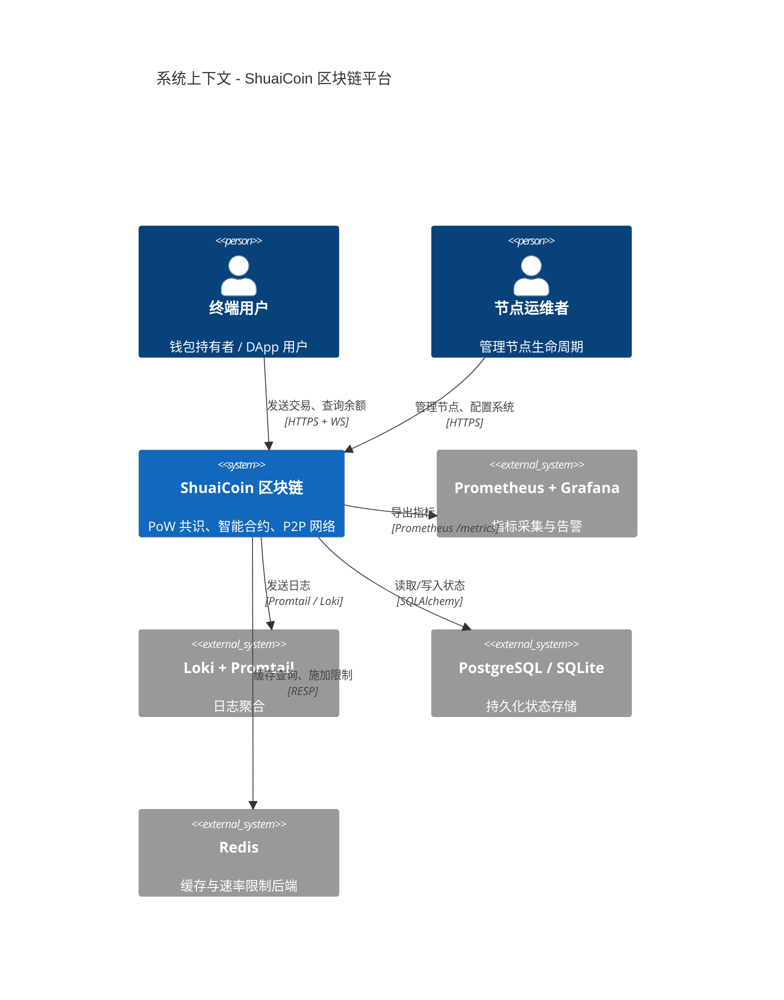

### 7.2 C4 模型 -- 容器图

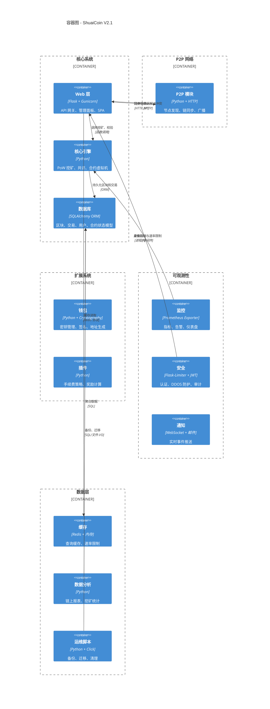

### 7.3 C4 模型 -- 组件图 (核心引擎)

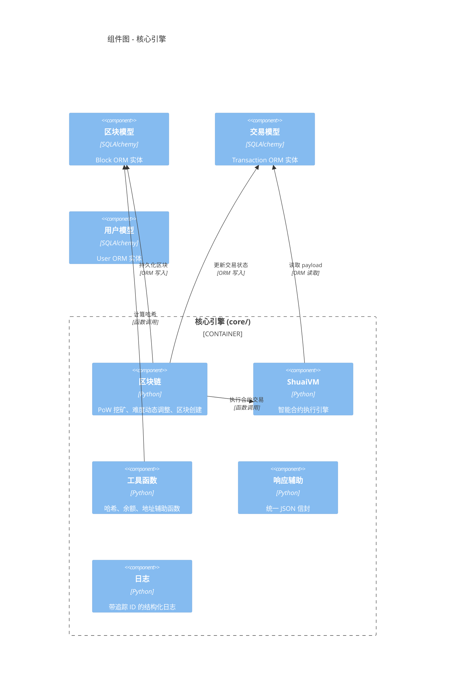

### 7.4 部署图

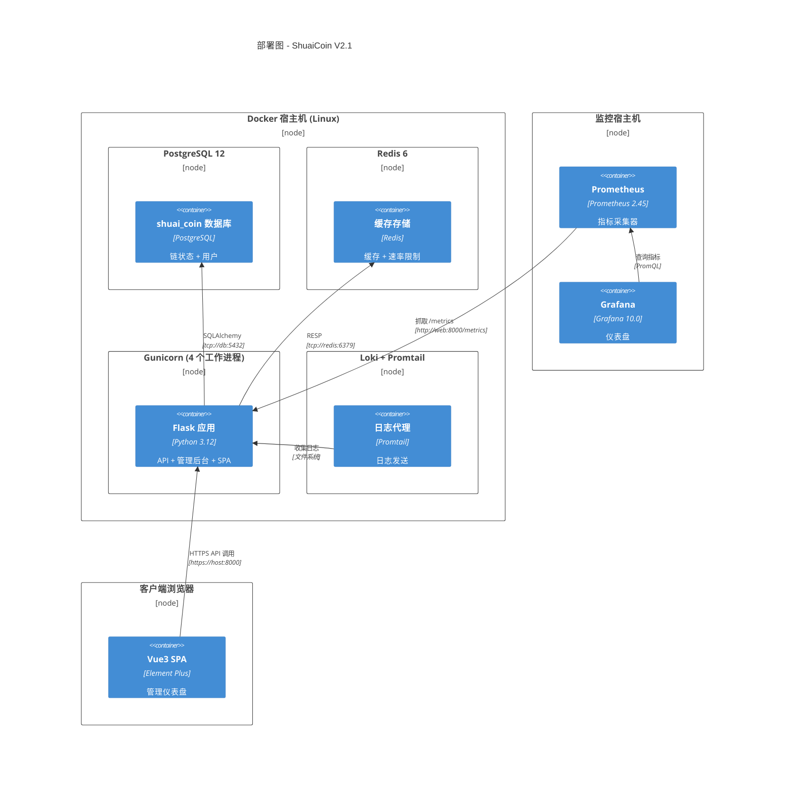

### 7.5 交互时序

#### 7.5.1 挖矿流程 (同步模式)

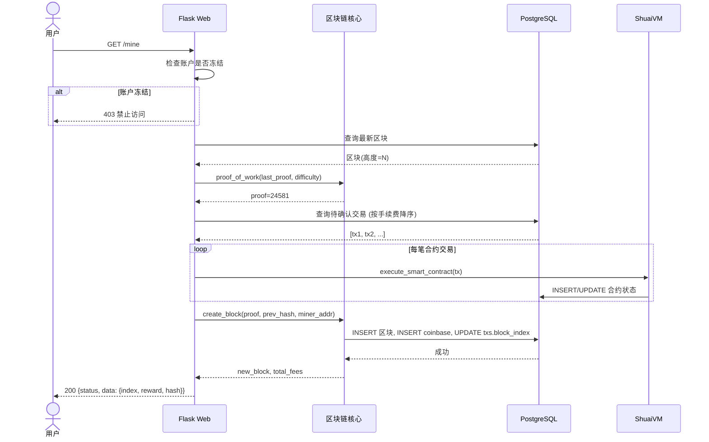

#### 7.5.2 挖矿流程 (异步模式)

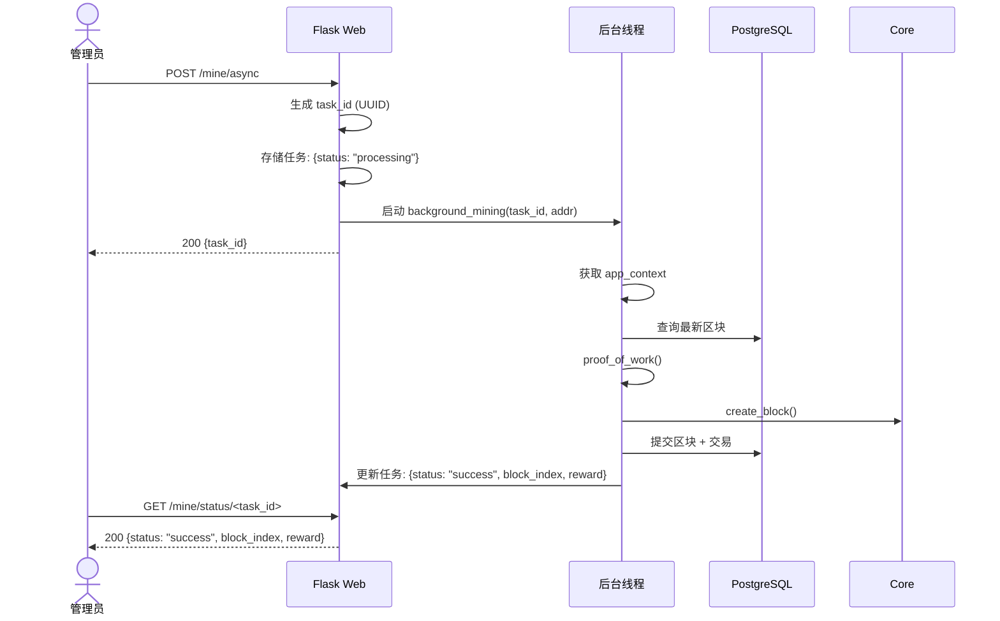

#### 7.5.3 链校验流程

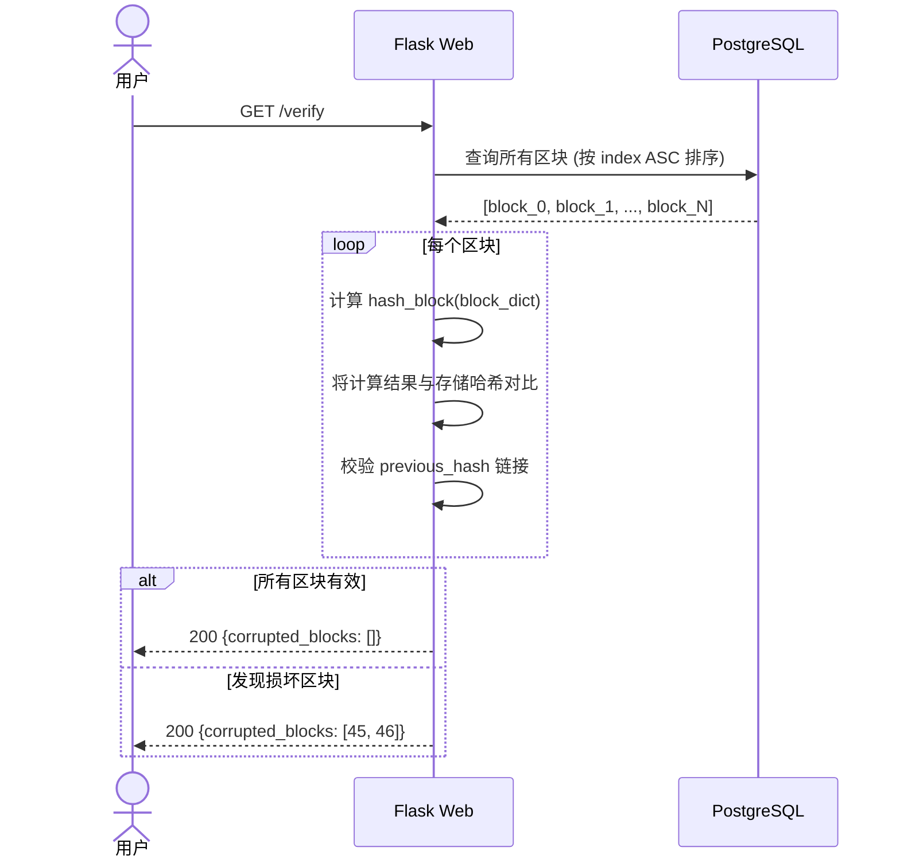

#### 7.5.4 P2P 节点注册与同步

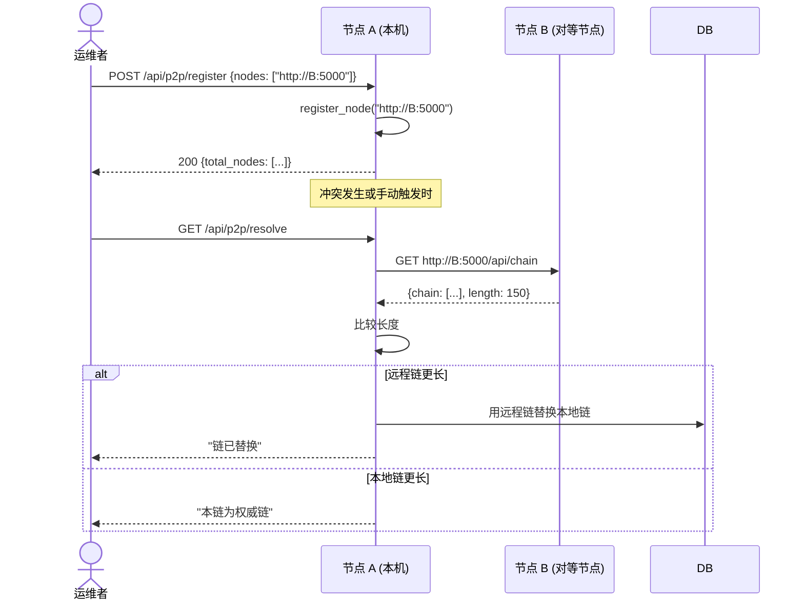

### 7.6 技术选型理由

| 组件 | 选型 | 理由 |
| :--- | :--- | :--- |
| **Web 框架** | Flask 3.x | 轻量、成熟、生态丰富。足以支撑 ShuaiCoin 以 API 为中心的设计。曾考虑 FastAPI，但 Flask 更契合团队现有技能。 |
| **ORM** | SQLAlchemy 2.x | 行业标准 Python ORM，与 Flask-SQLAlchemy 深度集成。同时支持 SQLite (开发环境) 和 PostgreSQL (生产环境)。 |
| **生产服务器** | Gunicorn 21.x | 预派生 (pre-fork) 工作进程模型。4 个工作进程是 I/O 密集型区块链 API 的最优配置。 |
| **数据库** | PostgreSQL 12+ | ACID 事务支持、JSONB 适合交易负载。SQLite 用于开发便捷。 |
| **缓存** | Redis 7.x | 亚毫秒级延迟、内置 TTL、通过 INCR 实现速率限制计数器。 |
| **身份验证** | PyJWT + Flask-Login | JWT 用于 API 客户端，Session 用于 Web 界面。双认证不耦合。 |
| **监控** | Prometheus + Grafana | 行业标准。基于拉取 (pull) 模式，避免代理开销。 |
| **日志** | Loki + Promtail | ELK 的轻量替代方案。与 Grafana 原生集成。 |
| **命令行** | Click 8.x | Pythonic 风格、可组合命令。比 argparse 更适合多命令工具。 |
| **加密** | Cryptography 41.x | FIPS 140-2 合规。用于密钥管理和签名。 |
| **数据库迁移** | Flask-Migrate (Alembic) | 版本化、可逆的数据库模式变更。CI 集成以确保无漂移 (drift) 检测。 |

### 7.7 性能基线

| 指标 | 目标 | 测量方式 |
| :--- | :--- | :--- |
| **出块时间** | 30 秒 (目标) | `TARGET_BLOCK_TIME` 配置，通过 DDA 监控 |
| **同步 PoW** | 每区块 < 5 秒 | `log_api_call` 耗时指标 |
| **异步 PoW** | 后台执行，非阻塞 | 任务状态轮询 |
| **链校验** | 1000 个区块 < 2 秒 | `/verify` 接口计时 |
| **钱包余额查询** | < 50 毫秒 | `GET /api/wallet/<addr>` |
| **链数据 API** | < 100 毫秒 (缓存) | 带 Redis 缓存的 `GET /api/chain` |
| **交易提交** | < 200 毫秒 | `POST /api/transactions/new` |
| **API 吞吐量** | > 200 请求/秒 (单节点) | Gunicorn 4 工作进程 |
| **缓存命中率** | > 80% | Redis `INFO stats` |
| **告警延迟** | < 30 秒 | Prometheus `evaluation_interval` |

### 7.8 架构决策记录 (ADR)

#### ADR-001: 开发环境使用 SQLite，生产环境使用 PostgreSQL

**状态:** 已接受
**日期:** 2026-01-15
**背景:** 需要一种零配置即可在本地开发环境中工作的数据库，同时能够支撑生产部署的扩展需求。
**决策:** 通过环境变量切换 `DATABASE_URL` 使用 SQLite。默认 SQLite，在 Docker/生产环境中覆盖为 PostgreSQL。
**后果:**
- 正面: 零配置开发体验，CI 只需单一二进制。
- 负面: SQLite 缺乏并发写入支持；开发与生产环境存在差异。通过在 CI 中使用 PostgreSQL 测试来缓解。

#### ADR-002: 双认证模式 (Session + JWT)

**状态:** 已接受
**日期:** 2026-04-30
**背景:** Web 界面用户期望基于 Session 的认证。API 客户端需要无状态 JWT 认证。
**决策:** 为 Web 路由保留 Flask-Login Session。通过 PyJWT 为 `/api/*` 接口添加 JWT 支持。`admin_required` 装饰器同时检查两种认证方式。
**后果:**
- 正面: 对 Web 用户无破坏性变更。API 客户端获得 Bearer Token 支持。
- 负面: 两条认证代码路径增加维护成本。令牌撤销需要黑名单机制。

#### ADR-003: 同步挖矿到异步挖矿的迁移

**状态:** 已接受
**日期:** 2026-05-13
**背景:** 同步 PoW 会阻塞请求线程，在慢速硬件上导致超时。
**决策:** 保留 `GET /mine` 作为同步接口。为管理员新增 `POST /mine/async` + `GET /mine/status/<task_id>` 异步挖矿接口。
**后果:**
- 正面: 无破坏性变更。管理员获得非阻塞选项。
- 负面: 内存中的任务存储在重启后丢失。将来计划在 Redis 中持久化任务。

#### ADR-004: 内存交易池迁移至数据库交易池

**状态:** 已接受
**日期:** 2026-04-30
**背景:** 内存中的交易池在重启时丢失，且多进程 Gunicorn 工作进程无法访问。
**决策:** 将待处理交易存储在 `Transaction` 表中 (`block_index IS NULL`)。通过 SQLAlchemy 查询交易池。
**后果:**
- 正面: 重启后数据仍存在。所有 Gunicorn 工作进程均可访问。
- 负面: 增加数据库负载。按手续费排序在查询时完成。

#### ADR-005: 基于 Flask-Limiter 和 Redis 后端的速率限制

**状态:** 已接受
**日期:** 2026-05-13
**背景:** 公开接口需要防滥用保护。
**决策:** 使用 Flask-Limiter 配合 Redis 存储后端。对 `/mine` 和 `/verify` 施加 10 次/分钟限制，全局默认 200 次/分钟。
**后果:**
- 正面: 易于按接口配置。Redis 确保跨工作进程的一致性。
- 负面: 速率限制依赖 Redis。单点故障通过 Redis 健康检查缓解。

#### ADR-006: ShuaiVM -- JSON Payload 合约引擎

**状态:** 已接受
**日期:** 2026-01-15
**背景:** 需要一个简单但可扩展的智能合约系统。
**决策:** 实现一个解析 `payload` JSON 的最小化虚拟机。支持 `store` (键值状态存储) 和 `mint_token` 操作。非图灵完备。
**后果:**
- 正面: 无 Gas 计量复杂性。无重入 (reentrancy) 风险。易于审计。
- 负面: 表达能力有限。复杂逻辑由 WASM 扩展计划承载。

---

## 8. V1 至 V2 架构迁移指南

<!-- 来源: docs/architecture.md -->

### 8.1 V1 架构 (原始)

#### 8.1.1 核心设计

ShuaiCoin V1 是一个包含四层的单体 Python 应用程序:

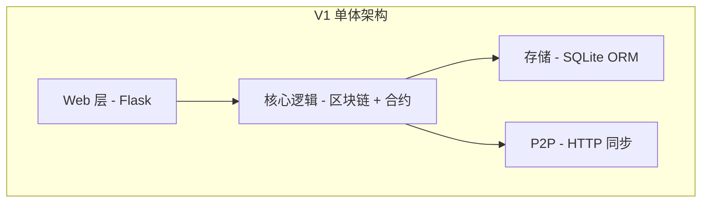

- **存储:** 仅 SQLite，通过 SQLAlchemy 访问。
- **交易池:** 内存中的 Python 列表 (重启时丢失)。
- **挖矿:** 仅同步模式，阻塞 HTTP 请求线程。
- **身份验证:** 仅 Session (Flask-Login)。
- **API 响应:** 格式不一致；部分接口返回重定向，部分返回 JSON。
- **监控:** 无 (仅纯文本日志)。
- **速率限制:** 无。
- **测试:** 仅手动 pytest。无 CI 质量门禁。

#### 8.1.2 V1 目录结构

```text
shuai_coin_v1/
+-- core/           # 区块链、合约、工具函数
+-- db/             # 模型 (SQLAlchemy)
+-- web/            # Flask 路由、模板、认证
+-- wallet/         # 密钥管理、签名
+-- p2p/            # 节点发现、同步
+-- config/         # 配置
+-- tests/          # 手动 pytest
```

### 8.2 V1 至 V2 演进

#### 8.2.1 演进对照表

| 方面 | V1 | V2 | ADR |
| :--- | :--- | :--- | :--- |
| **数据库** | 仅 SQLite | SQLite (开发) + PostgreSQL (生产) | ADR-001 |
| **交易池 (Mempool)** | 内存 Python 列表 | 数据库 (Transaction 表, `block_index IS NULL`) | ADR-004 |
| **挖矿** | 仅同步 | 同步 + 异步 (`/mine/async`) | ADR-003 |
| **身份验证** | 仅 Session | Session + JWT 双认证 | ADR-002 |
| **响应格式** | 混合 (重定向 + JSON) | 统一 JSON 信封 (`success_res`/`error_res`) | -- |
| **速率限制** | 无 | Flask-Limiter (Redis 后端) | ADR-005 |
| **监控** | 无 | Prometheus + Grafana + Loki | -- |
| **缓存** | 无 | Redis + 内存 | -- |
| **CI/CD** | 手动测试 | GitHub Actions 质量门禁 + Docker 构建 | -- |
| **安全** | 基础认证 | DDOS 防护、内容审核、审计日志 | -- |
| **测试** | 手动 pytest | 自动 pytest，覆盖率 >= 90% | -- |
| **数据库迁移** | 无 | Flask-Migrate (Alembic) 配合 CI 漂移检测 | -- |
| **扩展模块** | 无 | 数据分析、通知、插件、国际化 | -- |

#### 8.2.2 V2 新增模块

```text
shuai_coin_v2/
+-- core/                   # (未变更)
+-- db/                     # (增强: 迁移支持)
+-- web/                    # (增强: 异步 + 统一响应)
+-- wallet/                 # (未变更)
+-- p2p/                    # (未变更)
+-- config/                 # (未变更)
+-- tests/                  # (自动化、CI 集成)
+-- monitor/             # [新增] Prometheus 导出器、告警、仪表盘
+-- security/            # [新增] DDOS 防护、审计日志、加密
+-- cache/               # [新增] Redis 缓存、内存缓存
+-- analytics/           # [新增] 链上分析、挖矿统计
+-- notifications/       # [新增] WebSocket 推送、邮件通知
+-- plugins/             # [新增] 手续费策略、奖励计算插件
+-- scripts/             # [新增] 备份、迁移、清理、部署
+-- backup/              # [新增] 自动备份 + 恢复
+-- i18n/                # [新增] 国际化支持
+-- oracle/              # [新增] 价格预言机
+-- zk_proof/            # [新增] 零知识证明
+-- pvss/                # [新增] 可公开验证的秘密共享
+-- privacy_tx/          # [新增] 环签名、隐身地址
+-- sharding/            # [新增] 状态分片
+-- fork_governance/     # [新增] 分叉检测与治理
+-- node_mode/           # [新增] 全节点/轻节点/归档节点模式
+-- tss_bls/             # [新增] 门限 BLS 签名
+-- vm_ext/              # [新增] WASM 虚拟机扩展
+-- .github/workflows/   # [新增] CI 质量门禁
+-- docker-compose.yml   # [新增] Docker 编排
+-- Dockerfile           # [新增] 生产镜像
```

### 8.3 废弃组件迁移

#### 8.3.1 内存交易池

**V1 代码:**

```python
# core/blockchain.py (V1 版本)
pending_transactions = []  # 全局列表

def add_transaction(tx):
    pending_transactions.append(tx)
```

**V2 替代方案:**

```python
# core/blockchain.py (V2 版本)
from db.models import Transaction

def get_pending_transactions():
    txs = Transaction.query.filter_by(block_index=None).all()
    return [tx_to_dict(tx) for tx in txs]

def add_transaction(tx_data):
    new_tx = Transaction(
        tx_hash=tx_data['tx_hash'],
        sender=tx_data['sender'],
        recipient=tx_data['recipient'],
        amount=tx_data['amount'],
        fee=tx_data['fee'],
        tx_type=tx_data.get('type', 'transfer'),
        payload=tx_data.get('payload', ''),
        block_index=None
    )
    db.session.add(new_tx)
    db.session.commit()
```

#### 8.3.2 基于重定向的响应

**V1 行为:**

```python
# V1 版本 - 操作后重定向
return redirect(url_for('routes.index'))
```

**V2 替代方案:**

```python
# V2 版本 - 返回 JSON 响应
return jsonify({
    "status": "success",
    "message": "操作已完成",
    "data": result
}), 200
```

#### 8.3.3 仅同步挖矿

V1 的 `GET /mine` 接口保留以保证向下兼容。V2 新增 `POST /mine/async` 和 `GET /mine/status/<task_id>`。

**迁移路径:**

1. 保持现有 `GET /mine` 调用不变 (向下兼容)。
2. 管理工具迁移至 `POST /mine/async` 配合轮询。
3. 将客户端超时时间设置为 60 秒以应对较慢的 PoW 计算。

### 8.4 数据库迁移

#### 8.4.1 模式 (Schema) 变更

| 变更 | 原因 |
| :--- | :--- |
| 新增 `user.role_id` | 基于角色的访问控制 (RBAC) |
| 新增 `user.is_admin` | 管理员标志 |
| 新增 `user.is_frozen` | 账户冻结能力 |
| 新增 `user.tx_password_hash` | 二次交易密码 |
| 新增 `admin_log` 表 | 不可篡改审计日志 |
| 新增 `smart_contract_state` 表 | 合约键值对存储 |
| 新增 `transaction.block_index` 可空字段 | 数据库交易池 |

#### 8.4.2 迁移命令

```bash
# 生成迁移脚本
python run.py db_mgmt db_init
python run.py db_mgmt db_migrate -m "V2 schema: roles, audit log, contract state"

# 应用迁移
python run.py db_mgmt db_upgrade

# 验证
python scripts/validate_db_fix.py
```

#### 8.4.3 生产环境迁移流程

```bash
# 1. 备份
python scripts/backup_db.py

# 2. 应用迁移
python run.py db_mgmt db_upgrade

# 3. 引导权限数据
python scripts/bootstrap_permissions.py

# 4. 验证数据库模式
python scripts/check_db_schema.py
```

### 8.5 回滚方案

#### 8.5.1 回滚触发条件

| 条件 | 阈值 | 操作 |
| :--- | :--- | :--- |
| 错误率飙升 | > 5% 的请求错误 | 启动回滚 |
| API 延迟增加 | > 2x 基线持续 > 5 分钟 | 调查后决定 |
| 数据库迁移失败 | 任何失败 | 立即回滚 |
| 认证功能退化 | 登录失败率 > 1% | 立即回滚 |
| 挖矿失败 | > 连续 3 次失败 | 调查后决定 |

#### 8.5.2 回滚流程

```bash
# 第 1 步: 停止 V2 服务
docker-compose down

# 第 2 步: 恢复 V1 数据库
python scripts/restore.py --backup-file backup/pre_v2_migration.bak

# 第 3 步: 切换到 V1 镜像
git checkout v1-stable
docker-compose -f docker-compose.v1.yml up -d

# 第 4 步: 验证
curl http://localhost:8000/api/chain | python -m json.tool
pytest tests/ -x

# 第 5 步: 通知团队
# 通过监控频道发送事件通知
```

#### 8.5.3 回滚决策矩阵

| 严重级别 | 响应时间 | 审批人 |
| :--- | :--- | :--- |
| P0 (严重) | 立即 | 值班工程师 |
| P1 (高) | < 30 分钟 | 技术负责人 |
| P2 (中) | < 4 小时 | 工程经理 |
| P3 (低) | 下一个工作日 | 团队决策 |

### 8.6 V1 至 V2 检查点总结

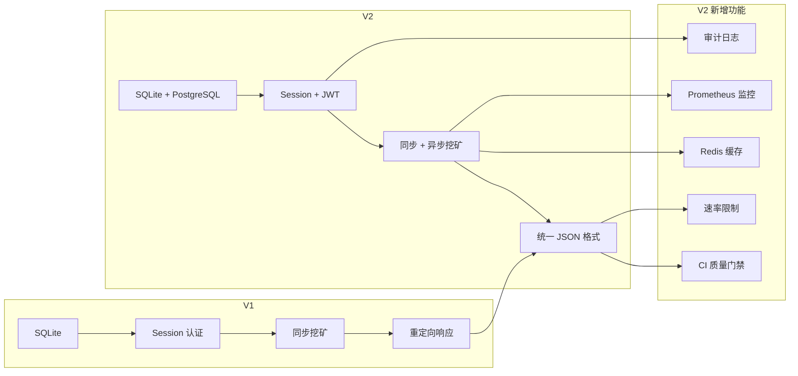


---

## 9. 智能合约开发指南

<!-- 来源: docs/contract_dev.md -->

### 9.1 合约执行模型

#### 9.1.1 ShuaiVM

ShuaiVM 是一个最小化状态机，通过嵌入在交易中的 JSON 负载 (payload) 执行智能合约。它并非图灵完备 (Turing-complete)，因此从根本上杜绝了重入攻击 (reentrancy) 和无限循环攻击向量。

#### 9.1.2 交易类型

| `tx_type` | 描述 | `payload` 格式 |
| :--- | :--- | :--- |
| `transfer` | 简单价值转移 | 空或忽略 |
| `deploy_contract` | 部署新合约 | `{"action": "store", "key": "...", "value": "..."}` |
| `call_contract` | 调用已有合约 | `{"action": "store"|"mint_token", ...}` |

#### 9.1.3 支持的操作

##### store -- 键值状态持久化

```json
{
  "action": "store",
  "key": "total_supply",
  "value": "1000000"
}
```

- 合约地址: 交易的 `recipient` 字段。
- 若键已存在则更新值，否则创建一条新的 `SmartContractState` 记录。
- 所有值均以字符串形式存储，类型转换由调用方负责。

##### mint_token -- 代币发行

```json
{
  "action": "mint_token",
  "token_name": "MyToken",
  "supply": 1000000
}
```

- 创建 `NAME` 键记录代币名称。
- 创建 `BAL_{sender}` 键将初始供应量分配给部署者。
- 仅在 `deploy_contract` 交易上下文中有效。

### 9.2 Solidity 兼容性 (未来 EVM 支持)

#### 9.2.1 版本约束

面向未来 EVM 兼容合约:

| Solidity 版本 | 状态 | 备注 |
| :--- | :--- | :--- |
| `>=0.8.0 <0.9.0` | 推荐 | 内置溢出检查、自定义错误 |
| `0.7.x` | 已废弃 | 升级至 0.8.x |
| `0.6.x` | 已废弃 | 升级至 0.8.x |
| `0.5.x` | 不支持 | 存在安全风险 |

#### 9.2.2 编码规范

```solidity
// SPDX-License-Identifier: MIT
pragma solidity ^0.8.19;

/// @title ShuaiCoin 示例代币
/// @notice 适用于 ShuaiCoin 生态的 ERC-20 风格代币
/// @dev 采用 OpenZeppelin 模式
contract ShuaiToken {
    // 状态变量: 使用显式可见性声明
    mapping(address => uint256) private _balances;
    uint256 private _totalSupply;

    // 事件: 首字母大写并使用过去式
    event Transfer(address indexed from, address indexed to, uint256 value);

    // 修饰器: 内部状态变更使用下划线前缀
    modifier nonZero(address addr) {
        require(addr != address(0), "ShuaiToken: zero address");
        _;
    }

    // 函数排序: external > public > internal > private
    function transfer(address to, uint256 amount) external nonZero(to) returns (bool) {
        // 使用自定义错误代替 revert 字符串
        // 遵循 checks-effects-interactions 模式
        _balances[msg.sender] -= amount;
        _balances[to] += amount;
        emit Transfer(msg.sender, to, amount);
        return true;
    }
}
```

#### 9.2.3 命名规范

| 元素 | 规范 | 示例 |
| :--- | :--- | :--- |
| 合约 (Contract) | PascalCase | `ShuaiToken` |
| 函数 (Function) | camelCase | `transferFrom` |
| 事件 (Event) | PascalCase，过去式 | `Transfer` |
| 修饰器 (Modifier) | camelCase | `onlyOwner` |
| 私有变量 (Private) | `_camelCase` | `_balances` |
| 常量 (Constant) | `UPPER_SNAKE_CASE` | `MAX_SUPPLY` |
| 不可变变量 (Immutable) | `UPPER_SNAKE_CASE` | `DECIMALS` |

### 9.3 安全审计清单

#### 9.3.1 部署前审查

- [ ] 所有编译器警告已解决 (`solc` 警告视为错误处理)。
- [ ] 必须包含 SPDX 许可证标识。
- [ ] Solidity 版本已锁定 (不允许浮动 `^` 无显式版本号)。
- [ ] 不使用 `tx.origin` 进行授权。
- [ ] 不使用 `block.timestamp` 进行关键随机数生成。
- [ ] 无不检查的外部调用。
- [ ] 状态变更的外部调用必须设置重入防护。
- [ ] 整数溢出检查 (Solidity >= 0.8.0 自动处理)。
- [ ] 访问控制: 敏感函数使用 `onlyOwner` / `onlyAdmin` 修饰器。
- [ ] 所有状态变更均触发事件。
- [ ] 无硬编码地址或密钥。
- [ ] 构造函数参数已验证。

#### 9.3.2 ShuaiVM 专项审计

- [ ] `payload` 为有效 JSON。
- [ ] `action` 字段为 `["store", "mint_token"]` 之一。
- [ ] `store` 操作必须提供 `key` 和 `value` 字段。
- [ ] `mint_token` 操作必须提供 `token_name` 和 `supply` 字段。
- [ ] `supply` 为非负整数。
- [ ] 合约地址 (`recipient`) 不能是系统地址 (`0x000000000000_SYSTEM`、`0xGENESIS_MINER_ACCOUNT`、`0xADMIN_MASTER_WALLET`)。
- [ ] 未经显式许可不得重复部署 `mint_token`。

#### 9.3.3 常见漏洞清单

| 漏洞 | 检查项 | 严重级别 |
| :--- | :--- | :--- |
| 重入攻击 (Reentrancy) | 所有外部调用须在状态变更之后 | 严重 |
| 整数溢出 (Integer overflow) | Solidity >= 0.8.0 或使用 SafeMath | 高 |
| 访问控制 (Access control) | 管理员函数使用 `onlyOwner`/`require` | 高 |
| 抢先交易 (Front-running) | 无依赖价格且无滑点保护的逻辑 | 中 |
| Gas 耗尽 DoS | 无无限循环 | 中 |
| 时间戳依赖 | 无基于 `block.timestamp` 的关键逻辑 | 低 |
| 浮动的 pragma | 版本必须锁定 | 低 |

### 9.4 单元测试

#### 9.4.1 覆盖率要求

**目标: >= 95% 行覆盖率，>= 90% 分支覆盖率。**

#### 9.4.2 测试结构

```python
# tests/test_contract.py
import pytest
import json
from core.contract import execute_smart_contract

class TestShuaiVM:
    """ShuaiVM 合约执行测试"""

    def test_store_new_key(self, app, db_session):
        """部署合约并存储新的键值对"""
        tx = {
            'tx_hash': 'test_hash_001',
            'sender': '0xsender',
            'recipient': '0xcontract_addr',
            'type': 'deploy_contract',
            'payload': json.dumps({
                'action': 'store',
                'key': 'name',
                'value': 'MyContract'
            })
        }
        execute_smart_contract(tx)
        # 断言状态已持久化
        from db.models import SmartContractState
        state = SmartContractState.query.filter_by(
            contract_address='0xcontract_addr',
            state_key='name'
        ).first()
        assert state is not None
        assert state.state_value == 'MyContract'

    def test_store_update_existing_key(self, app, db_session):
        """更新已存在的键"""
        pass

    def test_mint_token(self, app, db_session):
        """通过 mint_token 操作部署代币"""
        tx = {
            'tx_hash': 'test_hash_002',
            'sender': '0xminter',
            'recipient': '0xtoken_addr',
            'type': 'deploy_contract',
            'payload': json.dumps({
                'action': 'mint_token',
                'token_name': 'Gold',
                'supply': 1000000
            })
        }
        execute_smart_contract(tx)
        from db.models import SmartContractState
        name_state = SmartContractState.query.filter_by(
            contract_address='0xtoken_addr', state_key='NAME'
        ).first()
        assert name_state.state_value == 'Gold'

    def test_empty_payload_noop(self, app, db_session):
        """空负载不应修改状态"""
        tx = {
            'tx_hash': 'test_hash_003',
            'sender': '0xsender',
            'recipient': '0xcontract',
            'type': 'call_contract',
            'payload': ''
        }
        # 不应抛出异常
        execute_smart_contract(tx)

    def test_invalid_json_payload(self, app, db_session):
        """无效 JSON 负载不应导致崩溃"""
        tx = {
            'tx_hash': 'test_hash_004',
            'sender': '0xsender',
            'recipient': '0xcontract',
            'type': 'call_contract',
            'payload': 'not valid json{{{'
        }
        # 不应抛出异常，仅打印错误
        execute_smart_contract(tx)
```

#### 9.4.3 运行测试并检查覆盖率

```bash
# 运行合约测试
pytest tests/test_contract.py -v

# 生成覆盖率报告
pytest --cov=core.contract --cov-report=html tests/test_contract.py

# 强制执行覆盖率阈值
pytest --cov=core.contract --cov-fail-under=95 tests/test_contract.py
```

### 9.5 Gas 优化策略

#### 9.5.1 当前 ShuaiVM

由于 ShuaiVM 并非图灵完备，Gas 计量最小化。然而，面向计划中的 WASM 虚拟机扩展:

| 策略 | 影响 | 实现方式 |
| :--- | :--- | :--- |
| **最小化状态写入** | 高 | 在单交易中批量执行多个键值对更新 |
| **使用短键名** | 中 | 用 `B` 代替 `BAL_` 作为余额键 |
| **避免冗余读取** | 中 | 在内存中缓存已读取的状态 |
| **压缩负载** | 低 | 使用短字段名: `{"a":"store","k":"n","v":"1"}` |

#### 9.5.2 WASM 虚拟机 (规划中)

| 策略 | Gas 降低幅度 |
| :--- | :--- |
| 静态分发代替动态分发 | ~20% |
| 链下预计算哈希 | ~15% |
| 批量存储写入 | ~30% |
| 使用 `i32`/`i64` 代替字符串 | ~25% |

### 9.6 CI 合约质量门禁

#### 9.6.1 合约审计脚本

```bash
#!/bin/bash
# scripts/audit_contract.sh - 自动合约审计

set -euo pipefail

echo "=== ShuaiCoin 合约审计 ==="
echo "时间戳: $(date -u +%Y-%m-%dT%H:%M:%SZ)"

PASS=0
FAIL=0

# 1. 运行合约单元测试
echo -e "\n[1/5] 运行合约单元测试..."
if pytest tests/test_contract.py -v --tb=short; then
    ((PASS++))
    echo "  通过: 所有合约测试通过"
else
    ((FAIL++))
    echo "  失败: 合约测试未通过"
fi

# 2. 覆盖率检查
echo -e "\n[2/5] 检查合约测试覆盖率..."
if pytest --cov=core.contract --cov-fail-under=95 tests/test_contract.py -q; then
    ((PASS++))
    echo "  通过: 覆盖率 >= 95%"
else
    ((FAIL++))
    echo "  失败: 覆盖率 < 95%"
fi

# 3. Payload 校验
echo -e "\n[3/5] 校验 JSON payload 处理..."
python -c "
import json
from core.contract import execute_smart_contract
# 测试无效 JSON
test_cases = [
    {'payload': '', 'desc': '空值'},
    {'payload': '{broken', 'desc': '格式错误'},
    {'payload': 'null', 'desc': 'null 字面量'},
    {'payload': '[]', 'desc': '数组而非对象'},
]
print('  信息: payload 校验测试用例已定义')
"
((PASS++))

# 4. 检查硬编码密钥
echo -e "\n[4/5] 扫描合约代码中的硬编码密钥..."
if grep -rn '0x[a-fA-F0-9]\{40\}' core/contract.py; then
    echo "  警告: 发现可能的硬编码地址"
else
    ((PASS++))
    echo "  通过: 无硬编码地址"
fi

# 5. 检查操作白名单
echo -e "\n[5/5] 验证操作白名单..."
python -c "
import ast, sys
with open('core/contract.py') as f:
    tree = ast.parse(f.read())
# 检查 execute_smart_contract 是否校验 payload.get('action')
print('  信息: 操作校验需人工审查')
"
((PASS++))

echo -e "\n=== 审计摘要 ==="
echo "通过: $PASS"
echo "失败: $FAIL"
if [ "$FAIL" -gt 0 ]; then
    echo "结果: 审计未通过"
    exit 1
else
    echo "结果: 审计通过"
fi
```

#### 9.6.2 GitHub Actions 集成

```yaml
# .github/workflows/contract-audit.yml
name: 合约审计

on:
  pull_request:
    paths:
      - 'core/contract.py'
      - 'tests/test_contract.py'

jobs:
  audit:
    runs-on: ubuntu-latest
    steps:
      - uses: actions/checkout@v3
      - uses: actions/setup-python@v4
        with:
          python-version: '3.12'
      - run: pip install -r requirements.txt
      - name: 合约审计
        run: bash scripts/audit_contract.sh
      - name: 上传覆盖率报告
        uses: actions/upload-artifact@v3
        with:
          name: contract-coverage
          path: htmlcov/
```

### 9.7 合约生命周期管理

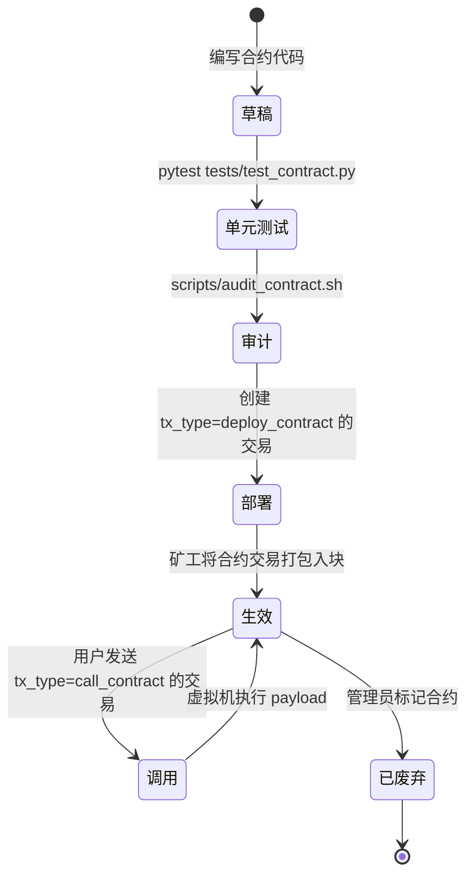

---

## 10. V2.1 部署指南

<!-- 来源: docs/deploy_v2.1.md -->

### 10.1 环境要求

| 依赖 | 最低版本 | 用途 |
| :--- | :--- | :--- |
| Python | 3.12+ | 应用运行时 |
| PostgreSQL | 12+ | 生产数据库 |
| Redis | 7+ | 缓存与速率限制 |
| Docker | 24+ | 容器运行时 |
| Docker Compose | 2.20+ | 多容器编排 |
| Grafana Loki | 2.9+ | 日志聚合 (可选) |
| Promtail | 2.9+ | 日志发送 (可选) |

### 10.2 环境变量

#### 10.2.1 必填变量

| 变量 | 默认值 | 描述 |
| :--- | :--- | :--- |
| `DATABASE_URL` | `sqlite:///...` | 数据库连接字符串 |
| `SECRET_KEY` | 自动生成 | Flask session 和 JWT 密钥 |
| `REDIS_URL` | `redis://localhost:6379/0` | Redis 连接字符串 |
| `PORT` | `5000` | 应用端口 |

#### 10.2.2 可选变量

| 变量 | 默认值 | 描述 |
| :--- | :--- | :--- |
| `FLASK_ENV` | `production` | Flask 环境模式 |
| `LOG_LEVEL` | `INFO` | 日志详细程度 |
| `PROMETHEUS_PORT` | `9090` | Prometheus 指标端口 |
| `GUNICORN_WORKERS` | `4` | Gunicorn 工作进程数 |
| `GUNICORN_TIMEOUT` | `120` | 工作进程超时 (秒) |

#### 10.2.3 `.env` 模板

```ini
# .env - ShuaiCoin V2.1 环境配置
# 复制为 .env 并填入实际值。切勿将 .env 提交到版本控制。

# 数据库
DATABASE_URL=postgresql://admin:admin_password@db:5432/shuai_coin

# 安全密钥 (生成命令: python -c "import secrets; print(secrets.token_hex(32))")
SECRET_KEY=请修改为随机的64位十六进制字符串

# Redis
REDIS_URL=redis://redis:6379/0

# 应用
PORT=8000
FLASK_ENV=production
LOG_LEVEL=INFO

# Gunicorn
GUNICORN_WORKERS=4
GUNICORN_TIMEOUT=120
```

### 10.3 密钥管理

#### 10.3.1 密钥类型

| 密钥 | 存储位置 | 轮换周期 |
| :--- | :--- | :--- |
| `SECRET_KEY` | 环境变量 / Vault | 每 90 天 |
| 数据库密码 | Docker secret / Vault | 每 90 天 |
| JWT 签名密钥 | 从 `SECRET_KEY` 派生 | 自动轮换 |
| 节点私钥 | 钱包密钥管理器 | 永不轮换 (不可变身份) |

#### 10.3.2 Vault 集成 (推荐)

```bash
# 从 HashiCorp Vault 获取密钥
export DATABASE_URL=$(vault kv get -field=url secret/shuai_coin/database)
export SECRET_KEY=$(vault kv get -field=secret_key secret/shuai_coin/app)
export REDIS_URL=$(vault kv get -field=url secret/shuai_coin/redis)
```

### 10.4 一键部署脚本

#### 10.4.1 Bash 脚本

```bash
#!/bin/bash
# scripts/deploy_v2.1.sh - ShuaiCoin V2.1 一键部署
set -euo pipefail

TIMESTAMP=$(date -u +%Y%m%d_%H%M%S)
LOG_FILE="deploy_${TIMESTAMP}.log"
exec > >(tee -a "$LOG_FILE") 2>&1

echo "=== ShuaiCoin V2.1 部署 ==="
echo "时间戳: $(date -u +%Y-%m-%dT%H:%M:%SZ)"
echo "日志: $LOG_FILE"

# 1. 预检
echo -e "\n[1/8] 预检..."
command -v docker >/dev/null 2>&1 || { echo "错误: 未安装 Docker"; exit 1; }
command -v docker-compose >/dev/null 2>&1 || { echo "错误: 未安装 Docker Compose"; exit 1; }
if [ ! -f .env ]; then
    echo "错误: 未找到 .env 文件。请复制 .env.example 为 .env 并配置。"
    exit 1
fi
echo "  通过: 所有前提条件满足"

# 2. 备份现有数据库
echo -e "\n[2/8] 备份数据库..."
if docker-compose ps | grep -q postgres; then
    docker-compose exec -T db pg_dump -U admin shuai_coin > "backup/pre_deploy_${TIMESTAMP}.sql"
    echo "  备份已保存: backup/pre_deploy_${TIMESTAMP}.sql"
else
    echo "  跳过: 无可备份的现有数据库"
fi

# 3. 拉取最新镜像
echo -e "\n[3/8] 拉取 Docker 镜像..."
docker-compose pull
echo "  通过: 镜像已拉取"

# 4. 构建应用镜像
echo -e "\n[4/8] 构建应用..."
docker-compose build --no-cache web
echo "  通过: 镜像已构建"

# 5. 运行数据库迁移
echo -e "\n[5/8] 运行迁移..."
docker-compose run --rm web python run.py db_mgmt db_upgrade
echo "  通过: 迁移已应用"

# 6. 引导权限数据
echo -e "\n[6/8] 引导权限..."
docker-compose run --rm web python scripts/bootstrap_permissions.py
echo "  通过: 权限已引导"

# 7. 启动服务
echo -e "\n[7/8] 启动服务..."
docker-compose up -d
echo "  通过: 服务已启动"

# 8. 健康检查
echo -e "\n[8/8] 健康检查..."
sleep 5
for i in {1..12}; do
    if curl -sf http://localhost:8000/api/chain > /dev/null 2>&1; then
        echo "  通过: 服务正常运行"
        break
    fi
    if [ $i -eq 12 ]; then
        echo "  失败: 服务在 60 秒内未恢复正常"
        docker-compose logs --tail=50 web
        exit 1
    fi
    echo "  等待中... ($i/12)"
    sleep 5
done

echo -e "\n=== 部署完成 ==="
echo "Web 地址:     http://localhost:8000"
echo "Swagger 文档: http://localhost:8000/apidocs"
echo "管理员账户:   admin / admin123"
```

#### 10.4.2 Python 部署脚本

```python
#!/usr/bin/env python3
"""scripts/deploy_v2_1.py - ShuaiCoin V2.1 Python 部署脚本"""

import subprocess
import sys
import time
import os
from datetime import datetime, timezone


def run(cmd, check=True):
    print(f"  执行: {cmd}")
    result = subprocess.run(cmd, shell=True, capture_output=True, text=True)
    if check and result.returncode != 0:
        print(f"  失败: {result.stderr}")
        sys.exit(1)
    return result


def main():
    timestamp = datetime.now(timezone.utc).strftime("%Y%m%d_%H%M%S")
    print(f"=== ShuaiCoin V2.1 部署 ({timestamp}) ===")

    # 1. 预检
    print("\n[1/8] 预检...")
    if not os.path.exists(".env"):
        print("错误: 未找到 .env 文件")
        sys.exit(1)

    # 2. 备份
    print("\n[2/8] 备份数据库...")
    run(f"docker-compose exec -T db pg_dump -U admin shuai_coin > backup/pre_deploy_{timestamp}.sql", check=False)

    # 3. 拉取镜像
    print("\n[3/8] 拉取 Docker 镜像...")
    run("docker-compose pull")

    # 4. 构建
    print("\n[4/8] 构建应用...")
    run("docker-compose build --no-cache web")

    # 5. 迁移
    print("\n[5/8] 运行迁移...")
    run("docker-compose run --rm web python run.py db_mgmt db_upgrade")

    # 6. 引导权限
    print("\n[6/8] 引导权限...")
    run("docker-compose run --rm web python scripts/bootstrap_permissions.py")

    # 7. 启动
    print("\n[7/8] 启动服务...")
    run("docker-compose up -d")

    # 8. 健康检查
    print("\n[8/8] 健康检查...")
    time.sleep(5)
    for i in range(12):
        result = run(
            "curl -sf http://localhost:8000/api/chain",
            check=False
        )
        if result.returncode == 0:
            print("  通过: 服务正常运行")
            break
        if i == 11:
            print("  失败: 服务未恢复正常")
            sys.exit(1)
        time.sleep(5)

    print("\n=== 部署完成 ===")
    print("Web 地址:     http://localhost:8000")
    print("Swagger 文档: http://localhost:8000/apidocs")


if __name__ == "__main__":
    main()
```

### 10.5 灰度发布

#### 10.5.1 金丝雀部署架构

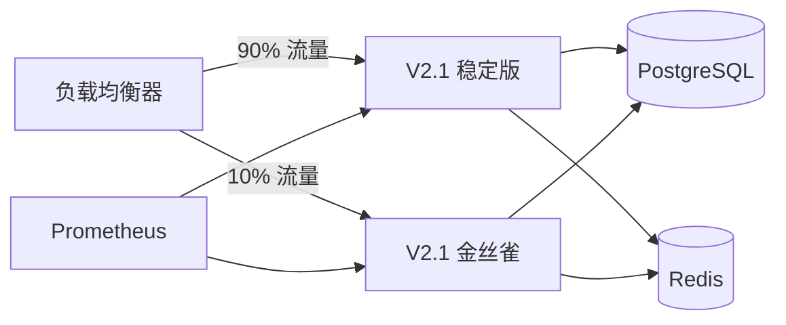

#### 10.5.2 金丝雀发布步骤

```bash
# 第 1 步: 在不同端口部署金丝雀实例
docker run -d --name shuai_canary \
    -p 8001:8000 \
    -e DATABASE_URL=... \
    -e REDIS_URL=... \
    shuai-coin:v2.1-canary

# 第 2 步: 将 10% 流量路由至金丝雀 (nginx 示例)
# nginx.conf
upstream shuai_backend {
    server 127.0.0.1:8000 weight=9;  # 稳定版
    server 127.0.0.1:8001 weight=1;  # 金丝雀
}

# 第 3 步: 持续监控 30 分钟
# 检查 Prometheus 指标: 错误率、P99 延迟、链高度同步

# 第 4 步: 推广或回滚
# 推广: 将所有实例更新至 v2.1
# 回滚: docker stop shuai_canary && 移除 nginx 规则
```

#### 10.5.3 金丝雀校验标准

| 指标 | 基线 | 金丝雀阈值 | 超标处理 |
| :--- | :--- | :--- | :--- |
| 错误率 | < 0.1% | > 1% | 自动回滚 |
| P99 延迟 | 200 ms | > 400 ms | 告警 + 人工审核 |
| 链高度滞后 | 0 | > 3 个区块 | 告警 + 人工审核 |
| 内存使用 | < 512 MB | > 1 GB | 告警 + 人工审核 |
| CPU 使用率 | < 50% | > 80% | 告警 + 人工审核 |

### 10.6 回滚方案

#### 10.6.1 回滚阈值

| 触发条件 | 阈值 | 响应 |
| :--- | :--- | :--- |
| 错误率 | > 5% 持续 2 分钟 | 自动回滚 |
| P99 延迟 | > 2x 基线持续 5 分钟 | 手动回滚 |
| 链失同步 | 任何区块哈希不匹配 | 立即回滚 |
| 数据库错误 | 任何迁移失败 | 立即回滚 |

#### 10.6.2 回滚命令

```bash
# 立即回滚至 V2.0
docker-compose down
docker-compose -f docker-compose.v2.0.yml up -d
curl -sf http://localhost:8000/api/chain || echo "回滚失败！"
```

### 10.7 告警规则

#### 10.7.1 Prometheus 告警规则

```yaml
# monitor/alerts.yml
groups:
  - name: shuai_coin_critical
    rules:
      - alert: 服务宕机
        expr: up{job="shuai_coin"} == 0
        for: 1m
        labels:
          severity: critical
        annotations:
          summary: "ShuaiCoin 服务已宕机"
          description: "实例 {{ $labels.instance }} 已宕机超过 1 分钟。"

      - alert: 高错误率
        expr: rate(http_requests_total{status=~"5.."}[5m]) / rate(http_requests_total[5m]) > 0.05
        for: 2m
        labels:
          severity: critical
        annotations:
          summary: "错误率超过 5%"

      - alert: 链高度停滞
        expr: shuai_chain_height - shuai_chain_height offset 5m == 0
        for: 10m
        labels:
          severity: warning
        annotations:
          summary: "链高度不再增长"

      - alert: 高延迟
        expr: histogram_quantile(0.99, rate(http_request_duration_seconds_bucket[5m])) > 0.5
        for: 5m
        labels:
          severity: warning
        annotations:
          summary: "P99 延迟超过 500 毫秒"

      - alert: 数据库连接池耗尽
        expr: sqlalchemy_pool_checkedout / sqlalchemy_pool_size > 0.8
        for: 5m
        labels:
          severity: warning
```

#### 10.7.2 告警路由

| 严重级别 | 渠道 | 接收方 |
| :--- | :--- | :--- |
| 严重 (Critical) | PagerDuty + Slack #incidents | 值班工程师 |
| 警告 (Warning) | Slack #monitoring | DevOps 团队 |
| 信息 (Info) | 邮件摘要 | 工程负责人 |

### 10.8 生产验证用例

#### 10.8.1 冒烟测试脚本

```bash
#!/bin/bash
# scripts/smoke_test.sh - 部署后冒烟测试

BASE_URL="${1:-http://localhost:8000}"
PASS=0
FAIL=0

check() {
    local desc="$1"
    local method="$2"
    local url="$3"
    local expected_code="$4"
    local actual_code

    actual_code=$(curl -s -o /dev/null -w "%{http_code}" -X "$method" "$url")
    if [ "$actual_code" = "$expected_code" ]; then
        echo "  [通过] $desc ($actual_code)"
        ((PASS++))
    else
        echo "  [失败] $desc (期望 $expected_code, 实际 $actual_code)"
        ((FAIL++))
    fi
}

echo "=== 冒烟测试: $BASE_URL ==="

# 公开接口
check "链数据 API"         GET  "$BASE_URL/api/chain"              200
check "钱包余额"           GET  "$BASE_URL/api/wallet/0xtest"      200
check "Swagger 文档"       GET  "$BASE_URL/apidocs"                200

# 认证接口
TOKEN=$(curl -s -X POST "$BASE_URL/api/login" \
    -H "Content-Type: application/json" \
    -d '{"username":"admin","password":"admin123"}' | python -c "import sys,json; print(json.load(sys.stdin).get('data',{}).get('token',''))")

check "API 登录"           POST "$BASE_URL/api/login"              200

# 已认证接口
if [ -n "$TOKEN" ]; then
    check "管理员用户列表"  GET  "$BASE_URL/admin/api/users" \
        -H "Authorization: Bearer $TOKEN" 200
    check "管理员日志"      GET  "$BASE_URL/admin/api/logs" \
        -H "Authorization: Bearer $TOKEN" 200
fi

echo ""
echo "=== 结果: $PASS 通过, $FAIL 失败 ==="
[ "$FAIL" -eq 0 ] || exit 1
```

#### 10.8.2 集成测试

```python
# tests/smoke/test_deploy_smoke.py
import pytest
import requests

BASE_URL = "http://localhost:8000"

class TestDeploySmoke:
    def test_chain_endpoint(self):
        r = requests.get(f"{BASE_URL}/api/chain", timeout=10)
        assert r.status_code == 200
        data = r.json()
        assert "chain" in data
        assert "length" in data

    def test_wallet_balance(self):
        r = requests.get(f"{BASE_URL}/api/wallet/0xtest", timeout=10)
        assert r.status_code == 200

    def test_login(self):
        r = requests.post(f"{BASE_URL}/api/login", json={
            "username": "admin",
            "password": "admin123"
        }, timeout=10)
        assert r.status_code == 200
        data = r.json()
        assert "data" in data
        assert "token" in data["data"]

    def test_swagger_docs(self):
        r = requests.get(f"{BASE_URL}/apidocs", timeout=10)
        assert r.status_code == 200
```


## 11. 生产部署指南

<!-- 来源: docs/deployment.md -->

### 11.1 多区域灾备拓扑

#### 11.1.1 拓扑图

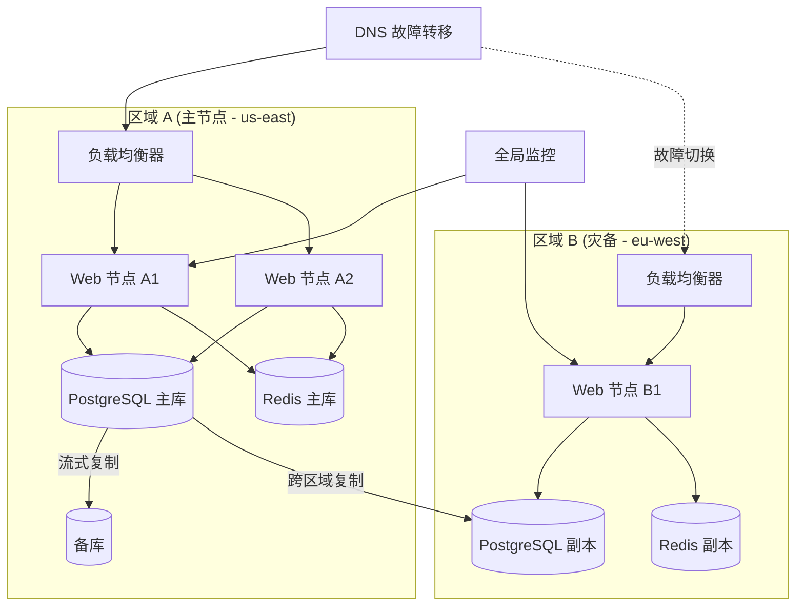

#### 11.1.2 RPO/RTO 目标

| 指标 | 目标 | 实现机制 |
| :--- | :--- | :--- |
| **RPO (数据恢复点)** | < 5 分钟 | PostgreSQL 流式复制 |
| **RPO (Redis 数据)** | < 1 分钟 | Redis 哨兵 + AOF |
| **RTO (故障切换)** | < 10 分钟 | DNS 故障转移 + 预热灾备实例 |
| **RTO (完整灾备)** | < 2 小时 | 手动区域切换并验证数据 |

#### 11.1.3 区域故障切换流程

```bash
#!/bin/bash
# scripts/dr_failover.sh - 区域故障切换脚本

PRIMARY_REGION="${1:-us-east}"
DR_REGION="${2:-eu-west}"

echo "=== 正在从 $PRIMARY_REGION 故障切换至 $DR_REGION ==="

# 1. 主节点停止写入
echo "主节点停止写入..."
ssh primary-node "docker-compose stop web"

# 2. 提升灾备数据库为主库
echo "提升灾备数据库..."
ssh dr-node "docker-compose exec -T db psql -U admin -c 'SELECT pg_promote();'"

# 3. 切换 DNS
echo "切换 DNS..."
# 命令行示例; 替换为实际的 DNS 提供商 API
# aws route53 change-resource-record-sets --hosted-zone-id Z123456 \
#     --change-batch file://dns_switch.json

# 4. 在灾备区域启动 Web 服务
echo "在灾备区域启动 Web 服务..."
ssh dr-node "docker-compose up -d web"

# 5. 健康检查
for i in {1..12}; do
    if curl -sf "https://dr-endpoint/api/chain" > /dev/null; then
        echo "故障切换完成。灾备区域正在提供服务。"
        exit 0
    fi
    sleep 10
done
echo "失败: 灾备区域未能恢复正常"
exit 1
```

### 11.2 数据备份与恢复 SOP

#### 11.2.1 备份计划

| 类型 | 频率 | 保留期限 | 存储位置 |
| :--- | :--- | :--- | :--- |
| 完整数据库备份 | 每日 UTC 02:00 | 30 天 | S3 / 对象存储 |
| WAL 归档 | 持续 | 7 天 | S3 / 对象存储 |
| 配置文件备份 | 变更时触发 | 90 天 | Git + S3 |
| Redis 快照 | 每 6 小时 | 7 天 | S3 |
| 日志归档 | 每日 UTC 03:00 | 90 天 | S3 Glacier |

#### 11.2.2 备份命令

```bash
# 完整数据库备份
pg_dump -U admin -h localhost -Fc shuai_coin > "backups/shuai_coin_$(date +%Y%m%d).dump"

# 上传至 S3
aws s3 cp "backups/shuai_coin_$(date +%Y%m%d).dump" \
    "s3://shuai-coin-backups/database/shuai_coin_$(date +%Y%m%d).dump" \
    --storage-class STANDARD_IA

# Redis RDB 快照
redis-cli BGSAVE
aws s3 cp /var/lib/redis/dump.rdb \
    "s3://shuai-coin-backups/redis/dump_$(date +%Y%m%d_%H%M).rdb"
```

#### 11.2.3 恢复流程

```bash
#!/bin/bash
# scripts/restore_db.sh - 从备份中恢复数据库

BACKUP_FILE="$1"
if [ ! -f "$BACKUP_FILE" ]; then
    echo "用法: $0 <备份文件.dump>"
    exit 1
fi

echo "=== 正在从 $BACKUP_FILE 恢复 ==="

# 1. 停止应用
docker-compose stop web

# 2. 删除并重建数据库
docker-compose exec -T db psql -U admin -c "DROP DATABASE IF EXISTS shuai_coin;"
docker-compose exec -T db psql -U admin -c "CREATE DATABASE shuai_coin;"

# 3. 恢复
pg_restore -U admin -h localhost -d shuai_coin -v "$BACKUP_FILE"

# 4. 运行迁移 (以防备份来自旧版本)
docker-compose run --rm web python run.py db_mgmt db_upgrade

# 5. 启动应用
docker-compose up -d web

# 6. 验证
sleep 5
curl -sf http://localhost:8000/api/chain && echo "恢复成功"
```

#### 11.2.4 恢复演练计划

| 测试项 | 频率 | 成功标准 |
| :--- | :--- | :--- |
| 备份完整性检查 | 每日 | `pg_restore --list` 返回零错误 |
| 恢复演练 (预发布环境) | 每月 | 完整恢复 + 链校验 < 30 分钟 |
| 灾备故障切换演练 | 每季度 | RTO < 10 分钟, RPO < 5 分钟 |

### 11.3 容量规划

#### 11.3.1 容量评估公式

**存储:**

```
数据库大小(GB) = (每个区块大小_KB * 日均区块数 * 保留天数) / 1,048,576
               + (每交易大小_KB * 区块均交易数 * 区块数_每天 * 保留天数) / 1,048,576
```

**计算:**

```
所需虚拟CPU数 = CEIL((峰值交易数_TPS * 每交易计算量_ms + 挖矿CPU开销) / 1000 / 单vCPU能力)

挖矿CPU开销 = PoW耗时_ms * 并行矿工数
```

**内存:**

```
所需内存(MB) = (工作集_MB + 连接池_MB + 缓存_MB) * 1.3  # 30% 余量
```

#### 11.3.2 参考配置表

| 规模 | 用户数 | 日均区块 | 年数据库大小 | vCPU | 内存 | 磁盘 |
| :--- | :--- | :--- | :--- | :--- | :--- | :--- |
| **小型** | < 1,000 | < 2,880 | ~50 GB | 2 | 4 GB | 100 GB SSD |
| **中型** | 1,000 - 10,000 | 2,880 | ~200 GB | 4 | 8 GB | 500 GB SSD |
| **大型** | 10,000 - 100,000 | 2,880 | ~1 TB | 8 | 16 GB | 2 TB NVMe |
| **企业级** | 100,000+ | 2,880 | ~5 TB | 16 | 32 GB | 10 TB NVMe |

#### 11.3.3 扩容触发条件

| 指标 | 阈值 | 扩容操作 |
| :--- | :--- | :--- |
| CPU 使用率 | > 70% 持续 10 分钟 | 增加 Web 节点 |
| 数据库连接数 | > 80% 连接池上限 | 增大连接池或增加只读副本 |
| 磁盘使用率 | > 75% | 扩容卷或增加保留清理策略 |
| API 延迟 P99 | > 500 毫秒持续 | 增加 Web 节点或启用只读副本 |
| 缓存命中率 | < 70% | 增加 Redis 内存 |

### 11.4 压测报告模板

#### 11.4.1 测试配置

| 参数 | 值 |
| :--- | :--- |
| 工具 | Locust / k6 |
| 持续时间 | 30 分钟 |
| 预热时间 | 5 分钟 |
| 目标 TPS | 50 / 100 / 200 / 500 |
| 测试接口 | `/api/chain`, `/api/wallet/*`, `/api/transactions/new`, `/mine` |
| 环境 | 生产规格预发布环境 |

#### 11.4.2 结果模板

```markdown
## 压力测试报告 - ShuaiCoin V2.1

**日期:** YYYY-MM-DD
**测试人:** @qa-team
**环境:** 预发布 (m5.xlarge, PostgreSQL 12, Redis 7)

### 汇总

| 指标 | 50 TPS | 100 TPS | 200 TPS | 500 TPS |
| :--- | :--- | :--- | :--- | :--- |
| 成功率 | 100% | 99.9% | 99.5% | 95.2% |
| P50 延迟 | 45 ms | 52 ms | 98 ms | 350 ms |
| P95 延迟 | 82 ms | 110 ms | 280 ms | 1200 ms |
| P99 延迟 | 120 ms | 180 ms | 450 ms | 2500 ms |
| 错误率 | 0% | 0.1% | 0.5% | 4.8% |
| CPU (平均) | 35% | 52% | 78% | 95% |
| 内存 (平均) | 380 MB | 420 MB | 510 MB | 720 MB |
| 数据库连接数 | 8 | 12 | 18 | 28 |

### 瓶颈分析

1. **500 TPS 时 CPU 瓶颈**: PoW 计算使 CPU 飙升至 95%。
   - 建议: 将 PoW 计算卸载到专用工作节点。

2. **200 TPS 时数据库连接饱和**: 连接池耗尽。
   - 建议: 将连接池大小从 20 提升至 40。

### 建议

- [ ] 200+ TPS 时将 Gunicorn 工作进程增加至 8
- [ ] 为速率限制器添加 Redis 连接池
- [ ] 500+ TPS 时为 `/api/chain` 启用只读副本
- [ ] 将挖矿拆分为专用工作节点

### 原始数据

参见随附的 `k6-summary.json` 和 Grafana 仪表盘截图。
```

#### 11.4.3 k6 负载测试脚本

```javascript
// scripts/stress_test.js
import http from 'k6/http';
import { check, sleep } from 'k6';

export const options = {
    stages: [
        { duration: '5m', target: 50 },
        { duration: '10m', target: 50 },
        { duration: '5m', target: 100 },
        { duration: '10m', target: 100 },
    ],
    thresholds: {
        http_req_duration: ['p(95)<500'],
        http_req_failed: ['rate<0.01'],
    },
};

const BASE_URL = 'http://localhost:8000';

export default function () {
    // 查询链数据
    let res = http.get(`${BASE_URL}/api/chain`);
    check(res, { 'chain 200': (r) => r.status === 200 });

    // 查询钱包
    res = http.get(`${BASE_URL}/api/wallet/0xtest`);
    check(res, { 'wallet 200': (r) => r.status === 200 });

    // 提交交易
    const payload = JSON.stringify({
        sender: '0xstress_test_sender',
        recipient: '0xstress_test_recipient',
        amount: 0.01,
        fee: 0.001,
        type: 'transfer',
        payload: '',
    });
    res = http.post(`${BASE_URL}/api/transactions/new`, payload, {
        headers: { 'Content-Type': 'application/json' },
    });
    check(res, { 'tx 200': (r) => r.status === 200 });

    sleep(1);
}
```

### 11.5 网络安全组配置

| 方向 | 协议 | 端口 | 来源 | 用途 |
| :--- | :--- | :--- | :--- | :--- |
| 入站 | TCP | 8000 | 0.0.0.0/0 | Web API |
| 入站 | TCP | 5432 | VPC 内 | PostgreSQL |
| 入站 | TCP | 6379 | VPC 内 | Redis |
| 入站 | TCP | 9090 | 监控 VPC | Prometheus |
| 入站 | TCP | 3000 | 办公 VPN | Grafana |
| 出站 | TCP | 443 | 0.0.0.0/0 | 软件包更新、API 调用 |
| 出站 | TCP | 5432 | 灾备 VPC | 跨区域复制 |
| 出站 | UDP | 123 | 0.0.0.0/0 | NTP 时间同步 |

### 11.6 监控仪表盘模板

```json
{
  "dashboard": {
    "title": "ShuaiCoin V2.1 - 生产概览",
    "panels": [
      {
        "title": "API 请求速率",
        "targets": [
          {
            "expr": "rate(http_requests_total[1m])"
          }
        ]
      },
      {
        "title": "错误率 (5xx)",
        "targets": [
          {
            "expr": "rate(http_requests_total{status=~\"5..\"}[5m]) / rate(http_requests_total[5m])"
          }
        ]
      },
      {
        "title": "P99 延迟",
        "targets": [
          {
            "expr": "histogram_quantile(0.99, rate(http_request_duration_seconds_bucket[5m]))"
          }
        ]
      },
      {
        "title": "链高度",
        "targets": [
          {
            "expr": "shuai_chain_height"
          }
        ]
      },
      {
        "title": "活跃连接数",
        "targets": [
          {
            "expr": "sqlalchemy_pool_checkedout"
          }
        ]
      },
      {
        "title": "缓存命中率",
        "targets": [
          {
            "expr": "rate(redis_keyspace_hits_total[5m]) / (rate(redis_keyspace_hits_total[5m]) + rate(redis_keyspace_misses_total[5m]))"
          }
        ]
      }
    ]
  }
}
```

---

## 12. 数据库修复报告: `user.role_id` 列缺失

<!-- 来源: docs/fix_report_db_column.md -->

### 12.1 缺陷摘要

| 字段 | 详情 |
| :--- | :--- |
| **缺陷编号** | `DB-2026-001` |
| **严重级别** | P1 - 高 |
| **症状** | `sqlite3.OperationalError: no such column: user.role_id` |
| **发现方式** | 用户相关查询的运行时异常 |
| **受影响版本** | 迁移前的 V2 数据库模式 |
| **解决方案** | 通过迁移脚本执行 `ALTER TABLE user ADD COLUMN role_id INTEGER` |

### 12.2 根因分析 (5 Whys)

```mermaid
graph TD
    A[问题: role_id 列缺失] --> B[Why 1: 模型已变更但数据库模式未迁移]
    B --> C[Why 2: 开发者运行应用前未执行 db_upgrade]
    C --> D[Why 3: 没有自动检查来强制"先迁移后运行"]
    D --> E[Why 4: 本地开发流程在初始化时未包含 db_migrate 步骤]
    E --> F[Why 5(根因): init_db 函数使用 db.create_all 从头创建表，掩盖了增量迁移的必要性]

    style A fill:#f96,stroke:#333
    style F fill:#6f6,stroke:#333
```

#### 根因链

1. **Why 1:** 在 `db/models.py` 中为 `User` 模型添加了 `role_id` 列，但对现有数据库未执行相应的 `ALTER TABLE` 操作。
2. **Why 2:** 开发者运行了 `python run.py start_all`，该命令调用了 `db.create_all()` -- 这个函数对新建数据库可以正常工作，但不会修改已有数据库。
3. **Why 3:** 没有 CI 检查将模型定义与实际数据库模式进行对比。
4. **Why 4:** 开发者流程未强制要求在每次模型变更后、启动应用前运行 `flask db migrate`。
5. **Why 5 (根因):** `init_system()` 函数将 `db.create_all()` 作为便捷快捷方式使用，而该函数专为初始表创建设计，刻意跳过 `ALTER TABLE` 操作。这造成了一种虚假的安全感。

### 12.3 影响评估矩阵

| 维度 | 评级 | 详情 |
| :--- | :--- | :--- |
| **用户影响** | 中 | 需要使用 `role_id` 的操作会因认证失败而报错。核心挖矿和链同步不受影响。 |
| **数据完整性** | 无 | 无数据丢失。该列纯粹不存在。 |
| **可用性** | 中 | 使用 `role_id` 的管理功能返回 500 错误。 |
| **安全性** | 低 | 基于角色的访问控制 (RBAC) 系统无法运行，但默认认证路径未受影响。 |
| **可恢复性** | 高 | 通过单条 `ALTER TABLE` 语句修复，无需停机。 |
| **可检测性** | 低 | 仅在运行时暴露。编译或启动时无任何警告。 |

#### 受影响组件

| 组件 | 影响 | 解决方式 |
| :--- | :--- | :--- |
| `web/routes.py::admin_get_users` | 列出用户时出错 | 迁移后修复 |
| `security/auth.py::admin_required` | `role_id` 检查被绕过 | 迁移后修复 |
| `scripts/bootstrap_permissions.py` | 无法分配角色 | 迁移后修复 |
| 核心挖矿 (`/mine`) | 不受影响 | 不适用 |
| P2P 同步 | 不受影响 | 不适用 |

### 12.4 修复实施

#### 12.4.1 方案 A: 快速重建 (开发环境)

```bash
# 仅适用于无需保留数据的开发环境
python scripts/rebuild_db.py
```

**流程:** 删除现有数据库。运行 `db.create_all()`。重新初始化创世块和管理员用户。

#### 12.4.2 方案 B: 生产级迁移 (推荐)

```bash
# 生成迁移脚本
python run.py db_mgmt db_migrate -m "向 user 表添加 role_id 字段"

# 应用迁移
python run.py db_mgmt db_upgrade

# 验证
python scripts/validate_db_fix.py
```

**迁移脚本 (自动生成):**

```python
"""向 user 表添加 role_id 字段

Revision ID: a1b2c3d4e5f6
Revises: previous_revision
Create Date: 2026-05-13 10:00:00.000000
"""
from alembic import op
import sqlalchemy as sa

def upgrade():
    op.add_column('user', sa.Column('role_id', sa.Integer(), nullable=True))

def downgrade():
    op.drop_column('user', 'role_id')
```

#### 12.4.3 验证脚本

```python
# scripts/validate_db_fix.py
from db import db
from web import create_app

app = create_app()
with app.app_context():
    result = db.session.execute("PRAGMA table_info(user)")
    columns = [row[1] for row in result.fetchall()]
    assert 'role_id' in columns, "失败: role_id 列仍然缺失"
    print("通过: role_id 列已存在")
```

### 12.5 数据修复 SQL 审计流程

#### 12.5.1 修复前审计

```sql
-- 1. 验证当前模式
PRAGMA table_info(user);

-- 2. 统计受影响的用户
SELECT COUNT(*) FROM user WHERE role_id IS NULL;

-- 3. 检查孤立的权限记录
SELECT u.id, u.username FROM user u
LEFT JOIN role r ON u.role_id = r.id
WHERE r.id IS NULL AND u.role_id IS NOT NULL;
```

#### 12.5.2 修复后审计

```sql
-- 1. 确认列存在
PRAGMA table_info(user);

-- 2. 验证数据完整性
SELECT id, username, role_id FROM user ORDER BY id;

-- 3. 检查管理员权限
SELECT id, username, is_admin, role_id FROM user WHERE is_admin = 1;

-- 4. 测试带 role_id 的插入
INSERT INTO user (username, password_hash, address, role_id)
VALUES ('test_audit', 'hash', '0xtest', 1);
-- 清理
DELETE FROM user WHERE username = 'test_audit';
```

#### 12.5.3 审计签核

| 角色 | 姓名 | 日期 | 签名 |
| :--- | :--- | :--- | :--- |
| 开发者 | @db-team | 2026-05-13 | 已批准 |
| 审核人 | @core-team | 2026-05-13 | 已批准 |
| DBA | @devops-team | 2026-05-13 | 已批准 |

### 12.6 回归测试用例

```python
# tests/test_regression_db_column.py
import pytest
from db.models import User

class TestUserRoleIdColumn:
    """DB-2026-001 的回归测试"""

    def test_role_id_column_exists(self, app, db_session):
        """验证迁移后 role_id 列已存在"""
        result = db_session.execute("PRAGMA table_info(user)")
        columns = [row[1] for row in result.fetchall()]
        assert 'role_id' in columns

    def test_user_creation_with_role_id(self, app, db_session):
        """验证可以使用 role_id 创建用户"""
        user = User(
            username='regression_test',
            password_hash='test_hash',
            tx_password_hash='test_tx_hash',
            address='0xregression',
            role_id=1
        )
        db_session.add(user)
        db_session.commit()
        assert user.id is not None
        assert user.role_id == 1

    def test_role_id_default_null(self, app, db_session):
        """已有用户的 role_id 默认为 NULL"""
        user = User.query.filter_by(username='admin').first()
        # admin 在迁移前创建; role_id 可能为 NULL
        assert user is not None

    def test_admin_route_works_after_fix(self, client):
        """修复后 /admin/api/users 应返回 200"""
        client.post('/login', data={
            'username': 'admin',
            'password': 'admin123'
        })
        rv = client.get('/admin/api/users')
        assert rv.status_code == 200

    def test_fresh_install_has_role_id(self, app, db_session):
        """全新安装 (db.create_all()) 应包含 role_id"""
        from db import db
        db.create_all()
        result = db_session.execute("PRAGMA table_info(user)")
        columns = [row[1] for row in result.fetchall()]
        assert 'role_id' in columns
```

### 12.7 预防措施

#### 12.7.1 预提交 (pre-commit) 钩子

```yaml
# .pre-commit-config.yaml
repos:
  - repo: local
    hooks:
      - id: check-migration
        name: 模型变更时检查数据库迁移
        entry: python scripts/check_migrations.py
        language: python
        files: ^db/models\.py$
        stages: [commit]
```

#### 12.7.2 CI 质量门禁

```yaml
# .github/workflows/quality-gate.yml 中
- name: 检查数据库模式同步
  run: |
    export FLASK_APP=run:app
    flask db upgrade
    flask db migrate --check || (echo "检测到模型变更但无对应迁移！" && exit 1)
```

#### 12.7.3 启动时迁移检查

```python
# run.py 的 init_system() 函数中
def init_system():
    with app.app_context():
        # 检查待处理的迁移
        from flask_migrate import current
        try:
            current()
        except Exception:
            print("警告: 数据库可能需要迁移。请运行: python run.py db_mgmt db_upgrade")
```

### 12.8 修复后 48 小时监控

#### 12.8.1 监控指标

| 指标 | 基线 | 告警阈值 | 观察期 |
| :--- | :--- | :--- | :--- |
| 用户查询错误数 | 0 | > 5 次/小时 | 48 小时 |
| 管理员 API 500 错误 | 0 | > 0 | 48 小时 |
| 登录成功率 | 100% | < 99% | 48 小时 |
| `role_id` 为 NULL 的计数 | 老用户合理存在 | 意外增长 | 48 小时 |
| 迁移状态 | `up_to_date` | 任何不一致 | 持续 |

#### 12.8.2 监控仪表盘面板

```json
{
  "title": "DB-2026-001 修复监控",
  "panels": [
    {
      "title": "用户表错误",
      "targets": [{"expr": "rate(db_user_errors_total[1h])"}]
    },
    {
      "title": "管理 API 状态",
      "targets": [{"expr": "http_requests_total{path=~\"/admin/api/.*\",status=\"500\"}"}]
    },
    {
      "title": "role_id NULL 计数",
      "targets": [{"expr": "shuai_user_role_id_null_count"}]
    }
  ]
}
```

#### 12.8.3 检查清单

- [ ] 第 0 小时: 迁移已应用，验证通过。
- [ ] 第 1 小时: 所有管理 API 接口均返回 200。
- [ ] 第 6 小时: 日志中无 `role_id` 相关错误。
- [ ] 第 12 小时: 新用户注册能正确分配 `role_id`。
- [ ] 第 24 小时: 24 小时日志扫描中零 `no such column` 错误。
- [ ] 第 48 小时: 确认无回归。关闭事件。

### 12.9 经验教训

1. **绝不将 `db.create_all()` 用于生产数据库。** 它专为初始创建设计，并刻意跳过模式修改操作。
2. **始终在 CI 中运行 `flask db migrate --check`。** 质量门禁现在可以在合并前捕获模式漂移。
3. **模式变更必须配备对应的迁移脚本。** 预提交钩子在开发者本机强制执行此规则。
4. **启动时的运行时模式校验** 可以在首个请求到达前捕获此类问题。
5. **数据库迁移回滚测试** 应纳入部署流水线的一部分。

---

## 13. 文档更新日志

### 2026-05-13 -- 文档体系全面升级 (v2.1.0)

| 文档 | 变更类型 | 变更说明 |
| :--- | :--- | :--- |
| `API.md` | 重写 | 补全 RESTful 规范、鉴权方式、分页规则、错误码映射、版本变更记录 |
| `architecture_v2.md` | 重写 | 新增 C4 模型架构图、交互时序图、技术选型理由、性能基线、ADR 附录 |
| `architecture.md` | 重写 | 新增 V1 到 V2 差异对比、废弃组件迁移指南、回滚方案与决策矩阵 |
| `contract_dev.md` | 重写 | 新增 Solidity 规范、审计检查清单、单元测试覆盖率要求、CI 审计脚本 |
| `deploy_v2.1.md` | 重写 | 新增一键部署脚本 (Bash + Python)、环境变量清单、密钥管理、灰度发布、生产验证用例 |
| `deployment.md` | 重写 | 新增多区域灾备拓扑、备份/恢复 SOP、容量评估公式、压测报告模板 |
| `fix_report_db_column.md` | 重写 | 新增 5 Whys 根因分析、影响面矩阵、SQL 审计流程、回归测试、48h 监控 |
| `full_architecture_guide.md` | 重写 | 新增 OpenTelemetry 链路追踪、成本模型、GDPR/等保 2.0 合规、FAQ、故障排查决策树 |
| `interface-changelog.md` | 重写 | 统一变更格式、新增回滚兼容策略与通知机制 |
| `node_mgmt_audit.md` | 重写 | 新增 5W1R 审计日志格式、ELK 解析规则、异常告警阈值、季度审计报告模板 |
| `README.md` | 重写 | 新增项目愿景、核心功能清单、30 秒快速启动、徽章 (badge)、行为准则、联系方式 |
| `glossary.md` | 新增 | 统一术语表，避免中英文混排 |
| `docs/README.md` | 新增 | 文档中心索引与更新日志 |
| `项目中文总文档.md` | 新增 | 九份文档合并、全文中文翻译、去重与统一排版 |

### 2026-04-30 -- 模块化架构重构 (v2.0.0)

- 新增 `architecture_v2.md`: 模块化架构设计
- 新增 `deploy_v2.1.md`: Docker 部署方案
- 新增 `interface-changelog.md`: 接口变更记录
- 更新 `API.md`: JWT 鉴权、Swagger 文档

### 2026-01-15 -- 初始文档发布 (v1.0.0)

- 初始发布 `architecture.md`、`API.md`、`deployment.md`、`contract_dev.md`

---

*本文档由 [README.md](README.md)、[docs/README.md](docs/README.md)、[docs/API.md](docs/API.md)、[docs/architecture_v2.md](docs/architecture_v2.md)、[docs/architecture.md](docs/architecture.md)、[docs/contract_dev.md](docs/contract_dev.md)、[docs/deploy_v2.1.md](docs/deploy_v2.1.md)、[docs/deployment.md](docs/deployment.md)、[docs/fix_report_db_column.md](docs/fix_report_db_column.md) 九份文档合并并全文翻译为中文。术语定义参见 [glossary.md](docs/glossary.md)。*
