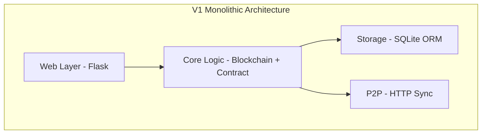
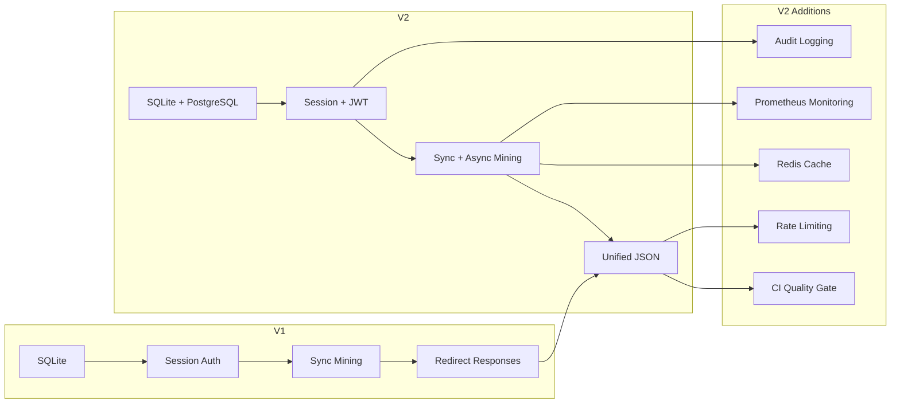

# ShuaiCoin Architecture V1 to V2 Migration Guide

<!--
Version:     2.1.0
Last Updated: 2026-05-13
Author:      @arch-team
Reviewer:    @core-team
-->

---

**Version** | **Date** | **Author** | **Changes**
2.1.0 | 2026-05-13 | @arch-team | Added migration guide, rollback plan, diff table
1.0.0 | 2026-01-15 | @arch-team | Initial V1 architecture documentation

---

## 1. V1 Architecture (Original)

### 1.1 Core Design

ShuaiCoin V1 was a monolithic Python application with four layers:



- **Storage:** SQLite only via SQLAlchemy.
- **Mempool:** In-memory Python list (lost on restart).
- **Mining:** Synchronous only, blocking the HTTP request thread.
- **Auth:** Session only (Flask-Login).
- **API Response:** Inconsistent; some endpoints returned redirects, others JSON.
- **Monitoring:** None (plain text logging only).
- **Rate Limiting:** None.
- **Testing:** Manual pytest only. No CI quality gate.

### 1.2 V1 Directory Structure

```text
shuai_coin_v1/
├── core/           # Blockchain, contract, utils
├── db/             # Models (SQLAlchemy)
├── web/            # Flask routes, templates, auth
├── wallet/         # Key management, signing
├── p2p/            # Node discovery, sync
├── config/         # Settings
└── tests/          # Manual pytest
```

---

## 2. V1 to V2 Evolution

### 2.1 Evolutionary Map

| Aspect | V1 | V2 | ADR |
| :--- | :--- | :--- | :--- |
| **Database** | SQLite only | SQLite (dev) + PostgreSQL (prod) | ADR-001 |
| **Mempool** | In-memory Python list | Database (Transaction table, `block_index IS NULL`) | ADR-004 |
| **Mining** | Synchronous only | Synchronous + Async (`/mine/async`) | ADR-003 |
| **Auth** | Session only | Session + JWT dual auth | ADR-002 |
| **Response** | Mixed (redirect + JSON) | Unified JSON envelope (`success_res`/`error_res`) | -- |
| **Rate Limiting** | None | Flask-Limiter (Redis backend) | ADR-005 |
| **Monitoring** | None | Prometheus + Grafana + Loki | -- |
| **Cache** | None | Redis + in-memory | -- |
| **CI/CD** | Manual testing | GitHub Actions quality gate + Docker build | -- |
| **Security** | Basic auth | DDOS protection, content moderation, audit logging | -- |
| **Testing** | Manual pytest | Automated pytest with coverage >= 90% | -- |
| **Migrations** | None | Flask-Migrate (Alembic) with CI drift check | -- |
| **Extensions** | None | Analytics, notifications, plugins, i18n | -- |

### 2.2 V2 New Modules

```text
shuai_coin_v2/
├── core/                   # (unchanged)
├── db/                     # (enhanced with migrations)
├── web/                    # (enhanced with async + unified response)
├── wallet/                 # (unchanged)
├── p2p/                    # (unchanged)
├── config/                 # (unchanged)
├── tests/                  # (automated, CI-integrated)
├── monitor/             # [NEW] Prometheus exporter, alerts, dashboards
├── security/            # [NEW] DDOS protection, audit logging, encryption
├── cache/               # [NEW] Redis cache, memory cache
├── analytics/           # [NEW] On-chain analytics, mining stats
├── notifications/       # [NEW] WebSocket push, email notifications
├── plugins/             # [NEW] Fee strategy, reward calculation plugins
├── scripts/             # [NEW] Backup, migration, cleanup, deployment
├── backup/              # [NEW] Automated backup + restore
├── i18n/                # [NEW] Internationalization support
├── oracle/              # [NEW] Price oracle
├── zk_proof/            # [NEW] Zero-knowledge proofs
├── pvss/                # [NEW] Publicly verifiable secret sharing
├── privacy_tx/          # [NEW] Ring signatures, stealth addresses
├── sharding/            # [NEW] State sharding
├── fork_governance/     # [NEW] Fork detection and governance
├── node_mode/           # [NEW] Full/light/archive node modes
├── tss_bls/             # [NEW] Threshold BLS signatures
├── vm_ext/              # [NEW] WASM virtual machine extension
├── .github/workflows/   # [NEW] CI quality gate
├── docker-compose.yml   # [NEW] Docker orchestration
└── Dockerfile           # [NEW] Production image
```

---

## 3. Deprecated Component Migration

### 3.1 In-Memory Mempool

**V1 Code:**

```python
# core/blockchain.py (V1)
pending_transactions = []  # global list

def add_transaction(tx):
    pending_transactions.append(tx)
```

**V2 Replacement:**

```python
# core/blockchain.py (V2)
from db.models import Transaction

def get_pending_transactions():
    txs = Transaction.query.filter_by(block_index=None).all()
    return [tx_to_dict(tx) for tx in txs]

def add_transaction(tx_data):
    new_tx = Transaction(
        tx_hash=tx_data['tx_hash'],
        sender=tx_data['sender'],
        recipient=tx_data['recipient'],
        amount=tx_data['amount'],
        fee=tx_data['fee'],
        tx_type=tx_data.get('type', 'transfer'),
        payload=tx_data.get('payload', ''),
        block_index=None
    )
    db.session.add(new_tx)
    db.session.commit()
```

### 3.2 Redirect-Based Responses

**V1 Behavior:**

```python
# V1 - Redirect after action
return redirect(url_for('routes.index'))
```

**V2 Replacement:**

```python
# V2 - JSON response
return jsonify({
    "status": "success",
    "message": "Operation completed",
    "data": result
}), 200
```

### 3.3 Synchronous Mining Only

The V1 `GET /mine` endpoint remains available for backward compatibility. V2 adds `POST /mine/async` and `GET /mine/status/<task_id>`.

**Migration Path:**

1. Keep existing `GET /mine` calls unchanged (backward compatible).
2. For admin tooling, migrate to `POST /mine/async` with polling.
3. Set client timeout to 60 seconds to handle slow PoW.

---

## 4. Database Migration

### 4.1 Schema Changes

| Change | Reason |
| :--- | :--- |
| Added `user.role_id` | Role-based access control |
| Added `user.is_admin` | Admin flag |
| Added `user.is_frozen` | Account freeze capability |
| Added `user.tx_password_hash` | Secondary transaction password |
| Added `admin_log` table | Immutable audit log |
| Added `smart_contract_state` table | Contract KV storage |
| Added `transaction.block_index` nullable | Database mempool |

### 4.2 Migration Commands

```bash
# Generate migration script
python run.py db_mgmt db_init
python run.py db_mgmt db_migrate -m "V2 schema: roles, audit log, contract state"

# Apply migration
python run.py db_mgmt db_upgrade

# Verify
python scripts/validate_db_fix.py
```

### 4.3 Production Migration Procedure

```bash
# 1. Backup
python scripts/backup_db.py

# 2. Apply migration
python run.py db_mgmt db_upgrade

# 3. Bootstrap permissions
python scripts/bootstrap_permissions.py

# 4. Verify schema
python scripts/check_db_schema.py
```

---

## 5. Rollback Plan

### 5.1 Rollback Trigger Conditions

| Condition | Threshold | Action |
| :--- | :--- | :--- |
| Error rate spike | > 5% of requests | Initiate rollback |
| API latency increase | > 2x baseline for > 5 minutes | Investigate then decide |
| Database migration failure | Any failure | Immediate rollback |
| Auth regression | Login failure rate > 1% | Immediate rollback |
| Mining failure | > 3 consecutive failures | Investigate then decide |

### 5.2 Rollback Procedure

```bash
# Step 1: Stop V2 services
docker-compose down

# Step 2: Restore V1 database
python scripts/restore.py --backup-file backup/pre_v2_migration.bak

# Step 3: Switch to V1 image
git checkout v1-stable
docker-compose -f docker-compose.v1.yml up -d

# Step 4: Verify
curl http://localhost:8000/api/chain | python -m json.tool
pytest tests/ -x

# Step 5: Notify team
# Send incident notification via monitoring channel
```

### 5.3 Rollback Decision Matrix

| Severity | Response Time | Approver |
| :--- | :--- | :--- |
| P0 (Critical) | Immediate | On-call engineer |
| P1 (High) | < 30 minutes | Tech lead |
| P2 (Medium) | < 4 hours | Engineering manager |
| P3 (Low) | Next business day | Team decision |

---

## 6. V1 to V2 Checkpoint Summary



---

*For V2 architecture details, see [architecture_v2.md](architecture_v2.md).*
*For terminology definitions, see [glossary.md](glossary.md).*
