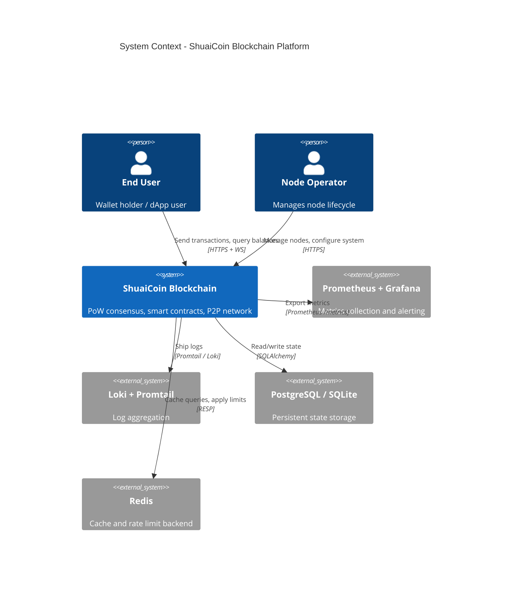
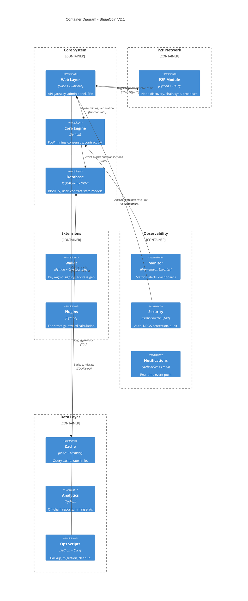
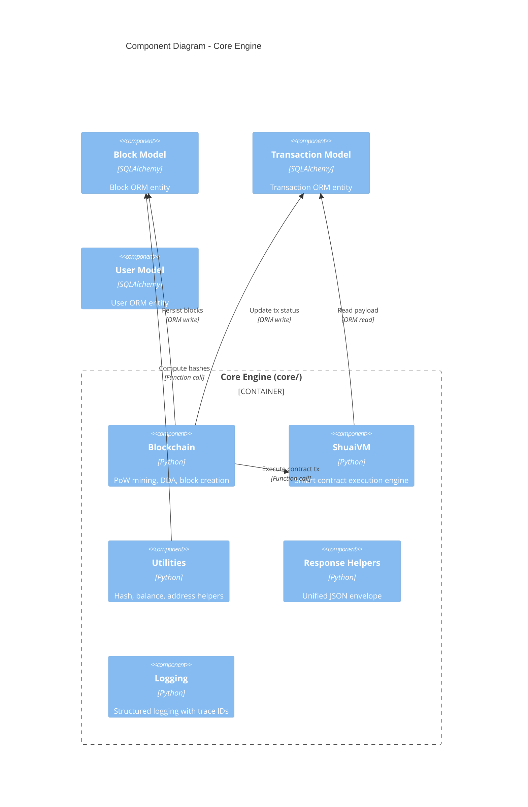
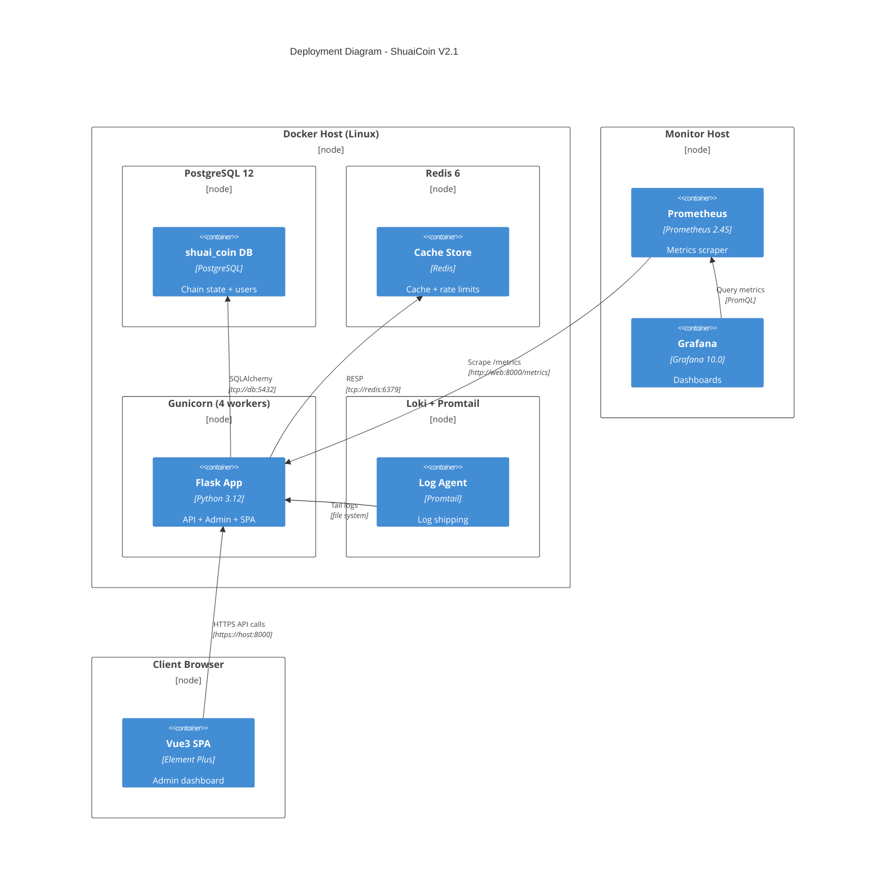
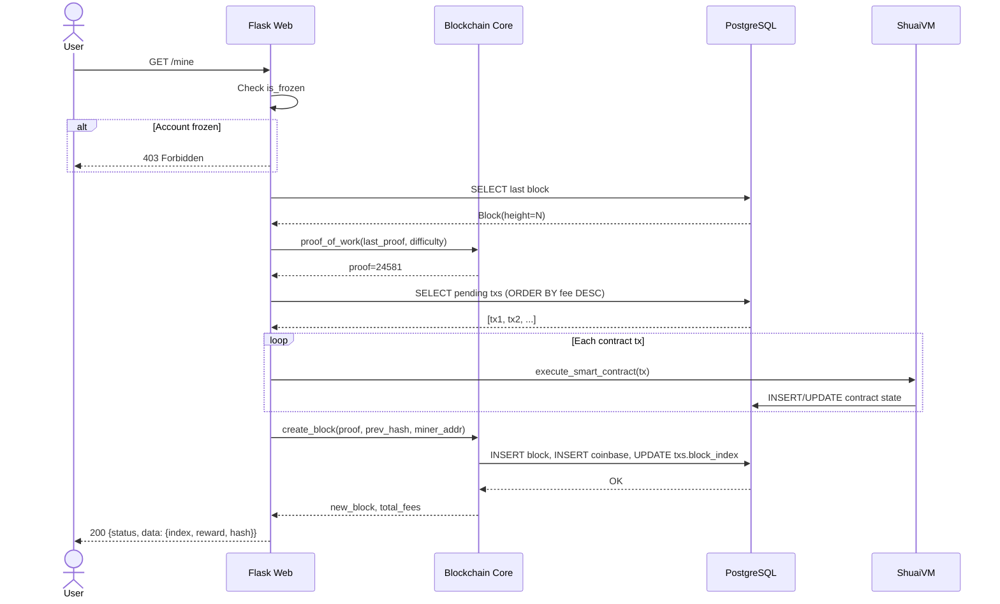
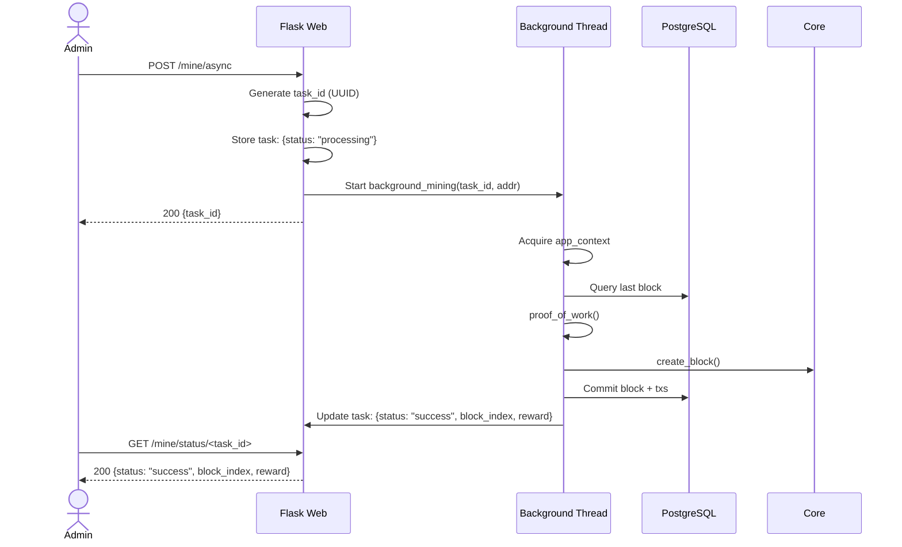
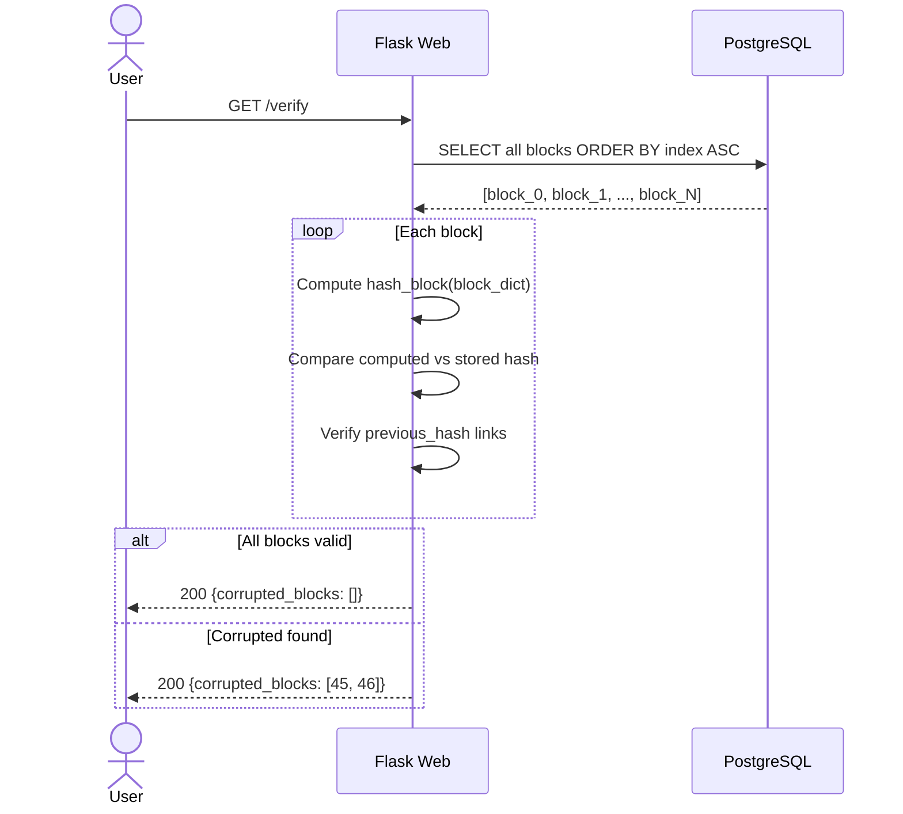
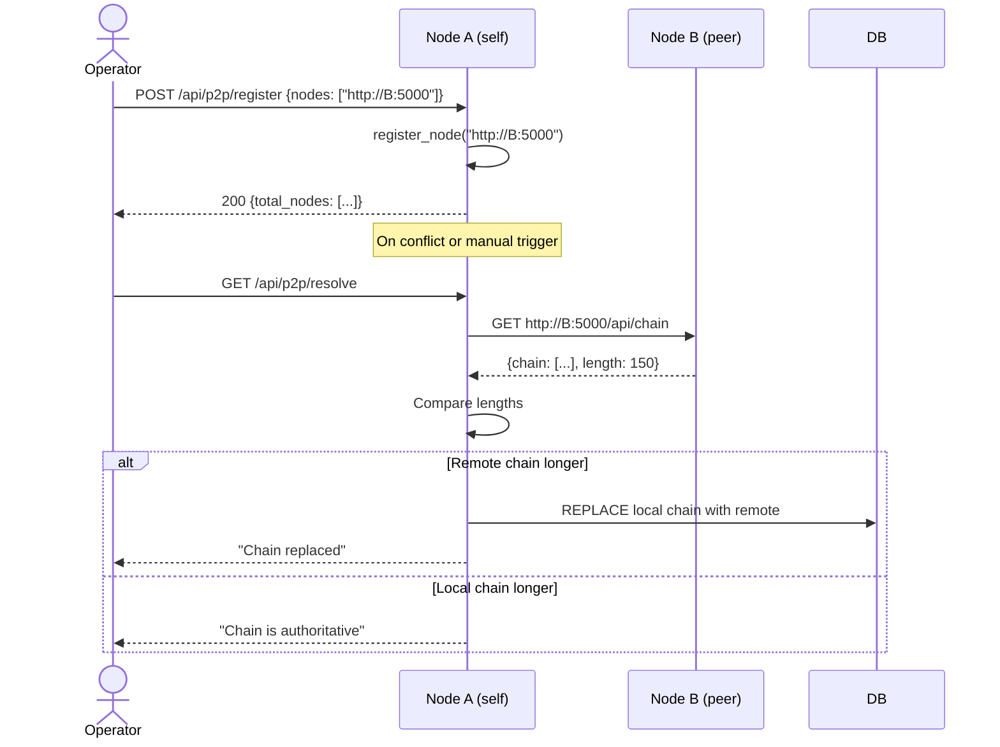

# ShuaiCoin Architecture Design Specification V2.0

<!--
Version:     2.1.0
Last Updated: 2026-05-13
Author:      @arch-team
Reviewer:    @core-team
-->

---

**Version** | **Date** | **Author** | **Changes**
2.1.0 | 2026-05-13 | @arch-team | C4 model, ADR appendix, performance baselines, interaction sequences
2.0.0 | 2026-04-30 | @arch-team | Modular redesign with observability, cache, and extensions
1.0.0 | 2026-01-15 | @arch-team | Initial monolithic architecture

---

## 1. C4 Model - Context Diagram

## 2. C4 Model - Container Diagram

## 3. C4 Model - Component Diagram (Core Engine)

## 4. Deployment Diagram

---

## 5. Interaction Sequences

### 5.1 Mining Flow (Synchronous)

### 5.2 Mining Flow (Asynchronous)

### 5.3 Chain Verification Flow

### 5.4 P2P Node Registration & Sync

---

## 6. Technology Selection Rationale

| Component | Choice | Rationale |
| :--- | :--- | :--- |
| **Web Framework** | Flask 3.x | Lightweight, mature, large ecosystem. Sufficient for ShuaiCoin's API-centric design. FastAPI considered but Flask aligns with existing team skills. |
| **ORM** | SQLAlchemy 2.x | Industry-standard Python ORM with Flask-SQLAlchemy integration. Supports SQLite (dev) and PostgreSQL (prod). |
| **Production Server** | Gunicorn 21.x | Pre-fork worker model. 4 workers optimal for I/O-bound blockchain API. |
| **Database** | PostgreSQL 12+ | ACID compliance, JSONB support for transaction payloads. SQLite for development convenience. |
| **Cache** | Redis 7.x | Sub-millisecond latency, built-in TTL, rate-limit counters via INCR. |
| **Auth** | PyJWT + Flask-Login | JWT for API clients, Session for web UI. Dual auth without coupling. |
| **Monitoring** | Prometheus + Grafana | Industry standard. Pull-based model avoids agent overhead. |
| **Logging** | Loki + Promtail | Lightweight alternative to ELK. Native Grafana integration. |
| **CLI** | Click 8.x | Pythonic, composable commands. Better than argparse for multi-command tools. |
| **Crypto** | Cryptography 41.x | FIPS 140-2 compliant. Used for key management and signing. |
| **Migrations** | Flask-Migrate (Alembic) | Versioned, reversible schema changes. CI-integrated drift detection. |

---

## 7. Performance Baseline

| Metric | Target | Measurement Method |
| :--- | :--- | :--- |
| **Block time** | 30 seconds (target) | `TARGET_BLOCK_TIME` config, monitored via DDA |
| **Sync PoW** | < 5 seconds per block | `log_api_call` duration metric |
| **Async PoW** | Background, non-blocking | Task status polling |
| **Chain verification** | < 2 seconds for 1000 blocks | `/verify` endpoint timing |
| **Wallet balance query** | < 50 ms | `GET /api/wallet/<addr>` |
| **Chain API** | < 100 ms (cached) | `GET /api/chain` with Redis |
| **Transaction submit** | < 200 ms | `POST /api/transactions/new` |
| **API throughput** | > 200 req/s (single node) | Gunicorn 4 workers |
| **Cache hit rate** | > 80% | Redis `INFO stats` |
| **Alert latency** | < 30 seconds | Prometheus `evaluation_interval` |

---

## 8. Architecture Decision Records (ADR)

### ADR-001: SQLite for Development, PostgreSQL for Production

**Status:** Accepted
**Date:** 2026-01-15
**Context:** Need a database that works with zero configuration for local development but scales for production deployment.
**Decision:** Use SQLite via environment-variable-switched `DATABASE_URL`. Default SQLite, override to PostgreSQL in Docker/production.
**Consequences:**
- Positive: Zero-config dev experience. Single binary for CI.
- Negative: SQLite lacks concurrent write support; dev-prod parity gap. Mitigated by CI testing on PostgreSQL.

### ADR-002: Dual Auth (Session + JWT)

**Status:** Accepted
**Date:** 2026-04-30
**Context:** Web UI users expect session-based auth. API clients need stateless JWT.
**Decision:** Keep Flask-Login sessions for web routes. Add JWT via PyJWT for `/api/*` endpoints. `admin_required` decorator checks both.
**Consequences:**
- Positive: No breaking change for web users. API clients get Bearer token support.
- Negative: Two auth code paths increase maintenance. Token revocation requires blacklist.

### ADR-003: Synchronous to Async Mining Migration

**Status:** Accepted
**Date:** 2026-05-13
**Context:** Synchronous PoW blocks the request thread, causing timeouts on slow hardware.
**Decision:** Keep `GET /mine` as synchronous. Add `POST /mine/async` + `GET /mine/status/<task_id>` for admin-only async mining.
**Consequences:**
- Positive: No breaking change. Admin gets non-blocking option.
- Negative: In-memory task store lost on restart. Future: persist tasks in Redis.

### ADR-004: In-Memory Mempool to Database Mempool

**Status:** Accepted
**Date:** 2026-04-30
**Context:** In-memory transaction pool lost on restart and was inaccessible to multi-process Gunicorn workers.
**Decision:** Store pending transactions in the `Transaction` table with `block_index IS NULL`. Query mempool via SQLAlchemy.
**Consequences:**
- Positive: Survives restarts. Visible to all Gunicorn workers.
- Negative: Additional DB load. Fee-based sorting at query time.

### ADR-005: Rate Limiting via Flask-Limiter with Redis Backend

**Status:** Accepted
**Date:** 2026-05-13
**Context:** Public endpoints need protection against abuse.
**Decision:** Use Flask-Limiter with Redis storage backend. Apply 10/min on `/mine` and `/verify`. 200/min global default.
**Consequences:**
- Positive: Easy to configure per-endpoint. Redis ensures consistency across workers.
- Negative: Redis dependency for rate limiting. Single point of failure mitigated by Redis health checks.

### ADR-006: ShuaiVM - JSON Payload Contract Engine

**Status:** Accepted
**Date:** 2026-01-15
**Context:** Need a simple but extensible smart contract system.
**Decision:** Implement a minimal VM that parses `payload` JSON. Supports `store` (KV state) and `mint_token` actions. No Turing-complete execution.
**Consequences:**
- Positive: No gas metering complexity. No reentrancy risk. Simple to audit.
- Negative: Limited expressiveness. WASM extension planned for complex logic.

---

*For terminology definitions, see [glossary.md](glossary.md).*
*For v1 to v2 migration details, see [architecture.md](architecture.md).*
