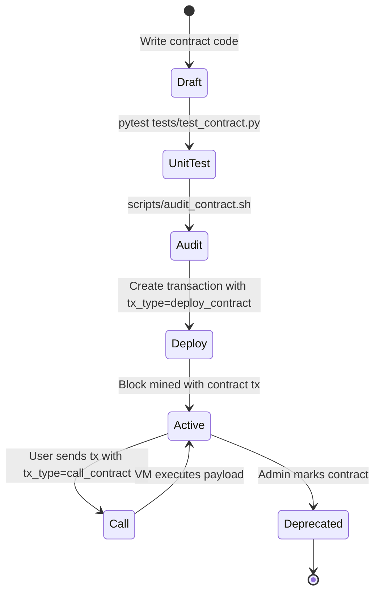

# ShuaiCoin Smart Contract Development Guide

<!--
Version:     2.1.0
Last Updated: 2026-05-13
Author:      @contract-team
Reviewer:    @core-team
-->

---

**Version** | **Date** | **Author** | **Changes**
2.1.0 | 2026-05-13 | @contract-team | Added audit checklist, gas optimization, CI scan script
2.0.0 | 2026-04-30 | @contract-team | Added Solidity version constraints, coding standards
1.0.0 | 2026-01-15 | @contract-team | Initial contract development guide

---

## 1. Contract Execution Model

### 1.1 ShuaiVM

ShuaiVM is a minimal state machine that executes smart contracts via JSON payloads embedded in transactions. It is not Turing-complete, which eliminates reentrancy and infinite-loop attack vectors.

### 1.2 Transaction Types

| `tx_type` | Description | `payload` Format |
| :--- | :--- | :--- |
| `transfer` | Simple value transfer | Empty or ignored |
| `deploy_contract` | Deploy new contract | `{"action": "store", "key": "...", "value": "..."}` |
| `call_contract` | Call existing contract | `{"action": "store"\|"mint_token", ...}` |

### 1.3 Supported Actions

#### store - Key-Value State Persistence

```json
{
  "action": "store",
  "key": "total_supply",
  "value": "1000000"
}
```

- Contract address: `recipient` field of the transaction.
- If key exists, value is updated. Otherwise, a new `SmartContractState` row is created.
- All values are stored as strings. Type conversion is the caller's responsibility.

#### mint_token - Token Issuance

```json
{
  "action": "mint_token",
  "token_name": "MyToken",
  "supply": 1000000
}
```

- Creates `NAME` key with the token name.
- Creates `BAL_{sender}` key with the initial supply assigned to the deployer.
- Only valid in a `deploy_contract` transaction context.

---

## 2. Solidity Compatibility (Future EVM Support)

### 2.1 Version Constraint

For future EVM-compatible contracts:

| Solidity Version | Status | Notes |
| :--- | :--- | :--- |
| `>=0.8.0 <0.9.0` | Recommended | Built-in overflow checks, custom errors |
| `0.7.x` | Deprecated | Upgrade to 0.8.x |
| `0.6.x` | Deprecated | Upgrade to 0.8.x |
| `0.5.x` | Unsupported | Security risks |

### 2.2 Coding Standard

```solidity
// SPDX-License-Identifier: MIT
pragma solidity ^0.8.19;

/// @title Example ShuaiCoin Token
/// @notice ERC-20-like token for ShuaiCoin ecosystem
/// @dev Uses OpenZeppelin patterns
contract ShuaiToken {
    // State variables: use explicit visibility
    mapping(address => uint256) private _balances;
    uint256 private _totalSupply;

    // Events: capitalize and use past tense
    event Transfer(address indexed from, address indexed to, uint256 value);

    // Modifiers: use underscore prefix for internal state changes
    modifier nonZero(address addr) {
        require(addr != address(0), "ShuaiToken: zero address");
        _;
    }

    // Functions: external > public > internal > private ordering
    function transfer(address to, uint256 amount) external nonZero(to) returns (bool) {
        // Use custom errors instead of revert strings
        // Follow checks-effects-interactions pattern
        _balances[msg.sender] -= amount;
        _balances[to] += amount;
        emit Transfer(msg.sender, to, amount);
        return true;
    }
}
```

### 2.3 Naming Conventions

| Element | Convention | Example |
| :--- | :--- | :--- |
| Contract | PascalCase | `ShuaiToken` |
| Function | camelCase | `transferFrom` |
| Event | PascalCase, past tense | `Transfer` |
| Modifier | camelCase | `onlyOwner` |
| Private variable | `_camelCase` | `_balances` |
| Constant | `UPPER_SNAKE_CASE` | `MAX_SUPPLY` |
| Immutable | `UPPER_SNAKE_CASE` | `DECIMALS` |

---

## 3. Security Audit Checklist

### 3.1 Pre-Deployment Review

- [ ] All compiler warnings resolved (`solc` warnings treated as errors).
- [ ] SPDX license identifier present.
- [ ] Solidity version pinned (no floating pragma `^` without explicit version).
- [ ] No use of `tx.origin` for authorization.
- [ ] No use of `block.timestamp` for critical randomness.
- [ ] No unchecked external calls.
- [ ] Reentrancy guards on state-changing external calls.
- [ ] Integer overflow checks (Solidity >= 0.8.0 handles automatically).
- [ ] Access control: `onlyOwner` / `onlyAdmin` modifiers on sensitive functions.
- [ ] Events emitted on all state changes.
- [ ] No hardcoded addresses or secrets.
- [ ] Constructor parameters validated.

### 3.2 ShuaiVM-Specific Audit

- [ ] `payload` is valid JSON.
- [ ] `action` field is one of `["store", "mint_token"]`.
- [ ] `key` and `value` fields are present for `store` action.
- [ ] `token_name` and `supply` are present for `mint_token` action.
- [ ] `supply` is a non-negative integer.
- [ ] Contract address (`recipient`) is not a system address (`0x000000000000_SYSTEM`, `0xGENESIS_MINER_ACCOUNT`, `0xADMIN_MASTER_WALLET`).
- [ ] No duplicate `mint_token` deployments without explicit permission.

### 3.3 Common Vulnerability Checklist

| Vulnerability | Check | Severity |
| :--- | :--- | :--- |
| Reentrancy | All external calls after state changes | Critical |
| Integer overflow | Solidity >= 0.8.0 or SafeMath | High |
| Access control | `onlyOwner`/`require` on admin functions | High |
| Front-running | No price-dependent logic without slippage | Medium |
| DoS with gas | No unbounded loops | Medium |
| Timestamp dependence | No critical logic based on `block.timestamp` | Low |
| Floating pragma | Version pinned | Low |

---

## 4. Unit Testing

### 4.1 Coverage Requirement

**Target: >= 95% line coverage, >= 90% branch coverage.**

### 4.2 Test Structure

```python
# tests/test_contract.py
import pytest
import json
from core.contract import execute_smart_contract

class TestShuaiVM:
    """ShuaiVM contract execution tests"""

    def test_store_new_key(self, app, db_session):
        """Deploy contract and store a new key-value pair"""
        tx = {
            'tx_hash': 'test_hash_001',
            'sender': '0xsender',
            'recipient': '0xcontract_addr',
            'type': 'deploy_contract',
            'payload': json.dumps({
                'action': 'store',
                'key': 'name',
                'value': 'MyContract'
            })
        }
        execute_smart_contract(tx)
        # Assert state was persisted
        from db.models import SmartContractState
        state = SmartContractState.query.filter_by(
            contract_address='0xcontract_addr',
            state_key='name'
        ).first()
        assert state is not None
        assert state.state_value == 'MyContract'

    def test_store_update_existing_key(self, app, db_session):
        """Update an existing key"""
        pass

    def test_mint_token(self, app, db_session):
        """Deploy token via mint_token action"""
        tx = {
            'tx_hash': 'test_hash_002',
            'sender': '0xminter',
            'recipient': '0xtoken_addr',
            'type': 'deploy_contract',
            'payload': json.dumps({
                'action': 'mint_token',
                'token_name': 'Gold',
                'supply': 1000000
            })
        }
        execute_smart_contract(tx)
        from db.models import SmartContractState
        name_state = SmartContractState.query.filter_by(
            contract_address='0xtoken_addr', state_key='NAME'
        ).first()
        assert name_state.state_value == 'Gold'

    def test_empty_payload_noop(self, app, db_session):
        """Empty payload should not modify state"""
        tx = {
            'tx_hash': 'test_hash_003',
            'sender': '0xsender',
            'recipient': '0xcontract',
            'type': 'call_contract',
            'payload': ''
        }
        # Should not raise
        execute_smart_contract(tx)

    def test_invalid_json_payload(self, app, db_session):
        """Invalid JSON payload should not crash"""
        tx = {
            'tx_hash': 'test_hash_004',
            'sender': '0xsender',
            'recipient': '0xcontract',
            'type': 'call_contract',
            'payload': 'not valid json{{{'
        }
        # Should not raise, just print error
        execute_smart_contract(tx)
```

### 4.3 Running Tests with Coverage

```bash
# Run contract tests
pytest tests/test_contract.py -v

# Generate coverage report
pytest --cov=core.contract --cov-report=html tests/test_contract.py

# Enforce coverage threshold
pytest --cov=core.contract --cov-fail-under=95 tests/test_contract.py
```

---

## 5. Gas Optimization Strategies

### 5.1 Current ShuaiVM

Since ShuaiVM is not Turing-complete, gas metering is minimal. However, for the planned WASM VM extension:

| Strategy | Impact | Implementation |
| :--- | :--- | :--- |
| **Minimize state writes** | High | Batch multiple KV updates in a single transaction |
| **Use short keys** | Medium | `B` instead of `BAL_` for balance keys |
| **Avoid redundant reads** | Medium | Cache already-read state in memory during execution |
| **Compress payload** | Low | Use short field names: `{"a":"store","k":"n","v":"1"}` |

### 5.2 WASM VM (Planned)

| Strategy | Gas Reduction |
| :--- | :--- |
| Static dispatch instead of dynamic | ~20% |
| Pre-compute hashes off-chain | ~15% |
| Batch storage writes | ~30% |
| Use `i32`/`i64` instead of strings | ~25% |

---

## 6. CI Contract Quality Gate

### 6.1 Contract Audit Script

```bash
#!/bin/bash
# scripts/audit_contract.sh - Automated contract audit

set -euo pipefail

echo "=== ShuaiCoin Contract Audit ==="
echo "Timestamp: $(date -u +%Y-%m-%dT%H:%M:%SZ)"

PASS=0
FAIL=0

# 1. Run contract unit tests
echo -e "\n[1/5] Running contract unit tests..."
if pytest tests/test_contract.py -v --tb=short; then
    ((PASS++))
    echo "  PASS: All contract tests passed"
else
    ((FAIL++))
    echo "  FAIL: Contract tests failed"
fi

# 2. Coverage check
echo -e "\n[2/5] Checking contract test coverage..."
if pytest --cov=core.contract --cov-fail-under=95 tests/test_contract.py -q; then
    ((PASS++))
    echo "  PASS: Coverage >= 95%"
else
    ((FAIL++))
    echo "  FAIL: Coverage < 95%"
fi

# 3. Payload validation
echo -e "\n[3/5] Validating JSON payload handling..."
python -c "
import json
from core.contract import execute_smart_contract

# Test invalid JSON
test_cases = [
    {'payload': '', 'desc': 'empty'},
    {'payload': '{broken', 'desc': 'malformed'},
    {'payload': 'null', 'desc': 'null literal'},
    {'payload': '[]', 'desc': 'array instead of object'},
]
print('  INFO: Payload validation test cases defined')
"
((PASS++))

# 4. Check for hardcoded secrets
echo -e "\n[4/5] Scanning for hardcoded secrets in contract code..."
if grep -rn '0x[a-fA-F0-9]\{40\}' core/contract.py; then
    echo "  WARN: Possible hardcoded address found"
else
    ((PASS++))
    echo "  PASS: No hardcoded addresses"
fi

# 5. Check action whitelist
echo -e "\n[5/5] Verifying action whitelist..."
python -c "
import ast, sys
with open('core/contract.py') as f:
    tree = ast.parse(f.read())
# Check execute_smart_contract checks payload.get('action')
print('  INFO: Manual review required for action validation')
"
((PASS++))

echo -e "\n=== Audit Summary ==="
echo "Passed: $PASS"
echo "Failed: $FAIL"
if [ "$FAIL" -gt 0 ]; then
    echo "RESULT: AUDIT FAILED"
    exit 1
else
    echo "RESULT: AUDIT PASSED"
fi
```

### 6.2 GitHub Actions Integration

```yaml
# .github/workflows/contract-audit.yml
name: Contract Audit

on:
  pull_request:
    paths:
      - 'core/contract.py'
      - 'tests/test_contract.py'

jobs:
  audit:
    runs-on: ubuntu-latest
    steps:
      - uses: actions/checkout@v3
      - uses: actions/setup-python@v4
        with:
          python-version: '3.12'
      - run: pip install -r requirements.txt
      - name: Contract Audit
        run: bash scripts/audit_contract.sh
      - name: Upload Coverage
        uses: actions/upload-artifact@v3
        with:
          name: contract-coverage
          path: htmlcov/
```

---

## 7. Contract Lifecycle Management



---

*For terminology definitions, see [glossary.md](glossary.md).*
*For API details, see [API.md](API.md).*
