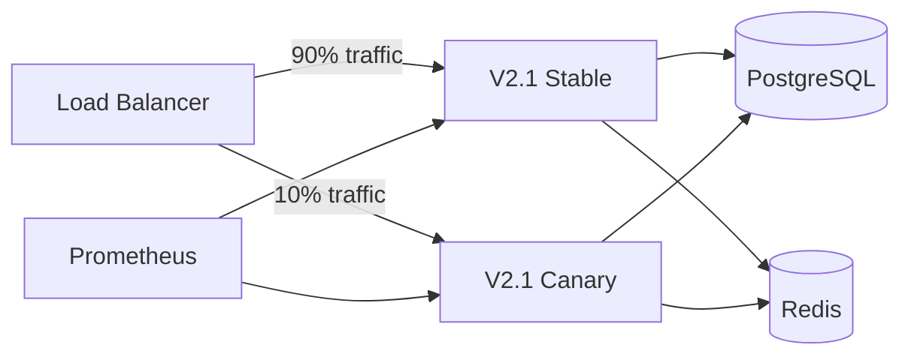

# ShuaiCoin V2.1 Deployment Guide

<!--
Version:     2.1.0
Last Updated: 2026-05-13
Author:      @devops-team
Reviewer:    @core-team
-->

---

**Version** | **Date** | **Author** | **Changes**
2.1.0 | 2026-05-13 | @devops-team | One-click deploy script, grayscale release, alarm rules
2.0.0 | 2026-04-30 | @devops-team | Docker Compose, gunicorn production setup
1.0.0 | 2026-01-15 | @devops-team | Initial deployment guide

---

## 1. Environment Requirements

| Dependency | Minimum Version | Purpose |
| :--- | :--- | :--- |
| Python | 3.12+ | Application runtime |
| PostgreSQL | 12+ | Production database |
| Redis | 7+ | Cache and rate limiting |
| Docker | 24+ | Container runtime |
| Docker Compose | 2.20+ | Multi-container orchestration |
| Grafana Loki | 2.9+ | Log aggregation (optional) |
| Promtail | 2.9+ | Log shipping (optional) |

---

## 2. Environment Variables

### 2.1 Required Variables

| Variable | Default | Description |
| :--- | :--- | :--- |
| `DATABASE_URL` | `sqlite:///...` | Database connection string |
| `SECRET_KEY` | Auto-generated | Flask secret key for sessions and JWT |
| `REDIS_URL` | `redis://localhost:6379/0` | Redis connection string |
| `PORT` | `5000` | Application port |

### 2.2 Optional Variables

| Variable | Default | Description |
| :--- | :--- | :--- |
| `FLASK_ENV` | `production` | Flask environment mode |
| `LOG_LEVEL` | `INFO` | Logging verbosity |
| `PROMETHEUS_PORT` | `9090` | Prometheus metrics port |
| `GUNICORN_WORKERS` | `4` | Number of Gunicorn workers |
| `GUNICORN_TIMEOUT` | `120` | Worker timeout (seconds) |

### 2.3 `.env` Template

```ini
# .env - ShuaiCoin V2.1 Environment Configuration
# Copy to .env and fill in values. Never commit .env to version control.

# Database
DATABASE_URL=postgresql://admin:admin_password@db:5432/shuai_coin

# Security (generate with: python -c "import secrets; print(secrets.token_hex(32))")
SECRET_KEY=change_me_to_a_random_64_char_hex_string

# Redis
REDIS_URL=redis://redis:6379/0

# Application
PORT=8000
FLASK_ENV=production
LOG_LEVEL=INFO

# Gunicorn
GUNICORN_WORKERS=4
GUNICORN_TIMEOUT=120
```

---

## 3. Secret Management

### 3.1 Key Types

| Key | Storage | Rotation |
| :--- | :--- | :--- |
| `SECRET_KEY` | Environment variable / Vault | Every 90 days |
| Database password | Docker secret / Vault | Every 90 days |
| JWT signing key | Derived from `SECRET_KEY` | Auto-rotated |
| Node private key | Wallet key manager | Never (immutable identity) |

### 3.2 Vault Integration (Recommended)

```bash
# Fetch secrets from HashiCorp Vault
export DATABASE_URL=$(vault kv get -field=url secret/shuai_coin/database)
export SECRET_KEY=$(vault kv get -field=secret_key secret/shuai_coin/app)
export REDIS_URL=$(vault kv get -field=url secret/shuai_coin/redis)
```

---

## 4. One-Click Deploy Script

### 4.1 Bash Script

```bash
#!/bin/bash
# scripts/deploy_v2.1.sh - One-click deployment for ShuaiCoin V2.1
set -euo pipefail

TIMESTAMP=$(date -u +%Y%m%d_%H%M%S)
LOG_FILE="deploy_${TIMESTAMP}.log"
exec > >(tee -a "$LOG_FILE") 2>&1

echo "=== ShuaiCoin V2.1 Deployment ==="
echo "Timestamp: $(date -u +%Y-%m-%dT%H:%M:%SZ)"
echo "Log: $LOG_FILE"

# 1. Pre-flight checks
echo -e "\n[1/8] Pre-flight checks..."
command -v docker >/dev/null 2>&1 || { echo "ERROR: Docker not installed"; exit 1; }
command -v docker-compose >/dev/null 2>&1 || { echo "ERROR: Docker Compose not installed"; exit 1; }
if [ ! -f .env ]; then
    echo "ERROR: .env file not found. Copy .env.example to .env and configure."
    exit 1
fi
echo "  PASS: All prerequisites met"

# 2. Backup existing database
echo -e "\n[2/8] Backing up database..."
if docker-compose ps | grep -q postgres; then
    docker-compose exec -T db pg_dump -U admin shuai_coin > "backup/pre_deploy_${TIMESTAMP}.sql"
    echo "  Backup saved: backup/pre_deploy_${TIMESTAMP}.sql"
else
    echo "  SKIP: No existing database to back up"
fi

# 3. Pull latest images
echo -e "\n[3/8] Pulling Docker images..."
docker-compose pull
echo "  PASS: Images pulled"

# 4. Build application image
echo -e "\n[4/8] Building application..."
docker-compose build --no-cache web
echo "  PASS: Image built"

# 5. Run database migrations
echo -e "\n[5/8] Running migrations..."
docker-compose run --rm web python run.py db_mgmt db_upgrade
echo "  PASS: Migrations applied"

# 6. Bootstrap permissions
echo -e "\n[6/8] Bootstrapping permissions..."
docker-compose run --rm web python scripts/bootstrap_permissions.py
echo "  PASS: Permissions bootstrapped"

# 7. Start services
echo -e "\n[7/8] Starting services..."
docker-compose up -d
echo "  PASS: Services started"

# 8. Health check
echo -e "\n[8/8] Health check..."
sleep 5
for i in {1..12}; do
    if curl -sf http://localhost:8000/api/chain > /dev/null 2>&1; then
        echo "  PASS: Service is healthy"
        break
    fi
    if [ $i -eq 12 ]; then
        echo "  FAIL: Service did not become healthy within 60 seconds"
        docker-compose logs --tail=50 web
        exit 1
    fi
    echo "  Waiting... ($i/12)"
    sleep 5
done

echo -e "\n=== Deployment Complete ==="
echo "Web:       http://localhost:8000"
echo "Swagger:   http://localhost:8000/apidocs"
echo "Admin:     admin / admin123"
```

### 4.2 Python Script

```python
#!/usr/bin/env python3
"""scripts/deploy_v2_1.py - Python deployment script for ShuaiCoin V2.1"""

import subprocess
import sys
import time
import os
from datetime import datetime, timezone


def run(cmd, check=True):
    print(f"  RUN: {cmd}")
    result = subprocess.run(cmd, shell=True, capture_output=True, text=True)
    if check and result.returncode != 0:
        print(f"  FAIL: {result.stderr}")
        sys.exit(1)
    return result


def main():
    timestamp = datetime.now(timezone.utc).strftime("%Y%m%d_%H%M%S")
    print(f"=== ShuaiCoin V2.1 Deployment ({timestamp}) ===")

    # 1. Pre-flight
    print("\n[1/8] Pre-flight checks...")
    if not os.path.exists(".env"):
        print("ERROR: .env file not found")
        sys.exit(1)

    # 2. Backup
    print("\n[2/8] Backing up database...")
    run(f"docker-compose exec -T db pg_dump -U admin shuai_coin > backup/pre_deploy_{timestamp}.sql", check=False)

    # 3. Pull images
    print("\n[3/8] Pulling Docker images...")
    run("docker-compose pull")

    # 4. Build
    print("\n[4/8] Building application...")
    run("docker-compose build --no-cache web")

    # 5. Migrate
    print("\n[5/8] Running migrations...")
    run("docker-compose run --rm web python run.py db_mgmt db_upgrade")

    # 6. Bootstrap
    print("\n[6/8] Bootstrapping permissions...")
    run("docker-compose run --rm web python scripts/bootstrap_permissions.py")

    # 7. Start
    print("\n[7/8] Starting services...")
    run("docker-compose up -d")

    # 8. Health check
    print("\n[8/8] Health check...")
    time.sleep(5)
    for i in range(12):
        result = run(
            "curl -sf http://localhost:8000/api/chain",
            check=False
        )
        if result.returncode == 0:
            print("  PASS: Service is healthy")
            break
        if i == 11:
            print("  FAIL: Service did not become healthy")
            sys.exit(1)
        time.sleep(5)

    print("\n=== Deployment Complete ===")
    print("Web:     http://localhost:8000")
    print("Swagger: http://localhost:8000/apidocs")


if __name__ == "__main__":
    main()
```

---

## 5. Grayscale Release

### 5.1 Canary Deployment Architecture



### 5.2 Canary Steps

```bash
# Step 1: Deploy canary instance on different port
docker run -d --name shuai_canary \
    -p 8001:8000 \
    -e DATABASE_URL=... \
    -e REDIS_URL=... \
    shuai-coin:v2.1-canary

# Step 2: Route 10% traffic to canary (nginx example)
# nginx.conf
upstream shuai_backend {
    server 127.0.0.1:8000 weight=9;  # stable
    server 127.0.0.1:8001 weight=1;  # canary
}

# Step 3: Monitor for 30 minutes
# Check Prometheus: error rate, latency p99, chain height sync

# Step 4: Promote or rollback
# Promote: Update all instances to v2.1
# Rollback: docker stop shuai_canary && remove nginx rule
```

### 5.3 Canary Validation Criteria

| Metric | Baseline | Canary Threshold | Action if Exceeded |
| :--- | :--- | :--- | :--- |
| Error rate | < 0.1% | > 1% | Auto-rollback |
| P99 latency | 200 ms | > 400 ms | Alert + manual review |
| Chain height lag | 0 | > 3 blocks | Alert + manual review |
| Memory usage | < 512 MB | > 1 GB | Alert + manual review |
| CPU usage | < 50% | > 80% | Alert + manual review |

---

## 6. Rollback Plan

### 6.1 Rollback Thresholds

| Trigger | Threshold | Response |
| :--- | :--- | :--- |
| Error rate | > 5% for 2 minutes | Automatic rollback |
| Latency P99 | > 2x baseline for 5 minutes | Manual rollback |
| Chain desync | Any block hash mismatch | Immediate rollback |
| Database error | Any migration failure | Immediate rollback |

### 6.2 Rollback Commands

```bash
# Immediate rollback to V2.0
docker-compose down
docker-compose -f docker-compose.v2.0.yml up -d
curl -sf http://localhost:8000/api/chain || echo "Rollback failed!"
```

---

## 7. Alarm Rules

### 7.1 Prometheus Alert Rules

```yaml
# monitor/alerts.yml
groups:
  - name: shuai_coin_critical
    rules:
      - alert: ServiceDown
        expr: up{job="shuai_coin"} == 0
        for: 1m
        labels:
          severity: critical
        annotations:
          summary: "ShuaiCoin service is down"
          description: "Instance {{ $labels.instance }} has been down for more than 1 minute."

      - alert: HighErrorRate
        expr: rate(http_requests_total{status=~"5.."}[5m]) / rate(http_requests_total[5m]) > 0.05
        for: 2m
        labels:
          severity: critical
        annotations:
          summary: "Error rate exceeds 5%"

      - alert: ChainHeightStalled
        expr: shuai_chain_height - shuai_chain_height offset 5m == 0
        for: 10m
        labels:
          severity: warning
        annotations:
          summary: "Chain height not increasing"

      - alert: HighLatency
        expr: histogram_quantile(0.99, rate(http_request_duration_seconds_bucket[5m])) > 0.5
        for: 5m
        labels:
          severity: warning
        annotations:
          summary: "P99 latency exceeds 500ms"

      - alert: DatabaseConnectionPoolExhausted
        expr: sqlalchemy_pool_checkedout / sqlalchemy_pool_size > 0.8
        for: 5m
        labels:
          severity: warning
```

### 7.2 Alert Routing

| Severity | Channel | Recipients |
| :--- | :--- | :--- |
| Critical | PagerDuty + Slack #incidents | On-call engineer |
| Warning | Slack #monitoring | DevOps team |
| Info | Email digest | Engineering leads |

---

## 8. Production Validation Tests

### 8.1 Smoke Test Script

```bash
#!/bin/bash
# scripts/smoke_test.sh - Post-deployment smoke test

BASE_URL="${1:-http://localhost:8000}"
PASS=0
FAIL=0

check() {
    local desc="$1"
    local method="$2"
    local url="$3"
    local expected_code="$4"
    local actual_code

    actual_code=$(curl -s -o /dev/null -w "%{http_code}" -X "$method" "$url")
    if [ "$actual_code" = "$expected_code" ]; then
        echo "  [PASS] $desc ($actual_code)"
        ((PASS++))
    else
        echo "  [FAIL] $desc (expected $expected_code, got $actual_code)"
        ((FAIL++))
    fi
}

echo "=== Smoke Test: $BASE_URL ==="

# Public endpoints
check "Chain API"             GET  "$BASE_URL/api/chain"              200
check "Wallet balance"        GET  "$BASE_URL/api/wallet/0xtest"      200
check "Swagger docs"          GET  "$BASE_URL/apidocs"                200

# Auth
TOKEN=$(curl -s -X POST "$BASE_URL/api/login" \
    -H "Content-Type: application/json" \
    -d '{"username":"admin","password":"admin123"}' | python -c "import sys,json; print(json.load(sys.stdin).get('data',{}).get('token',''))")

check "Login API"             POST "$BASE_URL/api/login"              200

# Authenticated
if [ -n "$TOKEN" ]; then
    check "Admin users list"  GET  "$BASE_URL/admin/api/users" \
        -H "Authorization: Bearer $TOKEN" 200
    check "Admin logs"        GET  "$BASE_URL/admin/api/logs" \
        -H "Authorization: Bearer $TOKEN" 200
fi

echo ""
echo "=== Results: $PASS passed, $FAIL failed ==="
[ "$FAIL" -eq 0 ] || exit 1
```

### 8.2 Integration Test

```python
# tests/smoke/test_deploy_smoke.py
import pytest
import requests

BASE_URL = "http://localhost:8000"

class TestDeploySmoke:
    def test_chain_endpoint(self):
        r = requests.get(f"{BASE_URL}/api/chain", timeout=10)
        assert r.status_code == 200
        data = r.json()
        assert "chain" in data
        assert "length" in data

    def test_wallet_balance(self):
        r = requests.get(f"{BASE_URL}/api/wallet/0xtest", timeout=10)
        assert r.status_code == 200

    def test_login(self):
        r = requests.post(f"{BASE_URL}/api/login", json={
            "username": "admin",
            "password": "admin123"
        }, timeout=10)
        assert r.status_code == 200
        data = r.json()
        assert "data" in data
        assert "token" in data["data"]

    def test_swagger_docs(self):
        r = requests.get(f"{BASE_URL}/apidocs", timeout=10)
        assert r.status_code == 200
```

---

*For production deployment architecture, see [deployment.md](deployment.md).*
*For terminology definitions, see [glossary.md](glossary.md).*
