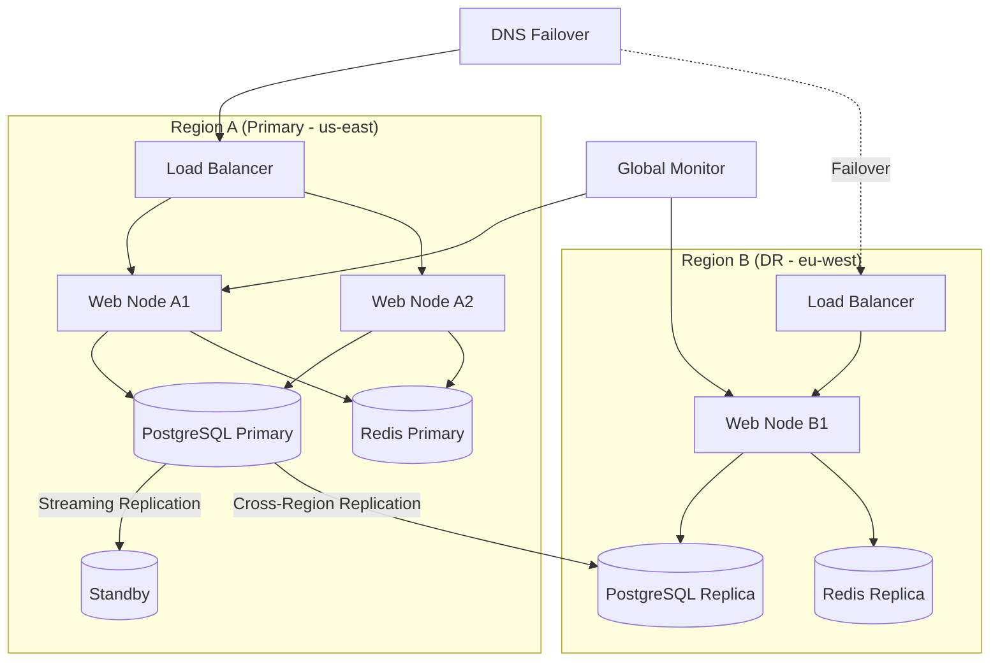

# ShuaiCoin Production Deployment Guide

<!--
Version:     2.1.0
Last Updated: 2026-05-13
Author:      @devops-team
Reviewer:    @core-team
-->

---

**Version** | **Date** | **Author** | **Changes**
2.1.0 | 2026-05-13 | @devops-team | Multi-region DR, backup SOP, capacity planning, stress test template
2.0.0 | 2026-04-30 | @devops-team | Docker orchestration, production database
1.0.0 | 2026-01-15 | @devops-team | Initial deployment guide

---

## 1. Multi-Region Disaster Recovery Topology

### 1.1 Topology Diagram



### 1.2 RPO/RTO Targets

| Metric | Target | Mechanism |
| :--- | :--- | :--- |
| **RPO (Data)** | < 5 minutes | PostgreSQL streaming replication |
| **RPO (Redis)** | < 1 minute | Redis sentinel with AOF |
| **RTO (Failover)** | < 10 minutes | DNS failover + pre-warmed DR instances |
| **RTO (Full DR)** | < 2 hours | Manual region switch with data validation |

### 1.3 Region Failover Procedure

```bash
#!/bin/bash
# scripts/dr_failover.sh - Region failover script

PRIMARY_REGION="${1:-us-east}"
DR_REGION="${2:-eu-west}"

echo "=== Initiating failover from $PRIMARY_REGION to $DR_REGION ==="

# 1. Stop writes on primary
echo "Stopping writes on primary..."
ssh primary-node "docker-compose stop web"

# 2. Promote DR database to primary
echo "Promoting DR database..."
ssh dr-node "docker-compose exec -T db psql -U admin -c 'SELECT pg_promote();'"

# 3. Switch DNS
echo "Switching DNS..."
# CLI example; replace with actual DNS provider API
# aws route53 change-resource-record-sets --hosted-zone-id Z123456 \
#     --change-batch file://dns_switch.json

# 4. Start web services in DR
echo "Starting web services in DR..."
ssh dr-node "docker-compose up -d web"

# 5. Health check
for i in {1..12}; do
    if curl -sf "https://dr-endpoint/api/chain" > /dev/null; then
        echo "Failover complete. DR region is serving traffic."
        exit 0
    fi
    sleep 10
done
echo "FAIL: DR region did not become healthy"
exit 1
```

---

## 2. Data Backup and Recovery SOP

### 2.1 Backup Schedule

| Type | Frequency | Retention | Storage |
| :--- | :--- | :--- | :--- |
| Full DB backup | Daily at 02:00 UTC | 30 days | S3 / object storage |
| WAL archival | Continuous | 7 days | S3 / object storage |
| Config backup | On change | 90 days | Git + S3 |
| Redis snapshot | Every 6 hours | 7 days | S3 |
| Log archive | Daily at 03:00 UTC | 90 days | S3 Glacier |

### 2.2 Backup Commands

```bash
# Full database backup
pg_dump -U admin -h localhost -Fc shuai_coin > "backups/shuai_coin_$(date +%Y%m%d).dump"

# Upload to S3
aws s3 cp "backups/shuai_coin_$(date +%Y%m%d).dump" \
    "s3://shuai-coin-backups/database/shuai_coin_$(date +%Y%m%d).dump" \
    --storage-class STANDARD_IA

# Redis RDB snapshot
redis-cli BGSAVE
aws s3 cp /var/lib/redis/dump.rdb \
    "s3://shuai-coin-backups/redis/dump_$(date +%Y%m%d_%H%M).rdb"
```

### 2.3 Recovery Procedure

```bash
#!/bin/bash
# scripts/restore_db.sh - Database recovery from backup

BACKUP_FILE="$1"
if [ ! -f "$BACKUP_FILE" ]; then
    echo "Usage: $0 <backup_file.dump>"
    exit 1
fi

echo "=== Restoring from $BACKUP_FILE ==="

# 1. Stop application
docker-compose stop web

# 2. Drop and recreate database
docker-compose exec -T db psql -U admin -c "DROP DATABASE IF EXISTS shuai_coin;"
docker-compose exec -T db psql -U admin -c "CREATE DATABASE shuai_coin;"

# 3. Restore
pg_restore -U admin -h localhost -d shuai_coin -v "$BACKUP_FILE"

# 4. Run migrations (in case backup is from older version)
docker-compose run --rm web python run.py db_mgmt db_upgrade

# 5. Start application
docker-compose up -d web

# 6. Verify
sleep 5
curl -sf http://localhost:8000/api/chain && echo "Recovery successful"
```

### 2.4 Recovery Test Schedule

| Test | Frequency | Success Criteria |
| :--- | :--- | :--- |
| Backup integrity check | Daily | `pg_restore --list` returns zero errors |
| Restore drill (staging) | Monthly | Full restore + chain verification < 30 min |
| DR failover drill | Quarterly | RTO < 10 min, RPO < 5 min |

---

## 3. Capacity Planning

### 3.1 Sizing Formula

**Storage:**

```
DB_Size(GB) = (Block_Size_KB * Avg_Blocks_Per_Day * Retention_Days) / 1,048,576
             + (Tx_Size_KB * Avg_Tx_Per_Block * Blocks_Per_Day * Retention_Days) / 1,048,576
```

**Compute:**

```
Required_vCPUs = CEIL((Peak_TPS * Compute_Per_Tx_ms + Mining_CPU_Overhead) / 1000 / vCPU_Capacity)

Mining_CPU_Overhead = PoW_Time_ms * Parallel_Miners
```

**Memory:**

```
Required_RAM(MB) = (Working_Set_MB + Connection_Pool_MB + Cache_MB) * 1.3  # 30% headroom
```

### 3.2 Reference Sizing Table

| Scale | Users | Blocks/Day | DB Size/Year | vCPUs | RAM | Disk |
| :--- | :--- | :--- | :--- | :--- | :--- | :--- |
| **Small** | < 1,000 | < 2,880 | ~50 GB | 2 | 4 GB | 100 GB SSD |
| **Medium** | 1,000 - 10,000 | 2,880 | ~200 GB | 4 | 8 GB | 500 GB SSD |
| **Large** | 10,000 - 100,000 | 2,880 | ~1 TB | 8 | 16 GB | 2 TB NVMe |
| **Enterprise** | 100,000+ | 2,880 | ~5 TB | 16 | 32 GB | 10 TB NVMe |

### 3.3 Scaling Triggers

| Metric | Threshold | Scaling Action |
| :--- | :--- | :--- |
| CPU utilization | > 70% sustained for 10 min | Add web node |
| DB connections | > 80% of pool max | Increase pool size or add read replica |
| Disk usage | > 75% | Expand volume or add retention cleanup |
| API latency P99 | > 500 ms sustained | Add web node or enable read replica |
| Cache hit rate | < 70% | Increase Redis memory |

---

## 4. Stress Test Report Template

### 4.1 Test Configuration

| Parameter | Value |
| :--- | :--- |
| Tool | Locust / k6 |
| Duration | 30 minutes |
| Ramp-up | 5 minutes |
| Target TPS | 50 / 100 / 200 / 500 |
| Endpoints tested | `/api/chain`, `/api/wallet/*`, `/api/transactions/new`, `/mine` |
| Environment | Production-spec staging |

### 4.2 Results Template

```markdown
## Stress Test Report - ShuaiCoin V2.1

**Date:** YYYY-MM-DD
**Tester:** @qa-team
**Environment:** staging (m5.xlarge, PostgreSQL 12, Redis 7)

### Summary

| Metric | 50 TPS | 100 TPS | 200 TPS | 500 TPS |
| :--- | :--- | :--- | :--- | :--- |
| Success rate | 100% | 99.9% | 99.5% | 95.2% |
| P50 latency | 45 ms | 52 ms | 98 ms | 350 ms |
| P95 latency | 82 ms | 110 ms | 280 ms | 1200 ms |
| P99 latency | 120 ms | 180 ms | 450 ms | 2500 ms |
| Error rate | 0% | 0.1% | 0.5% | 4.8% |
| CPU (avg) | 35% | 52% | 78% | 95% |
| Memory (avg) | 380 MB | 420 MB | 510 MB | 720 MB |
| DB connections | 8 | 12 | 18 | 28 |

### Bottleneck Analysis

1. **CPU bottleneck at 500 TPS**: PoW computation spikes CPU to 95%.
   - Recommendation: Offload PoW to dedicated workers.

2. **Database connection saturation at 200 TPS**: Connection pool exhausted.
   - Recommendation: Increase pool size from 20 to 40.

### Recommendations

- [ ] Increase Gunicorn workers to 8 for 200+ TPS
- [ ] Add Redis connection pooling for rate limiter
- [ ] Enable read replicas for `/api/chain` at 500+ TPS
- [ ] Split mining to dedicated worker nodes

### Raw Data

See attached `k6-summary.json` and Grafana dashboard snapshot.
```

### 4.3 k6 Load Test Script

```javascript
// scripts/stress_test.js
import http from 'k6/http';
import { check, sleep } from 'k6';

export const options = {
    stages: [
        { duration: '5m', target: 50 },
        { duration: '10m', target: 50 },
        { duration: '5m', target: 100 },
        { duration: '10m', target: 100 },
    ],
    thresholds: {
        http_req_duration: ['p(95)<500'],
        http_req_failed: ['rate<0.01'],
    },
};

const BASE_URL = 'http://localhost:8000';

export default function () {
    // Chain query
    let res = http.get(`${BASE_URL}/api/chain`);
    check(res, { 'chain 200': (r) => r.status === 200 });

    // Wallet query
    res = http.get(`${BASE_URL}/api/wallet/0xtest`);
    check(res, { 'wallet 200': (r) => r.status === 200 });

    // Transaction submit
    const payload = JSON.stringify({
        sender: '0xstress_test_sender',
        recipient: '0xstress_test_recipient',
        amount: 0.01,
        fee: 0.001,
        type: 'transfer',
        payload: '',
    });
    res = http.post(`${BASE_URL}/api/transactions/new`, payload, {
        headers: { 'Content-Type': 'application/json' },
    });
    check(res, { 'tx 200': (r) => r.status === 200 });

    sleep(1);
}
```

---

## 5. Network Security Group Configuration

| Direction | Protocol | Port | Source | Purpose |
| :--- | :--- | :--- | :--- | :--- |
| Inbound | TCP | 8000 | 0.0.0.0/0 | Web API |
| Inbound | TCP | 5432 | VPC only | PostgreSQL |
| Inbound | TCP | 6379 | VPC only | Redis |
| Inbound | TCP | 9090 | Monitor VPC | Prometheus |
| Inbound | TCP | 3000 | Office VPN | Grafana |
| Outbound | TCP | 443 | 0.0.0.0/0 | Package updates, API calls |
| Outbound | TCP | 5432 | DR VPC | Cross-region replication |
| Outbound | UDP | 123 | 0.0.0.0/0 | NTP time sync |

---

## 6. Monitoring Dashboard Template

```json
{
  "dashboard": {
    "title": "ShuaiCoin V2.1 - Production Overview",
    "panels": [
      {
        "title": "API Request Rate",
        "targets": [
          {
            "expr": "rate(http_requests_total[1m])"
          }
        ]
      },
      {
        "title": "Error Rate (5xx)",
        "targets": [
          {
            "expr": "rate(http_requests_total{status=~\"5..\"}[5m]) / rate(http_requests_total[5m])"
          }
        ]
      },
      {
        "title": "P99 Latency",
        "targets": [
          {
            "expr": "histogram_quantile(0.99, rate(http_request_duration_seconds_bucket[5m]))"
          }
        ]
      },
      {
        "title": "Chain Height",
        "targets": [
          {
            "expr": "shuai_chain_height"
          }
        ]
      },
      {
        "title": "Active Connections",
        "targets": [
          {
            "expr": "sqlalchemy_pool_checkedout"
          }
        ]
      },
      {
        "title": "Cache Hit Rate",
        "targets": [
          {
            "expr": "rate(redis_keyspace_hits_total[5m]) / (rate(redis_keyspace_hits_total[5m]) + rate(redis_keyspace_misses_total[5m]))"
          }
        ]
      }
    ]
  }
}
```

---

*For deployment automation, see [deploy_v2.1.md](deploy_v2.1.md).*
*For monitoring configuration, see [architecture_v2.md](architecture_v2.md).*
*For terminology definitions, see [glossary.md](glossary.md).*
