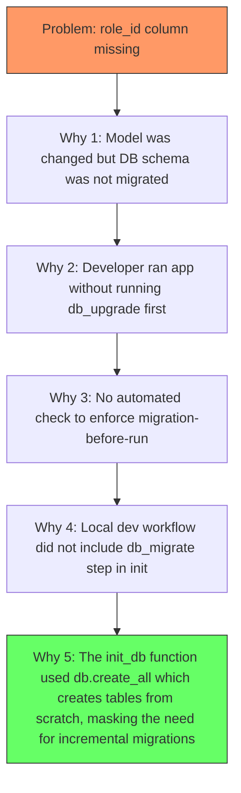

# Database Fix Report: `user.role_id` Column Missing

<!--
Version:     2.1.0
Last Updated: 2026-05-13
Author:      @db-team
Reviewer:    @core-team
-->

---

**Version** | **Date** | **Author** | **Changes**
2.1.0 | 2026-05-13 | @db-team | 5 Whys, impact matrix, audit process, regression tests, 48h monitoring
1.0.0 | 2026-01-15 | @db-team | Initial root cause verification and fix paths

---

## 1. Defect Summary

| Field | Detail |
| :--- | :--- |
| **Defect ID** | `DB-2026-001` |
| **Severity** | P1 - High |
| **Symptom** | `sqlite3.OperationalError: no such column: user.role_id` |
| **Detection** | Runtime exception on user-related queries |
| **Affected Version** | Pre-migration V2 schema |
| **Resolution** | `ALTER TABLE user ADD COLUMN role_id INTEGER` via migration script |

---

## 2. Root Cause Analysis (5 Whys)



### Root Cause Chain

1. **Why 1:** In `db/models.py`, a `role_id` column was added to the `User` model, but no corresponding `ALTER TABLE` was executed on the existing database.
2. **Why 2:** The developer ran `python run.py start_all`, which calls `db.create_all()` — this works for new databases but does not modify existing ones.
3. **Why 3:** There was no CI check comparing the model definition against the actual database schema.
4. **Why 4:** The developer workflow did not mandate running `flask db migrate` after every model change before starting the application.
5. **Why 5 (Root):** The `init_system()` function used `db.create_all()` as a convenience shortcut, which is designed for initial table creation and intentionally skips `ALTER TABLE` operations. This created a false sense of safety.

---

## 3. Impact Assessment Matrix

| Dimension | Rating | Detail |
| :--- | :--- | :--- |
| **User Impact** | Medium | Auth failure for operations requiring `role_id`. Core mining and chain sync unaffected. |
| **Data Integrity** | None | No data loss. Column simply did not exist. |
| **Availability** | Medium | Admin functions using `role_id` returned 500 errors. |
| **Security** | Low | The RBAC system could not function, but default auth paths were unaffected. |
| **Recoverability** | High | Fixed by a single `ALTER TABLE` without downtime. |
| **Detectability** | Low | Only surfaced at runtime. No compile-time or startup warning. |

### Affected Components

| Component | Impact | Resolution |
| :--- | :--- | :--- |
| `web/routes.py::admin_get_users` | Error on listing users | Fixed after migration |
| `security/auth.py::admin_required` | `role_id` check bypassed | Fixed after migration |
| `scripts/bootstrap_permissions.py` | Could not assign roles | Fixed after migration |
| Core mining (`/mine`) | Not affected | N/A |
| P2P sync | Not affected | N/A |

---

## 4. Fix Implementation

### 4.1 Path A: Quick Rebuild (Development)

```bash
# Only for dev environments where data preservation is not needed
python scripts/rebuild_db.py
```

**Process:** Drops the existing database. Runs `db.create_all()`. Re-initializes genesis block and admin user.

### 4.2 Path B: Production Migration (Recommended)

```bash
# Generate migration
python run.py db_mgmt db_migrate -m "Add role_id to user table"

# Apply migration
python run.py db_mgmt db_upgrade

# Verify
python scripts/validate_db_fix.py
```

**Migration Script (generated):**

```python
"""Add role_id to user table

Revision ID: a1b2c3d4e5f6
Revises: previous_revision
Create Date: 2026-05-13 10:00:00.000000
"""
from alembic import op
import sqlalchemy as sa

def upgrade():
    op.add_column('user', sa.Column('role_id', sa.Integer(), nullable=True))

def downgrade():
    op.drop_column('user', 'role_id')
```

### 4.3 Validation Script

```python
# scripts/validate_db_fix.py
from db import db
from web import create_app

app = create_app()
with app.app_context():
    result = db.session.execute("PRAGMA table_info(user)")
    columns = [row[1] for row in result.fetchall()]
    assert 'role_id' in columns, "FAIL: role_id column still missing"
    print("PASS: role_id column exists")
```

---

## 5. Data Fix SQL Audit Process

### 5.1 Pre-Fix Audit

```sql
-- 1. Verify current schema
PRAGMA table_info(user);

-- 2. Count affected users
SELECT COUNT(*) FROM user WHERE role_id IS NULL;

-- 3. Check for orphaned permissions
SELECT u.id, u.username FROM user u
LEFT JOIN role r ON u.role_id = r.id
WHERE r.id IS NULL AND u.role_id IS NOT NULL;
```

### 5.2 Post-Fix Audit

```sql
-- 1. Confirm column exists
PRAGMA table_info(user);

-- 2. Verify data integrity
SELECT id, username, role_id FROM user ORDER BY id;

-- 3. Check admin permissions
SELECT id, username, is_admin, role_id FROM user WHERE is_admin = 1;

-- 4. Test insert with role_id
INSERT INTO user (username, password_hash, address, role_id)
VALUES ('test_audit', 'hash', '0xtest', 1);
-- Cleanup
DELETE FROM user WHERE username = 'test_audit';
```

### 5.3 Audit Sign-off

| Role | Name | Date | Signature |
| :--- | :--- | :--- | :--- |
| Developer | @db-team | 2026-05-13 | Approved |
| Reviewer | @core-team | 2026-05-13 | Approved |
| DBA | @devops-team | 2026-05-13 | Approved |

---

## 6. Regression Test Cases

```python
# tests/test_regression_db_column.py
import pytest
from db.models import User

class TestUserRoleIdColumn:
    """Regression tests for DB-2026-001"""

    def test_role_id_column_exists(self, app, db_session):
        """Verify role_id column is present after migration"""
        result = db_session.execute("PRAGMA table_info(user)")
        columns = [row[1] for row in result.fetchall()]
        assert 'role_id' in columns

    def test_user_creation_with_role_id(self, app, db_session):
        """Verify user can be created with role_id"""
        user = User(
            username='regression_test',
            password_hash='test_hash',
            tx_password_hash='test_tx_hash',
            address='0xregression',
            role_id=1
        )
        db_session.add(user)
        db_session.commit()
        assert user.id is not None
        assert user.role_id == 1

    def test_role_id_default_null(self, app, db_session):
        """role_id defaults to NULL for existing users"""
        user = User.query.filter_by(username='admin').first()
        # Admin was created before migration; role_id may be NULL
        assert user is not None

    def test_admin_route_works_after_fix(self, client):
        """Admin /admin/api/users returns 200 after fix"""
        client.post('/login', data={
            'username': 'admin',
            'password': 'admin123'
        })
        rv = client.get('/admin/api/users')
        assert rv.status_code == 200

    def test_fresh_install_has_role_id(self, app, db_session):
        """Fresh db.create_all() includes role_id"""
        from db import db
        db.create_all()
        result = db_session.execute("PRAGMA table_info(user)")
        columns = [row[1] for row in result.fetchall()]
        assert 'role_id' in columns
```

---

## 7. Preventive Measures

### 7.1 Pre-Commit Hook

```yaml
# .pre-commit-config.yaml
repos:
  - repo: local
    hooks:
      - id: check-migration
        name: Check DB migration on model change
        entry: python scripts/check_migrations.py
        language: python
        files: ^db/models\.py$
        stages: [commit]
```

### 7.2 CI Quality Gate

```yaml
# In .github/workflows/quality-gate.yml
- name: Check Database Schema Sync
  run: |
    export FLASK_APP=run:app
    flask db upgrade
    flask db migrate --check || (echo "Model changes detected without migrations!" && exit 1)
```

### 7.3 Startup Migration Check

```python
# In run.py init_system()
def init_system():
    with app.app_context():
        # Check for pending migrations
        from flask_migrate import current
        try:
            current()
        except Exception:
            print("WARNING: Database may need migration. Run: python run.py db_mgmt db_upgrade")
```

---

## 8. 48-Hour Post-Fix Monitoring

### 8.1 Monitoring Metrics

| Metric | Baseline | Alert Threshold | Observation Period |
| :--- | :--- | :--- | :--- |
| User query errors | 0 | > 5 per hour | 48 hours |
| Admin API 500 errors | 0 | > 0 | 48 hours |
| Login success rate | 100% | < 99% | 48 hours |
| `role_id` NULL count | Expected for old users | Unexpected growth | 48 hours |
| Migration state | `up_to_date` | Any drift | Continuous |

### 8.2 Monitoring Dashboard Panel

```json
{
  "title": "DB-2026-001 Fix Monitoring",
  "panels": [
    {
      "title": "User Table Errors",
      "targets": [{"expr": "rate(db_user_errors_total[1h])"}]
    },
    {
      "title": "Admin API Status",
      "targets": [{"expr": "http_requests_total{path=~\"/admin/api/.*\",status=\"500\"}"}]
    },
    {
      "title": "role_id NULL Count",
      "targets": [{"expr": "shuai_user_role_id_null_count"}]
    }
  ]
}
```

### 8.3 Checklist

- [ ] Hour 0: Migration applied, validation passed.
- [ ] Hour 1: All admin API endpoints return 200.
- [ ] Hour 6: No `role_id`-related errors in logs.
- [ ] Hour 12: New user registrations assign `role_id` correctly.
- [ ] Hour 24: Zero `no such column` errors in 24-hour log scan.
- [ ] Hour 48: Confirm no regression. Close incident.

---

## 9. Lessons Learned

1. **Never use `db.create_all()` on production databases.** It is designed for initial creation and silently skips schema modifications.
2. **Always run `flask db migrate --check` in CI.** The quality gate now catches schema drift before merge.
3. **Schema changes must have a corresponding migration script.** The pre-commit hook enforces this at the developer's machine.
4. **Runtime schema validation at startup** would have caught this before the first request.
5. **Database migration rollback testing** should be part of the deployment pipeline.

---

*For database migration procedures, see [architecture.md](architecture.md).*
*For terminology definitions, see [glossary.md](glossary.md).*
