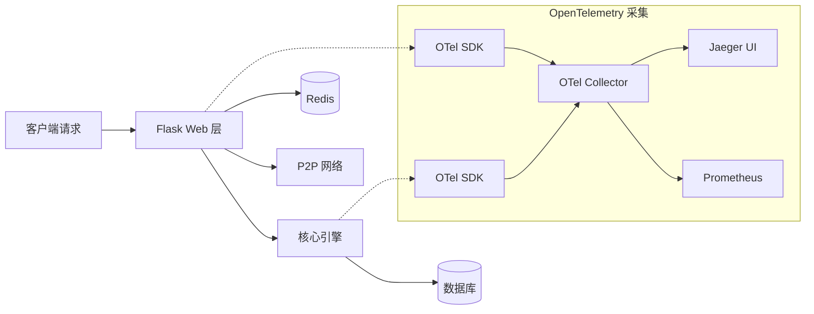
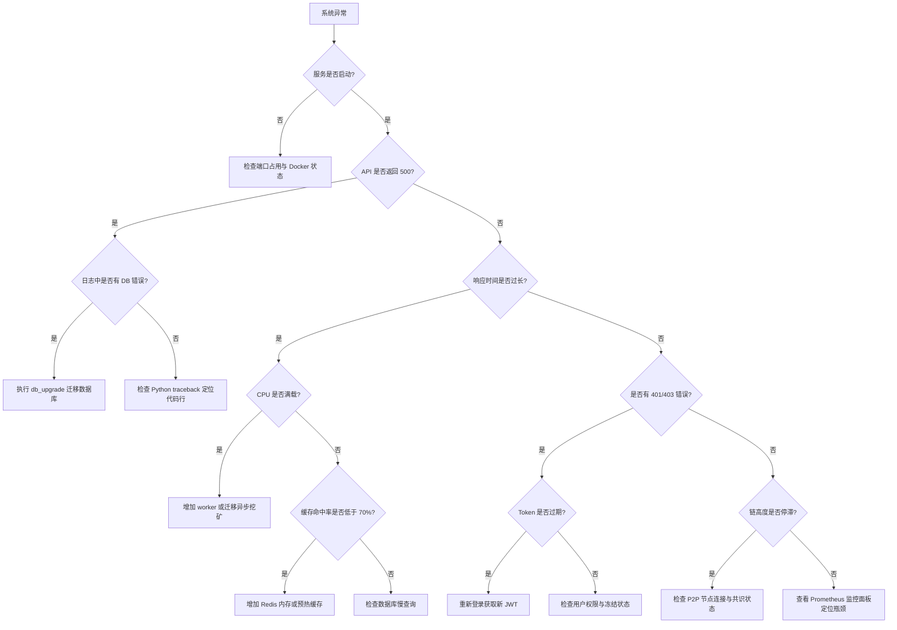

# ShuaiCoin 全量架构指南

<!--
版本号:     2.1.0
最后更新:   2026-05-13
作者:       @arch-team
评审人:     @core-team
-->

---

| **版本号** | **日期** | **作者** | **变更说明** |
| 2.1.0 | 2026-05-13 | @arch-team | 新增端到端链路追踪、成本估算、合规映射、FAQ与故障排查决策树 |
| 2.0.0 | 2026-04-30 | @arch-team | 模块化架构设计、新增扩展模块 |
| 1.0.0 | 2026-01-15 | @arch-team | 初始全量架构指南 |

---

## 1. 项目目录总表

```text
shuai_coin/
├── core/                   # 核心引擎 (共识、VM、存储驱动)
├── db/                     # 数据库 ORM (区块、交易、合约状态)
├── p2p/                    # 网络层 (节点发现、同步、广播)
├── web/                    # 应用层 (管理后台、API、SPA DApp)
├── wallet/                 # 钱包核心 (非对称加密、签名、地址)
├── zk_proof/               # 零知识证明 (ZK-SNARK/STARK, 最小化证明)
├── pvss/                   # 秘密共享 (分布式密钥、随机信标)
├── privacy_tx/             # 隐私交易 (环签名、隐身地址)
├── sharding/               # 分片扩容 (分片管理、跨片路由)
├── oracle/                 # 预言机 (喂价、外部数据校验)
├── fork_governance/        # 分叉治理 (版本升级、链重组处理)
├── node_mode/              # 节点分层 (全节点、轻节点、归档节点)
├── tss_bls/                # 门限签名 (聚合签名、TSS 签名)
├── vm_ext/                 # 虚拟机扩展 (WASM 合约支持、精细 Gas)
├── security/               # 安全加固 (防 DDOS、审计、加密)
├── monitor/                # 监控告警 (指标采集、自动告警)
├── analytics/              # 数据分析 (链上运营报表)
├── cache/                  # 性能优化 (Redis/本地内存缓存)
├── notifications/          # 事件通知 (WebSocket 推送、邮件)
├── scripts/                # 运维脚本 (备份、清理、迁移)
├── tests/                  # 全量测试 (单元、集成、性能)
├── docs/                   # 项目文档 (架构、API、部署)
└── requirements.txt        # 依赖清单
```

---

## 2. 端到端链路追踪 (OpenTelemetry)

### 2.1 追踪架构



### 2.2 集成代码示例

```python
# monitor/tracing.py - OpenTelemetry 集成
from opentelemetry import trace
from opentelemetry.sdk.trace import TracerProvider
from opentelemetry.sdk.trace.export import BatchSpanProcessor
from opentelemetry.exporter.otlp.proto.grpc.trace_exporter import OTLPSpanExporter
from opentelemetry.instrumentation.flask import FlaskInstrumentor
from opentelemetry.instrumentation.sqlalchemy import SQLAlchemyInstrumentor

def init_tracing(app):
    """初始化 OpenTelemetry 分布式追踪"""
    trace.set_tracer_provider(TracerProvider())

    otlp_exporter = OTLPSpanExporter(
        endpoint="http://localhost:4317",
        insecure=True
    )

    trace.get_tracer_provider().add_span_processor(
        BatchSpanProcessor(otlp_exporter)
    )

    # 自动注入 Flask
    FlaskInstrumentor().instrument_app(app)

    # 自动注入 SQLAlchemy
    SQLAlchemyInstrumentor().instrument(
        enable_commenter=True,
        commenter_options={}
    )

    return trace.get_tracer(__name__)
```

### 2.3 Span 属性标准

| 属性名 | 类型 | 说明 | 示例 |
| :--- | :--- | :--- | :--- |
| `http.method` | string | HTTP 方法 | `GET` |
| `http.url` | string | 请求路径 | `/api/chain` |
| `http.status_code` | int | 响应状态码 | `200` |
| `db.statement` | string | SQL 语句 | `SELECT * FROM block` |
| `chain.height` | int | 当前链高度 | `142` |
| `mining.difficulty` | int | 挖矿难度 | `4` |
| `tx.hash` | string | 交易哈希 | `a1b2c3...` |
| `user.id` | string | 用户 ID | `admin` |

### 2.4 追踪查询示例

```bash
# 在 Jaeger UI 中按 trace ID 查询
# 典型 trace 路径:
# Client -> GET /api/chain  (100ms)
#   └── SQL SELECT blocks    (45ms)
#   └── Redis cache hit      (2ms)
#   └── JSON serialization   (8ms)

# 查找慢请求
# Jaeger Query: http.method="GET" AND duration>500ms
```

---

## 3. 成本估算模型

### 3.1 基础设施成本

| 资源 | 规格 | 月度成本 (USD) | 年成本 (USD) |
| :--- | :--- | :--- | :--- |
| 计算 (EC2 t3.medium) | 2 vCPU, 4 GB | ~$30 | ~$360 |
| 数据库 (RDS db.t3.medium) | 2 vCPU, 4 GB, 100 GB | ~$80 | ~$960 |
| Redis (ElastiCache cache.t3.micro) | 0.5 vCPU, 0.5 GB | ~$15 | ~$180 |
| 负载均衡 (ALB) | 按量 | ~$20 | ~$240 |
| S3 备份存储 | 50 GB | ~$1 | ~$12 |
| 数据传输 | 100 GB/月 | ~$9 | ~$108 |
| **总计 (小规模)** | | **~$155/月** | **~$1,860/年** |

### 3.2 运维人力成本

| 角色 | 投入比例 | 月度成本 (估算) |
| :--- | :--- | :--- |
| 后端工程师 | 50% | ~$4,000 |
| DevOps 工程师 | 30% | ~$2,400 |
| 安全工程师 | 10% | ~$800 |
| **总计** | | **~$7,200/月** |

### 3.3 规模扩展成本预测

| 用户规模 | 月基础成本 | 月人力成本 | 总月成本 |
| :--- | :--- | :--- | :--- |
| < 1,000 | ~$155 | ~$7,200 | ~$7,355 |
| 1,000 - 10,000 | ~$500 | ~$10,000 | ~$10,500 |
| 10,000 - 100,000 | ~$2,000 | ~$15,000 | ~$17,000 |
| 100,000+ | ~$8,000 | ~$25,000 | ~$33,000 |

### 3.4 成本优化建议

- [ ] 使用预留实例 (Reserved Instances) 可节省 ~30% 计算成本。
- [ ] 冷数据归档至 S3 Glacier，降低存储成本 ~60%。
- [ ] 使用 Spot 实例运行非关键任务 (如链分析、报表生成)。
- [ ] 启用 Redis 缓存降低数据库查询，减少 RDS IOPS 消耗。
- [ ] 监控资源利用率，避免过度配置 (over-provisioning)。

---

## 4. 合规映射

### 4.1 GDPR 合规对照

| GDPR 要求 | ShuaiCoin 实现 | 状态 |
| :--- | :--- | :--- |
| **数据最小化** | 区块链仅存储地址哈希和交易数据，不存储 PII | 合规 |
| **删除权 (被遗忘权)** | 区块链不可篡改；个人信息不出现在链上 | 合规 (通过设计) |
| **数据可携带** | `GET /api/wallet/<address>` 可导出余额与交易 | 合规 |
| **访问控制** | JWT + Session 双鉴权，RBAC 权限模型 | 合规 |
| **数据处理记录** | 管理员操作日志 (`admin_log` 表) 不可篡改 | 合规 |
| **数据泄露通知** | `monitor/alerts.py` 支持自动告警通知 | 合规 |
| **DPIA (数据保护影响评估)** | 每次架构变更需附带安全评审 | 进行中 |

### 4.2 等保 2.0 对照

| 等保要求 | ShuaiCoin 实现 | 状态 |
| :--- | :--- | :--- |
| **身份鉴别** | 用户名 + 密码 + 交易密码双因子认证 | 合规 |
| **访问控制** | `admin_required` + `require_permission` 装饰器 | 合规 |
| **安全审计** | `admin_log` 表记录 who/when/what/result | 合规 |
| **入侵防范** | Flask-Limiter 速率限制 + DDOS 防护 | 合规 |
| **数据完整性** | SHA-256 链式哈希保证不可篡改 | 合规 |
| **数据保密性** | Werkzeug 密码哈希 + JWT 加密传输 | 合规 |
| **数据备份恢复** | `scripts/backup_db.py` + `scripts/restore.py` | 合规 |
| **剩余信息保护** | 无敏感数据明文存储 | 合规 |
| **通信完整性** | 建议生产环境启用 HTTPS (TLS 1.2+) | 建议项 |

### 4.3 合规检查清单

```bash
#!/bin/bash
# scripts/compliance_check.sh - 合规自检脚本

echo "=== ShuaiCoin 合规自检 ==="

# 1. 检查 TLS 配置
echo -n "[1/6] TLS 配置: "
if grep -q "ssl_context" run.py 2>/dev/null; then
    echo "通过"
else
    echo "警告: 生产环境建议配置 HTTPS"
fi

# 2. 检查日志中是否有明文密码
echo -n "[2/6] 日志明文密码检查: "
if grep -ri "password" logs/ 2>/dev/null | grep -v "password_hash" | grep -q .; then
    echo "失败: 发现明文密码"
else
    echo "通过"
fi

# 3. 检查审计日志完整性
echo -n "[3/6] 审计日志: "
if python -c "from db.models import AdminLog; print('通过')" 2>/dev/null; then
    echo "通过"
else
    echo "失败"
fi

# 4. 检查备份策略
echo -n "[4/6] 备份策略: "
if [ -f scripts/backup_db.py ]; then
    echo "通过"
else
    echo "失败"
fi

# 5. 检查速率限制
echo -n "[5/6] 速率限制: "
if grep -q "limiter" web/routes.py 2>/dev/null; then
    echo "通过"
else
    echo "警告: 未启用速率限制"
fi

# 6. 检查依赖漏洞
echo -n "[6/6] 依赖安全检查: "
pip check > /dev/null 2>&1 && echo "通过" || echo "警告: 依赖冲突"
```

---

## 5. 常见问题 (FAQ)

### 5.1 安装与启动

**Q: 首次启动报错 `ModuleNotFoundError: No module named 'flask'`？**
A: 请先安装依赖：`pip install -r requirements.txt`

**Q: `python run.py start_all` 启动后无法访问？**
A: 检查端口是否被占用：`netstat -an | findstr 5000`，或通过 `PORT=8000` 环境变量更换端口。

**Q: Docker 启动后报错 `Connection refused`？**
A: 等待数据库健康检查通过。`docker-compose logs db` 确认 PostgreSQL 已就绪。

### 5.2 数据库

**Q: 如何从 SQLite 迁移到 PostgreSQL？**
A: 执行 `python scripts/migrate_prod_manual.py`，或设置 `DATABASE_URL=postgresql://...` 后运行 `python run.py db_mgmt db_upgrade`。

**Q: `no such column` 错误如何修复？**
A: 执行 `python run.py db_mgmt db_upgrade`。详见 [fix_report_db_column.md](fix_report_db_column.md)。

### 5.3 挖矿

**Q: 挖矿请求超时怎么办？**
A: 使用异步挖矿接口 `POST /mine/async`，通过 `GET /mine/status/<task_id>` 轮询结果。

**Q: 如何调整挖矿难度？**
A: 修改 `config/settings.py` 中的 `DIFFICULTY` 值，或通过 `POST /admin/api/config` 接口调整。

### 5.4 P2P 网络

**Q: 节点之间如何发现彼此？**
A: 通过 `POST /api/p2p/register` 注册已知节点，系统自动进行链同步。

**Q: 为什么我的链高度与全网不一致？**
A: 手动触发同步：`GET /api/p2p/resolve`。也可能是因为网络延迟或节点离线。

### 5.5 安全

**Q: 默认密码安全吗？**
A: 不安全。生产环境必须立即修改 `admin` 用户密码和 `SECRET_KEY`。

**Q: 如何添加内容审核规则？**
A: 在 `config/sensitive_words.txt` 中添加敏感词 (每行一个)，在 `config/image_blacklist.sha256` 中添加图片黑名单哈希。

---

## 6. 故障排查决策树



### 6.1 常见故障速查表

| 症状 | 可能原因 | 排查命令 | 解决方案 |
| :--- | :--- | :--- | :--- |
| `Connection refused` | 服务未启动 | `docker-compose ps` | `docker-compose up -d` |
| `502 Bad Gateway` | Gunicorn worker 崩溃 | `docker-compose logs web` | 重启容器 |
| `no such column` | 模型与数据库不一致 | `flask db migrate --check` | `flask db upgrade` |
| `Token expired` | JWT 过期 | `python -c "import jwt; ..."` | 重新登录 |
| `Rate limit exceeded` | 请求过频 | 查看 `X-RateLimit-*` 头 | 等待冷却或降低频率 |
| `Out of memory` | 内存泄漏或缓存过大 | `docker stats` | 重启并调整内存限制 |
| 链不同步 | P2P 节点失联 | `GET /api/p2p/resolve` | 注册新节点 |

---

## 7. 功能模块简介

### 7.1 零知识证明体系
通过 ZK-SNARK 压缩区块验证证据，实现轻节点"秒同步"。用户无需下载数百 GB 数据即可验证交易真实性。

### 7.2 PVSS 可验证秘密共享
基于加密分片的秘密分发与公开验证，构建不可操纵的链上随机信标，确保共识选主过程的绝对公平。

### 7.3 隐私交易体系
结合环签名 (Ring Signature) 与隐身地址 (Stealth Address)，在保证账本可审计的前提下实现交易双方地址匿名与金额隐藏。

### 7.4 分片扩容
状态分片与跨片原子交易路由，通过并行处理突破单链 TPS 物理上限。

### 7.5 预言机
外部数据喂价与多源数据可信校验，打通区块链与现实世界的数据壁垒。

### 7.6 分叉治理与节点分层
自动检测分叉并支持软/硬分叉平滑升级。全节点、轻节点、归档节点三级分层。

### 7.7 虚拟机扩展 (WASM)
支持 WASM 高性能合约与精细化 Gas 计费，允许使用 C++/Rust 编写合约。

---

*术语定义参见 [glossary.md](glossary.md)。*
*架构详情参见 [architecture_v2.md](architecture_v2.md)。*
*部署指南参见 [deploy_v2.1.md](deploy_v2.1.md)。*
