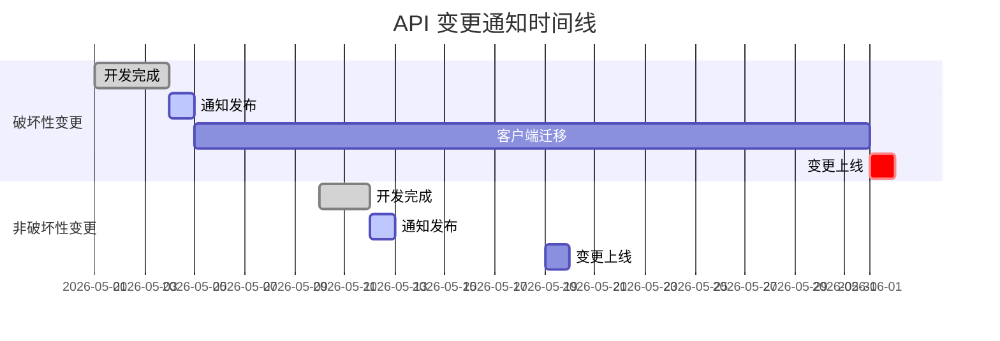
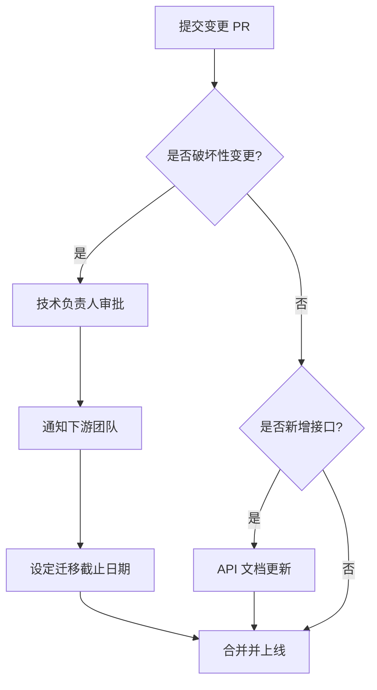

# ShuaiCoin 模块接口变更记录表

<!--
版本号:     2.1.0
最后更新:   2026-05-13
作者:       @api-team
评审人:     @core-team
-->

---

| **版本号** | **日期** | **作者** | **变更说明** |
| 2.1.0 | 2026-05-13 | @api-team | 统一变更格式，新增回滚兼容策略与通知机制 |
| 2.0.0 | 2026-04-30 | @api-team | 新增 JWT 鉴权、Swagger 文档、非跳转响应 |
| 1.0.0 | 2026-01-15 | @api-team | 初始变更记录 |

---

## 1. 变更记录

### 1.1 统一标准规范

所有接口变更必须遵循以下格式记录：

| 字段 | 说明 | 示例 |
| :--- | :--- | :--- |
| **版本号** | 语义化版本 (Semantic Versioning) | `v2.1.0` |
| **变更类型** | `新增` / `修改` / `废弃` / `删除` | `修改` |
| **接口路径** | 完整的路由路径 | `POST /mine/async` |
| **旧签名** | 变更前的接口签名 (如适用) | `GET /mine (redirect)` |
| **新签名** | 变更后的接口签名 (如适用) | `GET /mine (JSON)` |
| **向下兼容** | `是` / `否` / `部分` | `否` |
| **影响范围** | `高` / `中` / `低` | `高` |
| **迁移指南** | 旧版调用方如何适配新版 | 参见下方迁移指南章节 |
| **责任人** | 负责该变更的团队或个人 | `@core-team` |
| **变更时间** | ISO 8601 格式 (UTC) | `2026-05-13T10:00:00Z` |
| **回滚兼容** | 回滚后旧版客户端是否可正常工作 | `是` / `否` |

---

## 2. 详细变更记录表

| 版本号 | 变更时间 | 变更类型 | 接口路径 | 旧签名 | 新签名 | 向下兼容 | 影响范围 | 责任人 | 回滚兼容 |
| :--- | :--- | :--- | :--- | :--- | :--- | :--- | :--- | :--- | :--- |
| v2.1.0 | 2026-05-13T10:00:00Z | 新增 | `POST /mine/async` | — | `POST /mine/async` | 是 | 低 | @core-team | 是 |
| v2.1.0 | 2026-05-13T10:00:00Z | 新增 | `GET /mine/status/<task_id>` | — | `GET /mine/status/<task_id>` | 是 | 低 | @core-team | 是 |
| v2.1.0 | 2026-05-13T10:00:00Z | 新增 | `POST /admin/api/nodes/verify` | — | `POST /admin/api/nodes/verify` | 是 | 低 | @core-team | 是 |
| v2.1.0 | 2026-05-13T10:00:00Z | 修改 | `GET /verify` | `POST /verify (admin only)` | `GET /verify (all users)` | 部分 | 中 | @core-team | 是 |
| v2.1.0 | 2026-05-13T10:00:00Z | 修改 | `所有 /api/*` | 无统一格式 | 统一 JSON 信封 | 否 | 高 | @api-team | 否 |
| v2.0.0 | 2026-04-30T08:00:00Z | 新增 | `POST /api/login` | — | `POST /api/login (JWT)` | 是 | 低 | @auth-team | 是 |
| v2.0.0 | 2026-04-30T08:00:00Z | 修改 | `GET /mine` | 返回 `redirect` | 返回 `JSON` | 否 | 高 | @core-team | 否 |
| v2.0.0 | 2026-04-30T08:00:00Z | 新增 | `GET /apidocs` | — | Swagger UI | 是 | 低 | @api-team | 是 |
| v2.0.0 | 2026-04-30T08:00:00Z | 修改 | `core.blockchain.create_block` | 全局列表作为 mempool | 数据库查询 mempool | 否 | 高 | @core-team | 否 |

---

## 3. 迁移指南

### 3.1 v2.0.0 → v2.1.0 迁移

#### 统一响应信封迁移

**v2.0.0 响应格式 (旧):**

```json
{
  "code": 0,
  "message": "success",
  "data": {}
}
```

**v2.1.0 响应格式 (新):**

```json
{
  "status": "success",
  "message": "success",
  "data": {}
}
```

**客户端迁移代码:**

```javascript
// 旧代码 (v2.0.0)
const result = await fetch('/api/chain');
const data = await result.json();
if (data.code === 0) {
    handleSuccess(data.data);
}

// 新代码 (v2.1.0)
const result = await fetch('/api/chain');
const data = await result.json();
if (data.status === 'success') {
    handleSuccess(data.data);
}
```

#### `/verify` 权限变更

**变更说明:** `/verify` 从仅管理员变为所有登录用户可用。

**影响:** 无负面影响。管理员功能未受限制。

---

### 3.2 v1.0.0 → v2.0.0 迁移

#### `/mine` 响应格式变更

**v1.0.0 行为 (旧):**

```python
# 服务端返回 302 重定向
return redirect(url_for('routes.index'))
```

**v2.0.0 行为 (新):**

```python
# 服务端返回 JSON
return jsonify({
    "status": "success",
    "data": {"index": 143, "reward": 10.5, "hash": "0000a1b2..."}
}), 200
```

**前端迁移代码:**

```javascript
// v1.0.0 - 同步重定向模式 (已废弃)
// <a href="/mine">开始挖矿</a>  →  页面刷新跳转

// v2.0.0 - 异步 fetch 模式
const response = await fetch('/mine', {
    method: 'GET',
    credentials: 'same-origin'
});
const result = await response.json();
if (result.status === 'success') {
    showNotification(result.message);
    updateBalanceDisplay(result.data.reward);
}
```

#### 数据库 Mempool 迁移

**v1.0.0 代码 (已废弃):**

```python
# core/blockchain.py (v1)
pending_transactions = []  # 全局内存列表，重启丢失

def get_pending_transactions():
    return pending_transactions
```

**v2.0.0 代码 (当前):**

```python
# core/blockchain.py (v2)
from db.models import Transaction

def get_pending_transactions():
    txs = Transaction.query.filter_by(block_index=None).all()
    return [tx_to_dict(tx) for tx in txs]
```

---

## 4. 回滚兼容性策略

### 4.1 回滚类型定义

| 类型 | 描述 | 恢复时间 |
| :--- | :--- | :--- |
| **代码回滚** | Git 回退到旧版本 tag | < 5 分钟 |
| **数据回滚** | 恢复数据库备份 | < 30 分钟 |
| **配置回滚** | 恢复环境变量和配置文件 | < 5 分钟 |

### 4.2 接口变更回滚矩阵

| 变更 | 回滚兼容性 | 回滚步骤 |
| :--- | :--- | :--- |
| 新增接口 (`新增`) | 是 | 删除新路由代码，保留旧分支即可 |
| 修改接口 (向下兼容) | 是 | 直接切换版本 |
| 修改接口 (破坏性) | 否 | 需同时回滚前后端代码 |
| 废弃接口 (`废弃`) | 是 | 还原废弃标记 |
| 删除接口 (`删除`) | 否 | 需恢复代码并重新部署 |

### 4.3 破坏性变更回滚流程

```bash
#!/bin/bash
# scripts/rollback_api.sh - API 破坏性变更回滚脚本

TARGET_VERSION="$1"
if [ -z "$TARGET_VERSION" ]; then
    echo "用法: $0 <目标版本号>  (如: v2.0.0)"
    exit 1
fi

echo "=== 回滚 API 至 $TARGET_VERSION ==="
echo "警告: 当前版本包含破坏性变更，回滚前请确认客户端已同步回滚"

# 1. 检查目标版本
git tag | grep -q "$TARGET_VERSION" || {
    echo "错误: 未找到版本标签 $TARGET_VERSION"
    exit 1
}

# 2. 通知下游
echo "通知: 请确保所有客户端已切换到兼容版本"
read -p "确认继续? (yes/no): " confirm
[ "$confirm" != "yes" ] && exit 0

# 3. 停止服务
docker-compose stop web

# 4. 切换代码
git checkout "$TARGET_VERSION"
docker-compose build --no-cache web

# 5. 启动服务
docker-compose up -d web

# 6. 验证
sleep 5
curl -sf http://localhost:8000/api/chain && echo "回滚成功" || echo "回滚失败"
```

---

## 5. 变更通知机制

### 5.1 通知渠道

| 变更等级 | 通知方式 | 提前通知时间 | 接收方 |
| :--- | :--- | :--- | :--- |
| **破坏性变更** | Slack + Email + CHANGELOG.md | 2 周 | 全部开发者 |
| **非破坏性变更** | CHANGELOG.md | 1 周 | 全部开发者 |
| **新增接口** | CHANGELOG.md | 合并时 | 全部开发者 |
| **紧急修复** | PagerDuty + Slack #incidents | 即时 | 值班工程师 |

### 5.2 通知模板

```markdown
#### [破坏性变更] v2.2.0 - `GET /api/chain` 分页参数变更

- **变更时间:** 2026-06-01T00:00:00Z
- **影响范围:** 所有调用 `/api/chain` 的客户端
- **变更内容:** `page` 参数改为 `offset`，`size` 参数改为 `limit`
- **迁移截止:** 2026-07-01 前完成迁移
- **迁移指南:** 参见 [interface-changelog.md](interface-changelog.md#迁移指南)
- **联系人:** @api-team
```

### 5.3 通知时间线



---

## 6. 变更审批流程



---

## 7. 填写指南

1. **版本号:** 遵循语义化版本 (MAJOR.MINOR.PATCH)。
2. **变更类型:** 新增 (Add)、废弃 (Deprecate)、修改 (Modify)、删除 (Remove)。
3. **接口签名:** 函数名、参数及返回值定义。
4. **向下兼容:** 若破坏了兼容性，必须注明并在迁移指南中说明适配方式。
5. **回滚兼容:** 标注当回滚至旧版本时，客户端是否需要同步变更。
6. **迁移指南:** 提供旧版代码如何适配新版的具体示例。

---

*接口规范详情参见 [API.md](API.md)。*
*术语定义参见 [glossary.md](glossary.md)。*
