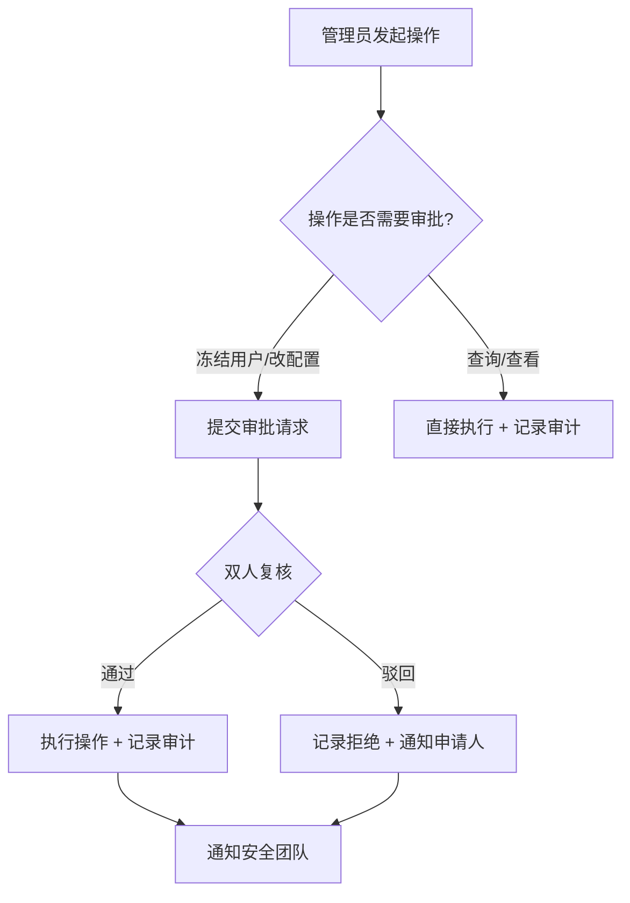

# ShuaiCoin 节点管理审计报告

<!--
版本号:     2.1.0
最后更新:   2026-05-13
作者:       @security-team
评审人:     @core-team
-->

---

| **版本号** | **日期** | **作者** | **变更说明** |
| 2.1.0 | 2026-05-13 | @security-team | 完善审计日志格式、ELK 解析规则、异常告警阈值、季度审计报告模板 |
| 2.0.0 | 2026-04-30 | @security-team | 新增功能缺失分析、异步挖矿、结构化日志 |
| 1.0.0 | 2026-01-15 | @security-team | 初始审计报告 |

---

## 1. 已实现功能清单

| 功能点 | 实现状态 | 路径 | 职责说明 |
| :--- | :--- | :--- | :--- |
| 管理员登录 | 已实现 | `/login` | 验证管理员身份并下发 JWT/Session |
| 用户状态管理 | 已实现 | `/admin/api/users` | 获取用户列表，冻结/解冻用户 |
| 系统日志查看 | 已实现 | `/admin/api/logs` | 查看管理员操作审计日志 |
| 系统配置管理 | 部分实现 | `/admin/api/config` | 查看/更新区块难度、奖励等配置 |
| 同步挖矿 | 已实现 | `/mine` | 同步 PoW 挖矿，返回 JSON 结果 |
| 异步挖矿 | 已实现 | `POST /mine/async` | 后台线程执行 PoW，轮询结果 |
| 节点同步 | 已实现 | `/api/p2p/resolve` | 手动触发全网最长链共识同步 |
| 节点注册 | 已实现 | `/api/p2p/register` | 动态添加 P2P 节点地址 |
| 链完整性校验 | 已实现 | `/verify` | 校验所有区块哈希连续性 |
| 节点健康校验 | 已实现 | `POST /admin/api/nodes/verify` | 异步 TCP + API 校验外部节点 |
| 速率限制 | 已实现 | Flask-Limiter | 全局 + 按端点 + 按用户限流 |
| 内容审核 | 已实现 | `security/auth.py` | 敏感词过滤 + 图片哈希黑名单 |

---

## 2. 审计日志格式规范

### 2.1 标准审计日志字段

每条审计日志必须包含以下字段 (5W1R 模型):

| 字段 | 英文名 | 类型 | 必填 | 说明 | 示例 |
| :--- | :--- | :--- | :--- | :--- | :--- |
| 操作时间 | `timestamp` | ISO 8601 | 是 | 操作发生的精确时间 (UTC) | `2026-05-13T10:30:00.123Z` |
| 操作人 | `who` | string | 是 | 执行操作的用户标识 | `admin` |
| 操作人 IP | `source_ip` | string | 是 | 操作来源 IP 地址 | `192.168.1.100` |
| 操作类型 | `action` | string | 是 | 操作分类 (见下方分类表) | `USER_FREEZE` |
| 操作目标 | `target` | string | 是 | 操作影响的对象 | `user_id=3, username=alice` |
| 操作原因 | `why` | string | 是 | 操作触发的业务原因 | `违规内容举报 #ticket-1234` |
| 操作结果 | `result` | string | 是 | 操作执行结果 | `SUCCESS` / `FAILED` |
| 失败原因 | `error` | string | 否 | 失败时的错误详情 | `权限不足: 非管理员操作` |
| 追踪 ID | `trace_id` | UUID | 是 | 全链路追踪标识 | `550e8400-e29b-41d4-a716-446655440000` |
| 请求耗时 | `duration_ms` | int | 否 | 操作执行的毫秒数 | `245` |

### 2.2 操作类型枚举

| `action` | 中文名称 | 说明 |
| :--- | :--- | :--- |
| `USER_FREEZE` | 冻结用户 | 管理员冻结/解冻用户账户 |
| `USER_CREATE` | 创建用户 | 新用户注册 |
| `USER_DELETE` | 删除用户 | 管理员删除用户 (慎用) |
| `CONFIG_UPDATE` | 配置更新 | 修改系统配置参数 |
| `MINE_START` | 开始挖矿 | 触发挖矿操作 |
| `MINE_COMPLETE` | 挖矿完成 | 成功生成新区块 |
| `NODE_REGISTER` | 节点注册 | 注册新的 P2P 节点 |
| `NODE_VERIFY` | 节点校验 | 校验外部节点健康状态 |
| `CHAIN_VERIFY` | 链校验 | 区块链完整性校验 |
| `LOGIN_SUCCESS` | 登录成功 | 用户成功登录 |
| `LOGIN_FAILED` | 登录失败 | 用户登录失败 |
| `PERMISSION_DENIED` | 权限拒绝 | 未授权访问被拦截 |
| `RATE_LIMIT` | 速率限制 | 触发速率限制 |
| `CONTENT_BLOCKED` | 内容拦截 | 敏感内容被审核拦截 |

### 2.3 数据库存储结构

```sql
CREATE TABLE audit_log (
    id INTEGER PRIMARY KEY AUTOINCREMENT,
    timestamp TEXT NOT NULL DEFAULT (datetime('now')),
    who TEXT NOT NULL,
    source_ip TEXT NOT NULL,
    action TEXT NOT NULL,
    target TEXT NOT NULL,
    why TEXT NOT NULL DEFAULT '',
    result TEXT NOT NULL CHECK(result IN ('SUCCESS', 'FAILED')),
    error TEXT DEFAULT NULL,
    trace_id TEXT NOT NULL,
    duration_ms INTEGER DEFAULT 0
);

CREATE INDEX idx_audit_log_timestamp ON audit_log(timestamp);
CREATE INDEX idx_audit_log_who ON audit_log(who);
CREATE INDEX idx_audit_log_action ON audit_log(action);
CREATE INDEX idx_audit_log_result ON audit_log(result);
```

### 2.4 审计日志生成代码

```python
# security/audit.py - 审计日志工具
import uuid
import time
import logging
from flask import request
from flask_login import current_user

audit_logger = logging.getLogger('audit')

def record_audit(action, target, why='', result='SUCCESS', error=None):
    """记录审计日志 (5W1R 模型)"""
    start_time = time.time()

    log_entry = {
        'timestamp': time.strftime('%Y-%m-%dT%H:%M:%S.') + f'{int((time.time() % 1) * 1000):03d}Z',
        'who': current_user.username if current_user.is_authenticated else 'anonymous',
        'source_ip': request.remote_addr or 'unknown',
        'action': action,
        'target': target,
        'why': why,
        'result': result,
        'error': error,
        'trace_id': str(uuid.uuid4()),
        'duration_ms': int((time.time() - start_time) * 1000)
    }

    # 写入结构化日志
    audit_logger.info(
        f"[AUDIT] who={log_entry['who']} "
        f"action={log_entry['action']} "
        f"target={log_entry['target']} "
        f"result={log_entry['result']} "
        f"trace_id={log_entry['trace_id']} "
        f"ip={log_entry['source_ip']} "
        f"duration={log_entry['duration_ms']}ms"
    )

    # 持久化到数据库
    from db.models import AdminLog
    from db import db
    db_log = AdminLog(
        admin_name=log_entry['who'],
        action=f"{log_entry['action']}: {log_entry['target']} | result={log_entry['result']}"
    )
    db.session.add(db_log)
    db.session.commit()

    return log_entry
```

---

## 3. ELK 日志解析规则

### 3.1 Filebeat 配置

```yaml
# filebeat.yml - 审计日志采集配置
filebeat.inputs:
  - type: log
    enabled: true
    paths:
      - /app/logs/audit.log
    fields:
      log_type: audit
      service: shuai_coin

    multiline.pattern: '^\[AUDIT\]'
    multiline.negate: true
    multiline.match: after
```

### 3.2 Logstash Grok 解析规则

```ruby
# logstash/pipeline/audit.conf
filter {
  if [fields][log_type] == "audit" {
    grok {
      match => {
        "message" => [
          "\[AUDIT\] who=%{DATA:audit_who} action=%{DATA:audit_action} target=%{DATA:audit_target} result=%{DATA:audit_result} trace_id=%{DATA:audit_trace_id} ip=%{IP:audit_source_ip} duration=%{NUMBER:audit_duration_ms:int}"
        ]
      }
    }

    date {
      match => ["audit_timestamp", "ISO8601"]
      target => "@timestamp"
    }

    mutate {
      add_field => {
        "audit_index" => "shuai-coin-audit-%{+YYYY.MM.dd}"
      }
    }
  }
}
```

### 3.3 Elasticsearch 索引模板

```json
{
  "index_patterns": ["shuai-coin-audit-*"],
  "settings": {
    "number_of_shards": 1,
    "number_of_replicas": 1
  },
  "mappings": {
    "properties": {
      "@timestamp": { "type": "date" },
      "audit_who": { "type": "keyword" },
      "audit_action": { "type": "keyword" },
      "audit_target": { "type": "text" },
      "audit_result": { "type": "keyword" },
      "audit_trace_id": { "type": "keyword" },
      "audit_source_ip": { "type": "ip" },
      "audit_duration_ms": { "type": "integer" }
    }
  }
}
```

### 3.4 Kibana 审计面板查询

```
# 查询所有失败操作
audit_result: "FAILED"

# 查询某用户所有操作
audit_who: "admin" AND @timestamp >= now-24h

# 查询冻结用户操作
audit_action: "USER_FREEZE"

# 查询登录失败 (潜在暴力破解)
audit_action: "LOGIN_FAILED" AND @timestamp >= now-1h

# 查询长耗时操作
audit_duration_ms > 5000
```

---

## 4. 异常行为告警阈值

### 4.1 告警规则定义

| 告警名称 | 触发条件 | 严重级别 | 检测频率 | 响应措施 |
| :--- | :--- | :--- | :--- | :--- |
| **暴力破解检测** | `LOGIN_FAILED` > 10 次/分钟/同一 IP | 严重 | 1 分钟 | 自动封禁 IP 30 分钟 |
| **异常管理操作** | `USER_FREEZE` 或 `CONFIG_UPDATE` 在非工作时间 (22:00-06:00) | 高 | 实时 | 通知安全值班 |
| **批量用户操作** | `USER_FREEZE` > 5 次/小时 | 高 | 1 小时 | 确认是否为批量合规操作 |
| **权限提升尝试** | `PERMISSION_DENIED` > 20 次/小时/同一用户 | 中 | 1 小时 | 检查用户行为 |
| **配置频繁变更** | `CONFIG_UPDATE` > 3 次/天 | 中 | 1 天 | 审计配置变更合理性 |
| **审计日志中断** | 5 分钟内无审计日志 | 严重 | 5 分钟 | 检查日志系统健康状态 |
| **异常高耗时** | `audit_duration_ms` > 5000 持续 10 分钟 | 中 | 10 分钟 | 性能排查 |

### 4.2 Prometheus 告警规则

```yaml
# monitor/audit_alerts.yml
groups:
  - name: shuai_coin_audit
    rules:
      - alert: BruteForceAttack
        expr: rate(audit_login_failed_total[1m]) > 10
        for: 1m
        labels:
          severity: critical
          category: security
        annotations:
          summary: "检测到暴力破解攻击"
          description: "IP {{ $labels.source_ip }} 在一分钟内失败登录 {{ $value }} 次"

      - alert: UnauthorizedAdminAction
        expr: audit_action_total{action=~"USER_FREEZE|CONFIG_UPDATE"} > 0
        for: 0m
        labels:
          severity: warning
        annotations:
          summary: "检测到管理操作"
          description: "{{ $labels.who }} 执行了 {{ $labels.action }} 操作"

      - alert: AuditLogGap
        expr: rate(audit_log_total[5m]) == 0
        for: 5m
        labels:
          severity: critical
        annotations:
          summary: "审计日志中断"
          description: "过去 5 分钟内无审计日志产生"

      - alert: HighRateLimitTrigger
        expr: rate(audit_rate_limit_total[10m]) > 5
        for: 10m
        labels:
          severity: warning
        annotations:
          summary: "速率限制触发频繁"
```

---

## 5. 季度审计报告模板

### 5.1 报告结构

```markdown
# ShuaiCoin 节点管理季度审计报告

**报告期:** 2026-Q2 (2026-04-01 至 2026-06-30)
**编制人:** @security-team
**编制日期:** 2026-07-05
**审批人:** @core-team

---

## 1. 审计概览

| 指标 | 本季度 | 上季度 | 变化 |
| :--- | :--- | :--- | :--- |
| 总审计日志条数 | __ | __ | __ |
| 管理员操作数 | __ | __ | __ |
| 安全事件数 | __ | __ | __ |
| 登录失败数 | __ | __ | __ |
| 速率限制触发数 | __ | __ | __ |
| 平均响应时间 | __ | __ | __ |

## 2. 用户操作统计

| 操作类型 | 次数 | 占比 |
| :--- | :--- | :--- |
| LOGIN_SUCCESS | __ | __% |
| MINE_COMPLETE | __ | __% |
| CHAIN_VERIFY | __ | __% |
| CONFIG_UPDATE | __ | __% |
| USER_FREEZE | __ | __% |

## 3. 安全事件记录

| 日期 | 事件类型 | 详情 | 处理结果 |
| :--- | :--- | :--- | :--- |
| __ | 暴力破解 | __ | 自动封禁 |
| __ | 未授权访问 | __ | 已处理 |

## 4. 异常行为分析

(描述本季度发现的所有异常操作模式、根因分析及改进措施)

## 5. 合规状态

| 检查项 | 状态 | 备注 |
| :--- | :--- | :--- |
| 审计日志完整性 | 通过 | 零中断 |
| 管理员操作双人复核 | 通过 | -- |
| 敏感操作审批流程 | 通过 | -- |
| 日志保留时长 | 通过 | > 90 天 |

## 6. 改进建议

1. (改进建议列表)
2. ...

## 7. 附录

- [详细操作日志 (CSV)](./reports/Q2_2026_audit_log.csv)
- [安全事件处置记录](./reports/Q2_2026_incidents.md)
```

### 5.2 审计数据导出脚本

```python
# scripts/export_audit_report.py - 导出季度审计数据
import csv
from datetime import datetime, timedelta
from db.models import AdminLog
from web import create_app

def export_quarter(year, quarter):
    """导出指定季度的审计数据"""
    start_month = (quarter - 1) * 3 + 1
    start_date = datetime(year, start_month, 1)
    if start_month + 3 > 12:
        end_date = datetime(year + 1, 1, 1)
    else:
        end_date = datetime(year, start_month + 3, 1)

    app = create_app()
    with app.app_context():
        logs = AdminLog.query.filter(
            AdminLog.timestamp >= start_date,
            AdminLog.timestamp < end_date
        ).order_by(AdminLog.timestamp.asc()).all()

        filename = f"reports/Q{quarter}_{year}_audit_log.csv"
        with open(filename, 'w', newline='', encoding='utf-8') as f:
            writer = csv.writer(f)
            writer.writerow(['ID', '管理员', '操作', '时间'])
            for log in logs:
                writer.writerow([log.id, log.admin_name, log.action, log.timestamp])

        print(f"导出完成: {filename} ({len(logs)} 条记录)")

if __name__ == '__main__':
    export_quarter(2026, 2)
```

---

## 6. 审计日志保留策略

| 日志类型 | 热存储 (Elasticsearch) | 冷存储 (S3) | 总计 |
| :--- | :--- | :--- | :--- |
| 审计日志 | 30 天 | 365 天 | 395 天 |
| 应用日志 | 7 天 | 90 天 | 97 天 |
| 错误日志 | 30 天 | 180 天 | 210 天 |
| 性能指标 | 15 天 | 180 天 | 195 天 |

```bash
# Elasticsearch 索引生命周期管理
PUT _ilm/policy/shuai_coin_audit_policy
{
  "policy": {
    "phases": {
      "hot": {
        "actions": { "rollover": { "max_age": "1d", "max_size": "50gb" } }
      },
      "warm": {
        "min_age": "7d",
        "actions": { "shrink": { "number_of_shards": 1 } }
      },
      "delete": {
        "min_age": "30d",
        "actions": { "delete": {} }
      }
    }
  }
}
```

---

## 7. 安全操作审批流程



### 7.1 需要双人审批的操作

- 冻结/解冻用户 (`USER_FREEZE`)
- 修改系统配置 (`CONFIG_UPDATE`)
- 删除用户 (`USER_DELETE`)
- 手动触发链重组
- 修改管理员权限

---

*术语定义参见 [glossary.md](glossary.md)。*
*接口规范参见 [API.md](API.md)。*
*部署指南参见 [deploy_v2.1.md](deploy_v2.1.md)。*
